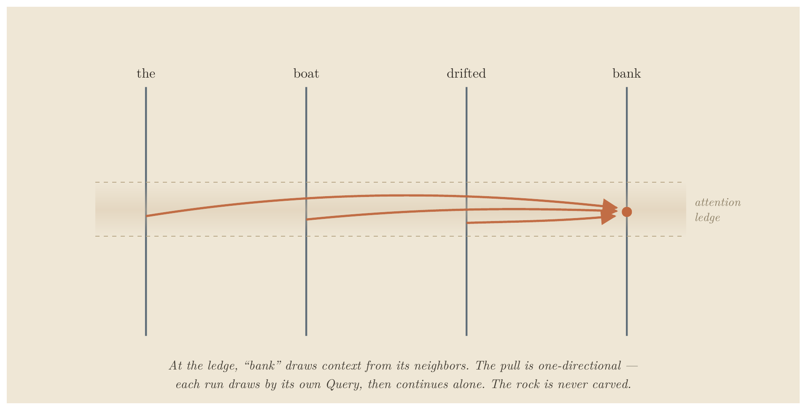
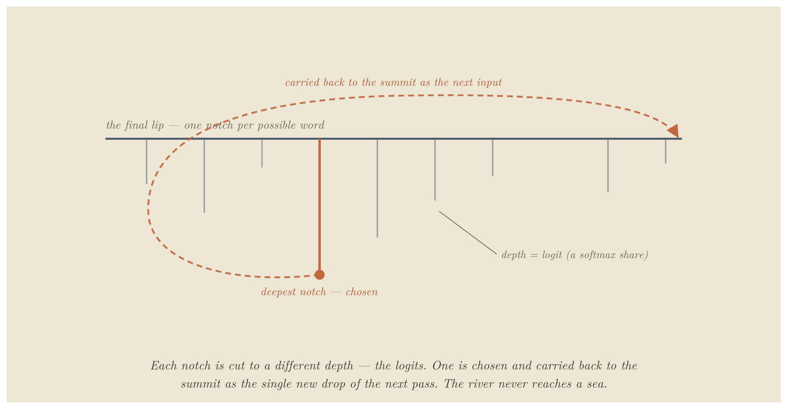
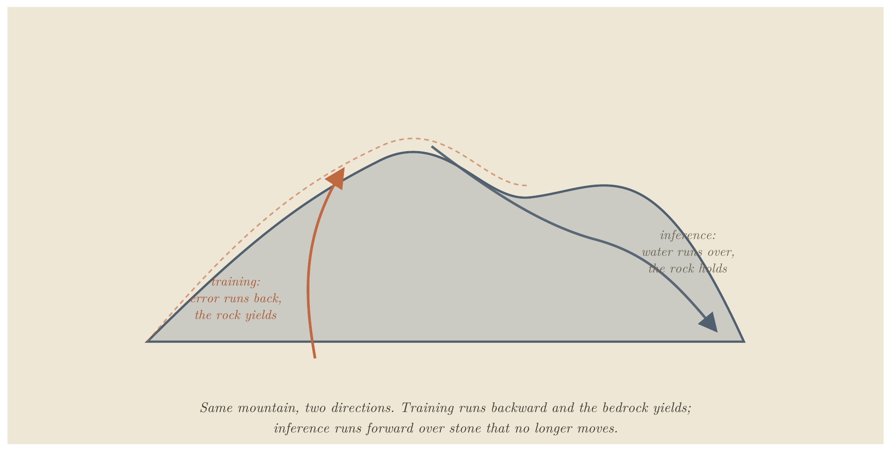

# The River and the Canyon

**A Physical Blueprint for Large Language Models**

E. A. Flores · Apiana AI, Inc. · May 2026

> Prefer a typeset version? **[Read the paper as a PDF](the-river-and-the-canyon.pdf)**.

---

## Abstract

Most explanations of large language models are either too loose (a "digital brain that thinks") or too dense (a wall of linear algebra). This paper takes a third path: it maps the real operations of a transformer onto one sustained physical picture — weights as a frozen, solid mountain, activations as water flowing over it, training as the slow carving of the rock, inference as water finding paths across stone that no longer moves. The governing distinction is permanence: grooves carved by training are permanent, channels laid down by attention are not, and that single axis is exactly the difference between weights and activations. The picture is held consistently from tokenization through attention, the residual stream, and the feed-forward block, and on into production techniques — KV caching, FlashAttention, LoRA, grouped-query attention — and finally to where it breaks, in a candid account of superposition, discreteness, and the decoder-only assumption. It is written for the technically literate non-specialist who wants an intuition they can reason from, debug with, and explain to others.

## Contents

- [Introduction: The Explanatory Gap](#introduction-the-explanatory-gap)
- [Act I: The Topography (Static Architecture)](#act-i-the-topography-static-architecture)
- [Act II: The Hydrology (Dynamic Mechanics)](#act-ii-the-hydrology-dynamic-mechanics)
- [Act III: Tectonic Shifts (Training vs. Inference)](#act-iii-tectonic-shifts-training-vs-inference)
- [Act IV: Advanced Hydrology (Stress-Testing the Model)](#act-iv-advanced-hydrology-stress-testing-the-model)
- [Act V: The Structural Frontier](#act-v-the-structural-frontier)
- [Quick-Reference Architecture Blueprint](#quick-reference-architecture-blueprint)
- [Limits of This Framework](#limits-of-this-framework)
- [Conclusion: The Wonder Without a Ghost](#conclusion-the-wonder-without-a-ghost)

---

## Introduction: The Explanatory Gap

Most explanations of Large Language Models (LLMs) fall into one of two traps: mystifyingly abstract ("it's a digital brain that thinks like a human") or brutally mathematical ($\text{Attention}(Q, K, V) = \text{softmax}\!\left(\frac{QK^T}{\sqrt{d_k}}\right)V$). The first is lazy anthropomorphism; the second is a wall of linear algebra that hides the structural elegance underneath.

This paper offers a third register: it maps the real operations of a transformer onto a single physical framework — the **mountain-and-water analogy**.

The core mapping is this: **weights are the mountain, and activations are the water.** Training is the slow carving of the bedrock into shape. Inference is water finding paths down a mountain that is frozen solid. Attention is the fluid step where the water finds and follows its own temporary channels across the rock — recomputed fresh for every input, leaving no lasting mark. With that mapping held steady, the same intuition can carry you all the way into production techniques like KV caching, FlashAttention, and LoRA.

**How to read this doc:** This document is written for the technically literate non-specialist: engineers, physicists, technical leads, and curious generalists who already have a rough working knowledge of neural networks and are comfortable with vectors, matrices, and dot products — but who want a single, coherent physical intuition for how transformers actually operate that they can reason from, debug with, and explain to others. Every concept appears twice — once in real engineering terms and once in the mountain-and-water analogy — so you can speak the left column in meetings and think in the right column in the shower. Where the analogy strains, the text says so explicitly, because a model you lean on should tell you where its own edges are.

---

## Act I: The Topography (Static Architecture)

Before water can flow, the landscape must be defined. In a transformer architecture, this landscape is a sequence of high-dimensional geometric spaces.

```
[Raw Text Input]
       |
       v
1. TOKENIZATION  (Choosing the Drops)
       |
       v
2. EMBEDDINGS  (Starting Coordinates)
       |
       v
3. POSITIONAL ENCODING  (Time-Stamping / Twisting the Sequence)
       |
       v
[To the Central Run / First Layer]
```

### 1. Tokenization: Choosing the Drops

- **In Real Terms:** Before any mathematical computation occurs, a raw text string is processed by a separate, mechanical component called a tokenizer. It slices text into sub-word units (tokens) and converts them into integers based on a fixed vocabulary index. A common word like "the" is usually a single token, while a longer one like "tokenization" may split into `[token]` and `[ization]`. The model never reads raw text — only integer token IDs, which may map to a whole word, a word-piece, or a fragment.
- **In the Analogy:** This is choosing the raindrops. Before any water touches the mountain, a valve breaks the continuous stream of text into discrete, standardized drops. The mountain never encounters a "sentence" all at once; it only receives a disciplined stream of individual drops.

### 2. Embeddings: Map Coordinates

- **In Real Terms:** Every token ID is looked up in an embedding matrix, turning a simple integer into a dense vector of numbers (e.g., $d_{\text{model}} = 1024$ or $4096$). During training, these vectors are nudged so that tokens used in similar contexts point in similar directions. Meaning is entirely geometric: proximity and angle encode semantic relationships. This is why "king" and "queen" land near one another in the space without an engineer explicitly coding the relationship.
- **In the Analogy:** Each unique type of raindrop has a fixed launch point on the highest ridge — but here is the subtlety: those launch points are not chosen and stamped onto a finished mountain. During training, while the rock is still soft clay, the entire ridge system is sculpted so that drops which behave alike come to rest on adjacent crags. The "king" drop and the "queen" drop end up on neighboring ledges not because someone placed them there, but because training slowly moved the mountain until they did — so they naturally begin their descent down the same initial valleys.

> **A Note on High-Dimensional Sanity**
>
> The geometry you understand in 3D transfers identically to a 1024D embedding space. The formula for Euclidean distance is the same — it simply has more terms:
>
> $$\text{Distance} = \sqrt{\sum_{i=1}^{n}(x_i - y_i)^2}$$
>
> Cosine similarity (the angle between two vectors) remains the workhorse metric: $1$ means pointing in the same direction, $0$ means perpendicular (unrelated), and $-1$ means opposite. The only counterintuitive trap to avoid is crowding. In a 1024D space, two random vectors are almost always nearly perpendicular ($\cos \approx 0$). Unrelated noise is the default state of the universe, which means any genuine directional similarity stands out as an incredibly stark, rare signal. You can keep your 3D intuition for distance and angles; just abandon the requirement to visualize it.

### 3. Positional Encoding: Time-Stamping the Stream

- **In Real Terms:** The attention mechanism is naturally order-blind. It treats inputs as an unordered bag of tokens. To preserve syntax and word order, positional information must be injected. There are two main families:
  - **Sinusoidal / learned encodings** are added directly onto the embedding vectors as a fixed (or learned) offset before the token enters the stack.
  - **Rotary encodings (RoPE)**, now the more common choice in modern models, are not added — instead, they rotate the Query and Key vectors by an angle proportional to position, inside the attention step itself. The effect is that relative position falls out of the QK dot product naturally.

  Either way, the goal is the same: ensure that the vector for "dog" in "the dog bit the man" is mathematically distinct from "dog" in "the man bit the dog".
- **In the Analogy:** If you drop five identical drops of water down a slope, they will follow the exact same path. To prevent this, every drop is marked by position — and here the picture asks for one indulgence: assume the drops can carry orientation. The older method (sinusoidal) stamps each drop with a fixed timecode as it passes the valve. The newer method (rotary) instead rotates each drop's orientation based on its position in the sequence before it touches the rock, so even identical drops strike the surface at subtly different angles depending on when they arrive. In both cases, position acts as an ordered coordinate system — ensuring relative timing emerges naturally whether the river of text is dropped onto the mountain all at once during training, or arrives drop-by-drop during deployment.

---

## Act II: The Hydrology (Dynamic Mechanics)

Once the drops are positioned in space and time, they enter the stack. This is where the static rock of the model meets the fluid dynamic of the input.

```
[Input Vectors]
       |
   +---+---+
   v       v
[Central Run] --> 4. ATTENTION ROUTING   (Water maps its own path)
   |       |
   v       v
[Central Run] --> 5. PARALLEL HEADS       (Sensing multiple traits)
   |       |
   v       v
[Central Run] --> 6. FEED-FORWARD BLOCK   (Local terrain knowledge)
   |       |
   +---+---+
       v
[To Next Layer Stack]
```

### The Residual Stream: The Central Run

- **In Real Terms:** In a modern transformer, layers do not completely overwrite the input vector. Instead, the architecture is fundamentally additive: $x + \text{Attn}(x)$, then $x + \text{FFN}(x)$. (In practice a normalization step — LayerNorm or RMSNorm — sits at each block to keep the channel's magnitude from drifting, a small stabilization gate rather than a place where tokens mix.) The original embedding space acts as a continuous highway or communication channel, where each subsequent block merely writes a small, incremental update onto the existing signal. Critically, there is one of these channels per token — they run in parallel, side by side, and the only operation that ever lets one run draw on another is attention.
- **In the Analogy:** Every drop rides its own deep-cut riverbed carved straight down the range, from the summit all the way to the base. This is its **Central Run**, and it keeps the same one the entire descent. When a drop passes a ridge, its current isn't diverted and remade from scratch. Instead, the attention pools and the siphon blocks act as small side-tributaries: they branch off briefly, calculate a specific physical force, and then pour their raw, newly acquired momentum right back into that drop's own roaring main channel. The runs travel parallel and private down the whole range — except at the rare attention ledges, where a run can draw on its neighbors, then continue alone. Each Central Run carries the accumulated history of its own journey forward.

### 4. Attention: The Self-Mapping Riverbed

- **In Real Terms:** Attention is where tokens exchange context. Every token projects three distinct vectors via trained weight matrices:
  1. **Query (Q):** "What context am I looking for?"
  2. **Key (K):** "What context do I contain?"
  3. **Value (V):** "What information do I offer to those who want it?"

  A token's Query vector is multiplied against every other token's Key vector ($QK^T$). The resulting scores are run through a softmax function to turn them into percentages that sum to $1.0$. The model then creates a weighted blend of all the Value vectors based on those percentages:

  $$\text{Attention}(Q, K, V) = \text{softmax}\!\left(\frac{QK^T}{\sqrt{d_k}}\right)V$$

  After this step, a vector is no longer isolated; its position in space has been shifted by the tokens around it. The word "bank" next to "river" is pulled toward a completely different geometric neighborhood than "bank" next to "robbery".
- **In the Analogy:** This is the foundational illusion of the model. The rock of the mountain is dead and completely unmoving, yet the water appears to interact intelligently. At an attention ledge, the rock briefly exposes each Central Run to its neighbors. Each drop looks around at the runs nearby and draws according to its own Query — pulling one-directionally, while each neighbor pulls by its own. The ledge creates the opportunity; the draw does the rest. They dynamically discover and follow a temporary channel across the stone, routing themselves in real-time — but they carve nothing. The route is pure flow, not erosion; it leaves no lasting mark on the rock. If you change a single drop upstream, the entire network of ripples instantly recalculates and finds a different channel. The mountain didn't move; the water simply found a path over it, computed entirely from itself, and that path vanishes the instant the next input arrives.

> **The key distinction to keep:** grooves (carved into the rock by training) are permanent. Temporary channels (laid down by attention, per input) are not. The only difference between the two is permanence — and that is exactly the difference between weights and activations.

Consider the sentence "the boat drifted toward the bank." Watch one word: *bank*. Before any attention, its drop lands at a single blurry launch point — every sense of the word at once: riverside, financial institution, a tilt in flight. Then it reaches the first attention ledge and looks around at its neighbors. *Boat* and *drifted* contribute the most momentum, so their Value pours into *bank*'s Central Run, and the drop that leaves the ledge has shifted toward the riverside region of the space. Change one word upstream — "the teller counted the cash inside the bank" — and *boat*'s pull never happens; *teller* and *cash* prevail instead, and the very same starting drop slides into a different valley. The rock never moved. The water found a different path over it because the neighbors changed. One thing the picture must not blur: the pull is one-directional. *Bank* draws on *boat* and *drifted* to resolve itself, but it does not reshape them in the same act — each token gathers from its neighbors according to what its own Query is looking for, which is not the same as all of them averaging toward a shared level. Attention is asymmetric: who-draws-from-whom is set by the asker, not by mutual mixing.



> **Figure 1.** At the attention ledge, "bank" draws context from its neighbors — one-directionally. *Schematic illustration; see "Limits of This Framework" for where the mapping intentionally simplifies the underlying mathematics.*

### 5. Multi-Head Attention: Multi-Sensory Flow

- **In Real Terms:** Rather than computing attention once across the entire vector dimension, the space is split into parallel "heads" (e.g., 8, 16, or 32 heads). If $d_{\text{model}} = 1024$ and there are 8 heads, each head operates independently within its own 128-dimensional slice. Heads appear to specialize: one may track syntactic dependencies (verbs to nouns), another pronoun references ("it" to "the truck"), another broad topical sentiment — though these roles are interpretive readings, not labels the model assigns itself. Their final outputs are stitched back together at the end of the layer.
- **In the Analogy:** Instead of the water reading the slope as a single, blunt force, the stream splits its perception into several independent senses. Hold what follows as a clean caricature rather than the literal truth — real heads overlap, blur, and multitask, as Act V will show: one part of the current responds to the steepness of the grade, another to the microscopic texture of the granite, a third to the centrifugal pull of the curve. At the bottom of the ledge, these distinct senses merge back into the drop's own Central Run.

### 6. The Feed-Forward Block: Pressurized Siphons

- **In Real Terms:** After attention has let the tokens share context, each token passes — alone — through a feed-forward network (classically two projections with a non-linearity; modern models such as Llama and Gemma typically use three, in a gated variant with GELU or SiLU). This is the crucial counterpart to attention: where attention is the step where tokens talk to each other, the feed-forward block is the step where each token is transformed in isolation, with no communication between tokens at all. It is where much of the model's raw factual "knowledge" is applied, rewriting each vector based only on its own contents.
- **In the Analogy:** Having drawn from one another at the ledge, the drops are now forced — one at a time — through a series of narrow, pressurized siphons cut into the rock at the plateau's edge. Inside the siphon there are no neighbors; each drop is squeezed, filtered, and accelerated based purely on its own properties, untouched by the others. It emerges changed, then spills back into its own Central Run. Attention is where the drops draw on one another; the siphon is where each drop is processed privately against millions of microscopic internal grooves where the model's static factual knowledge is permanently etched into the tube walls. Every layer alternates the two: gather and mix, then squeeze each one alone.

### 7. Stacking Layers: Descending the Range

- **In Real Terms:** A single layer consisting of attention and a token-wise feed-forward neural network is not enough. Transformers stack these layers deep (anywhere from 24 to over 100 layers). The output vectors of Layer 1 become the input vectors for Layer 2. Through this deep stack, a rough labor division tends to emerge — low layers leaning toward surface-level token patterns, middle layers toward relational syntax, high layers toward abstract semantics — though, as with the heads above, the boundaries are gradient and overlapping, not the clean tiers the summary suggests.
- **In the Analogy:** One mountain ridge cannot process a complex prompt. The water must descend a massive, interconnected mountain range, flowing down ridge after ridge, basin after basin. Each individual ridge processes the water and shifts its composition slightly. By the time the stream pours over the final precipice at the bottom of the entire range, the simple raindrops have been thoroughly mixed, accelerated, and organized into a highly sophisticated current that reflects the entire topography of the journey.

### 8. The Final Precipice: From Water to Word

- **In Real Terms:** After the last layer, the model takes the vector at the final position and passes it through one closing normalization (the final LayerNorm/RMSNorm) and then the unembedding projection — sometimes tied to the original embedding matrix (reused as its transpose), sometimes a separately learned matrix. This produces a logit: one raw, unbounded score for every token in the vocabulary (typically tens of thousands to a few hundred thousand — roughly 32k–256k, not millions). A softmax converts the full set of logits into a probability distribution summing to $1.0$. Temperature scales the logits beforehand — dividing by a small value sharpens the distribution toward the single top scorer (near-deterministic), a larger value flattens it (more varied). A sampling rule then draws the actual token: greedy/argmax takes the peak, while top-k, nucleus (top-p), and multinomial sampling roll weighted dice among the leading candidates. That one token is decoded back to text, appended to the input, and the entire descent runs again to produce the next word.
- **In the Analogy:** Having survived every ridge, siphon, and attention ledge, the transformed current reaches the lip of the final precipice — but first it passes through one last calibrating gate that keeps the flow from running too high or too low (the final norm). Spread below the lip is a vast fan of outflow notches, one for every word the model could say, each cut to a different depth (the logits). The system reads the whole fan at once and converts those depths into proper flow-shares (softmax), using a temperature dial to decide how sharply the depths are distinguished: turn it cold and the walls steepen until only the single deepest notch can be entered, so the same flow always yields the same word; turn it warm and the walls flatten until many notches are viable and the outcome turns unpredictable. Then the water commits to exactly one notch — the deepest every time (greedy), or a weighted roll among the most promising (nucleus, top-k). Here is the move the downhill picture hides: the chosen water is not released into any sea. It is carried straight back to the summit as the lone new drop of the next pass, joining the damp trails its predecessors left along the rock (the KV cache, detailed in Act IV) so that only its own fresh splash must be computed. The river never reaches an ocean. It runs the entire range once per word — and only at this final notch does the internal geology of the mountain turn back into a readable word.



> **Figure 2.** The fan of outflow notches; one is chosen and carried back to the summit as the next input.

---

## Act III: Tectonic Shifts (Training vs. Inference)

The entire mechanics of machine learning hinge on a clean distinction between two states of matter: the fluid and the stone. The one nuance to hold is that the stone can be deliberately re-softened — but never by the act of using the model.



> **Figure 3.** Training reshapes the bedrock; inference routes water over solid, unmoving stone.

### 9. Training: The Canyon Carves the River

- **In Real Terms:** During training, data is fed forward, an error is measured against a target output, and that error is propagated backward through the network using calculus (backpropagation). Every single weight parameter is slightly nudged via gradient descent to minimize that error.
- **In the Analogy:** Training is a relentless feedback loop. The mountain is not hard granite yet; it is soft, malleable clay. You pour billions of gallons of water down it. Each time a stream misses the correct exit valley, an error signal runs back through the whole range and reshapes the clay — not as a single dramatic shockwave, but as a vast simultaneous adjustment, every grain nudged a little according to how much it contributed to the miss. The canyon and the river carve each other. Over millions of iterations, the landscape settles until its valleys naturally guide the water exactly where it needs to go.

### 10. Inference: Water on Solid Stone

- **In Real Terms:** Once training is complete, the weights are locked. They become static numbers stored in memory. When a user queries a deployed model, no weights are altered. The forward pass computes activations, but the underlying parameters do not change by a single bit. This is why a base model does not "learn" or remember your conversation after your session is wiped.
- **In the Analogy:** The clay has been fired in a kiln. The mountain is now frozen, solid rock, and pouring water down it changes nothing about its shape. The uncanny illusion of an active, adaptive mind responding to your words is purely the result of mechanism #4 (Attention): dynamic routing occurring on top of an entirely static substrate.

> **The adaptation nuance:** "Frozen" here means fixed in place during use — not cold, and not permanent. An engineer can deliberately reopen the kiln — continued pretraining or fine-tuning re-softens the rock and re-carves the valleys on purpose. What never happens is the rock softening simply because water ran over it. Learning is a separate, deliberate act; inference is not learning. Act IV's adaptation techniques are precisely the controlled ways of editing the mountain without melting the whole thing down.

---

## Act IV: Advanced Hydrology (Stress-Testing the Model)

To prove this conceptual model is robust, we must use it to explain advanced engineering and optimization frameworks used in production environments today.

### 11. KV Caching: Damp Trails on the Ledge

- **The Production Problem:** LLMs generate text auto-regressively — one token at a time. To generate token 101, the model must run attention against all 100 preceding tokens. Recomputing the Key and Value vectors for that entire history at every single step is a massive, wasteful bottleneck. Engineers solve this by saving the past Key ($K$) and Value ($V$) vectors in a memory buffer called the **KV Cache**, so only the $Q$, $K$, and $V$ for the single new token need to be computed. Most modern models shrink that cache further by sharing Key and Value projections across groups of heads (Grouped-Query Attention, or GQA), reducing memory without changing the attention mechanism itself.
- **The Physical Analogy:** When a long stream of water drops flows down a ridge, they leave a damp, glistening trail on the rocks they pass over. When a brand-new drop arrives at the top, it does not need to reinvent the entire riverbed. It simply brings its fresh momentum (Query), encounters the wet, lubricated trails left behind by its predecessors (Keys and Values), and slides instantly into the established current. You only calculate the splash of the newest drop; the rest of the path is already primed.

### 12. FlashAttention: Narrow Blinders and Local Mathematics

- **The Production Problem:** Graphics Processing Units (GPUs) are incredibly fast at arithmetic but slow at moving data between their large main memory (High Bandwidth Memory, or HBM) and their tiny, ultra-fast on-chip memory (SRAM). Standard attention computes and stores a massive intermediate $N \times N$ attention matrix across the whole sequence, constantly choking the GPU's memory bandwidth. FlashAttention reorganizes the calculation: it breaks the input into small blocks, computes attention incrementally inside SRAM, and never writes the giant matrix to slow main memory.
- **The crucial detail:** It is exact, not an approximation. The hard part is that softmax is global: to normalize correctly, it nominally needs every score at once, which seems to fight against processing in small local blocks. FlashAttention solves this with online softmax — it carries a running maximum and a running sum as it sweeps through the blocks, and rescales its partial results each time a new block arrives. The output is mathematically exact — identical to full attention up to floating-point rounding. Nothing is dropped or estimated; the speed comes entirely from avoiding slow memory traffic.
- **The Physical Analogy:** Imagine you must map how water moves down a massive cliff. The traditional approach photographs the entire mountain at ultra-high resolution, uploads that enormous file to a slow distant server, and computes every ripple at once. FlashAttention puts on blinders. You walk to the cliff with a small notebook, study one square foot of rock, compute how the water slips over that patch, and move down to the next — but critically, you keep a running tally in the margin (the high-water mark so far, the total flow so far) and adjust your earlier figures as you go. Because you carry those running totals, the final map is exactly as accurate as the all-at-once photograph. You simply never wasted time writing, saving, or hauling the textbook-sized map of the whole journey.

### 13. LoRA (Low-Rank Adaptation): Tarps and Traffic Cones

- **The Production Problem:** Fully fine-tuning an LLM on a new domain traditionally requires updating all of its billions of parameters, which demands an unsustainable amount of memory. LoRA bypasses this by freezing the original weight matrix $W$ and injecting two much smaller, low-rank matrices ($A$ and $B$) alongside it. If the main weight matrix is a massive square ($4096 \times 4096$), $A$ and $B$ are narrow strips ($4096 \times 8$ and $8 \times 4096$). Only these tiny matrices are trained, cutting the trainable-parameter footprint by well over 99%.
- **The Physical Analogy:** You want to adapt a model to a new task (say, teaching a general model to write medical code). A full fine-tune is the equivalent of bringing bulldozers back into the canyon to blast and reshape the granite bedrock — effective, but it means re-softening and re-firing the whole mountain. LoRA leaves the bedrock completely untouched and instead lays down slick plastic tarps and traffic cones. The original mountain stays solid, fired rock. But by placing a light, highly targeted plastic guide ($A \times B$) right at a critical valley choke point, you divert the entire river into a new valley without moving a single ounce of ancient stone. This is the cleanest example of the Act III nuance: a deliberate edit to behavior that adds a removable steering layer rather than melting down the mountain.

---

## Act V: The Structural Frontier

### 14. Mechanistic Interpretability: Reading the Grooves Backward

If the mountain's shape explains how the water moves, can we look at an existing mountain and reverse-engineer exactly what concepts it contains? This is the core pursuit of **Mechanistic Interpretability** (the field of "AI archaeology"). It is partially possible — and getting steadily better — but it is an uphill battle for two fundamental, structural reasons (not engineering failures):

**1. Superposition (The Primary Wall).** This is the harder and more central obstacle, and the one current research treats as the main event. Concepts are not stored in clean, isolated geographic zones. A single dimension in the vector space does not represent "dogs". Instead, a concept is smeared across hundreds of dimensions as a directional pattern, and a single dimension may fire for dozens of entirely unrelated concepts at once (e.g., "the color blue," "legal contracts," and "the concept of fast"). That symptom is polysemanticity — one dimension, many meanings. Its cause is superposition: because near-orthogonal directions are cheap in high-dimensional space, the trained model ends up storing far more features than it has dimensions, packing them in as overlapping directions rather than assigning each its own axis. So you cannot simply point at a direction and "read off" its meaning — the direction has no single meaning. This is exactly what a single Central Run carries: one stream, holding far more overlapping contributions than it has room for, all dissolved into the same water. The leading attempt to fight this, sparse autoencoders (dictionary learning), is essentially a backward transform that tries to un-mix those overlapping features into clean, individually interpretable ones directly from the Central Run. It has produced real wins, though the method itself is now under scrutiny. It is not solved.

**2. Information Destruction (The Secondary Wall).** Compounding the problem, the non-linear operations inside the model — activations like Softmax and ReLU — are inherently many-to-one transformations. They act like physical waterfalls: once separate streams merge over the drop, you cannot look at the pool below and uniquely reconstruct exactly where each molecule entered. Because the forward pass discards information, it cannot be cleanly run backward to a single cause.

In the physical framework — and this is one of the places the analogy openly bends, where the math is simply more honest than the mountain — superposition means the exact same canyon groove is shared by entirely different weather events, and a minor shift in the angle of entry changes how the water climbs that groove's walls. You cannot understand the mountain by staring at one rock face in isolation; you must map the entire network of valleys as a single, contiguous fluid system. The honest state of the field is "archaeology with gradients" — you recover real fragments, the tools improve every year, but you are reconstructing a smeared, overlapping, multi-layer structure, not inverting a tidy equation.

---

## Quick-Reference Architecture Blueprint

| Component | Technical ML Equivalent | Operational State | Physical Analogy |
|---|---|---|---|
| **Raindrop Type** | Token ID | Pre-computed, mechanical vocabulary unit | Raw input units generated by a valve slicing a stream. |
| **Initial Ledge Coordinates** | Embedding Vector | Meaning mapped as high-dimensional geometry | High ridges sculpted during training so similar elements sit near each other. |
| **Drop Time-Stamp / Twist** | Positional Encoding | Position injected before or inside attention | Stamping a timecode or rotating the entry angle to preserve relative order. |
| **The Fired, Solid Rock** | Weights / Parameters ($W$) | Static during inference; re-softened only by training | The solid topography of the range guiding fluid flow. |
| **The Flowing Water** | Activations | Temporary values computed per input | Dynamic fluid navigating the terrain. |
| **Permanent Grooves** | Learned weights / trained pathways | Carved by training, fixed at use | Fixed channels etched deeply into the clay or rock. |
| **The Central Run** | Residual Stream | Per-token additive channel running through every layer | Each drop's own riverbed running the full range, carrying its accumulated history; runs draw on one another only at attention. |
| **Temporary Channels / Ripples** | Attention Routing ($QK^T$) | Input-dependent, recomputed every forward pass | Shifting fluid interactions that dissolve when the flow stops. |
| **Pressurized Tubes** | Feed-Forward Block (MLP) | Isolated processing, storing factual data | Single siphons processing drops privately against etched walls. |
| **The Final Notch / Delta-Fan** | Unembedding + Softmax + Sampling | Last-position vector → vocabulary distribution → one token, then fed back | Fan of outflow notches at the final lip; one is chosen and carried back to the summit for the next pass. |
| **Tectonic Shift / Clay Crushing** | Backpropagation / Gradients | Deliberate weight updates during training | Massive feedback loops warping soft clay landscape under a deluge. |
| **Moisture Left on the Stone** | KV Cache | Buffer saving historical $K$ and $V$ vectors | Glistening, wet trails lubricating the path for the next arrival. |
| **Running Margin Tally + Blinders** | FlashAttention (online softmax) | Exact attention, computed block-wise in fast memory | Local patch navigation while holding running high-water totals in a notepad. |
| **Plastic Tarps / Cones** | LoRA Matrices ($A \times B$) | Low-parameter adaptation; base weights frozen | Light behavioral interventions steering currents without blasting rock. |

---

## Limits of This Framework

A good analogy earns trust by naming where it breaks. This one bends in a few specific places, and it's worth holding all of them in view rather than pretending the mapping is perfect:

- **Drops are discrete; the real operations are continuous.** Tokens genuinely are discrete units, so "drops" fits them well. But embeddings and attention are continuous, high-dimensional matrix operations — there is no literal chunky droplet flowing down a slope, just vectors being transformed. The drop is a useful handle for the token, not a faithful picture of the math done to it.
- **Geometry can't be seen, only reasoned about.** The mountain is 3D; the real space is 1024+ dimensions. Every spatial image here is a deliberate down-projection. The intuition (distance, angle, similarity) transfers exactly; the picture does not.
- **Superposition is where the math wins.** As covered above, a single groove standing in for many overlapping concepts is the point where the physical picture loses resolution and the linear algebra is simply more honest. Treat the mountain as a guide here, not the ground truth.
- **"Frozen in place" is true only at inference.** The mountain can be deliberately re-softened (fine-tuning, continued training). It just never softens from the simple act of being used.
- **The current flows one way — downhill — so the framework assumes a causal, decoder-only model.** That fits modern LLMs, which are overwhelmingly autoregressive. A bidirectional architecture like BERT, where every token attends to past and future at once, would need water running uphill and down simultaneously; that is a different mountain, outside this map.
- **The attention picture leans toward routing because fluid flow naturally conveys directionality and per-input adaptation.** The underlying operation is mathematically a weighted synthesis of information sources — each token assembling a custom blend from the others — rather than literal path selection, and no simple physical image captures both properties equally well. The prose carries direction; the math also carries aggregation. Hold both.
- **This is not the loss landscape.** That older picture also has valleys and a downhill, but it plots loss against parameters, with the optimizer as the thing descending. The sharpest way to keep them apart is not training versus inference — it is the role of gradient descent. There, gradient descent is the traveler walking the slope; here it is the sculptor that carves the slope (Act III), and the water that later runs over the fired rock is a different thing on a different surface.

None of these break the core mapping — weights as mountain, activations as water, training as carving, inference as flow on unchanging stone. They mark the edges of the map, which is exactly what makes the rest of it safe to lean on.

One last edge points beyond this map rather than marking a flaw in it: the mountain remembers nothing. Every system that appears to — recalling past conversations, retrieving documents, holding preferences — stores that memory somewhere else entirely, in structures built around the solid rock rather than in the rock itself. How those structures work, and how water is drawn back up from them, is a different framework for a different paper; the mountain explains the model, not everything built on top of it.

---

## Conclusion: The Wonder Without a Ghost

The ultimate utility of the mountain-and-water blueprint is demystification. When an LLM produces a beautifully coherent, deeply empathetic, or brilliant piece of prose, it is easy to assume there is a ghost in the machine — a hidden hand guiding the generation. The physical framework forces us to confront the boring, elegant reality. There is no hidden hand. There is only a highly complex, self-organizing physical system. The wonder of a large language model does not require an appeal to consciousness. It is the natural consequence of gradient descent grinding against massive datasets to minimize error, billions of times over, until a structure emerges that is complex enough to capture the geometry of human language. The structure that emerges is the explanation; there is nothing underneath it to find. Nothing guides the words from behind the rock — though whether there is anything it is like to be the river is a question the mechanism cannot settle, and does not pretend to. The river flows because the canyon demands it.

---

*Written by E. A. Flores, Apiana AI, Inc. The mountain-and-water framework is the author's, developed and stress-tested in extended collaboration with Claude (Anthropic), which served as an editorial and technical sounding board.*

*© 2026 E. A. Flores. Licensed under [Creative Commons Attribution-NonCommercial 4.0 (CC BY-NC 4.0)](https://creativecommons.org/licenses/by-nc/4.0/) — share and adapt with attribution, non-commercial use only.*
