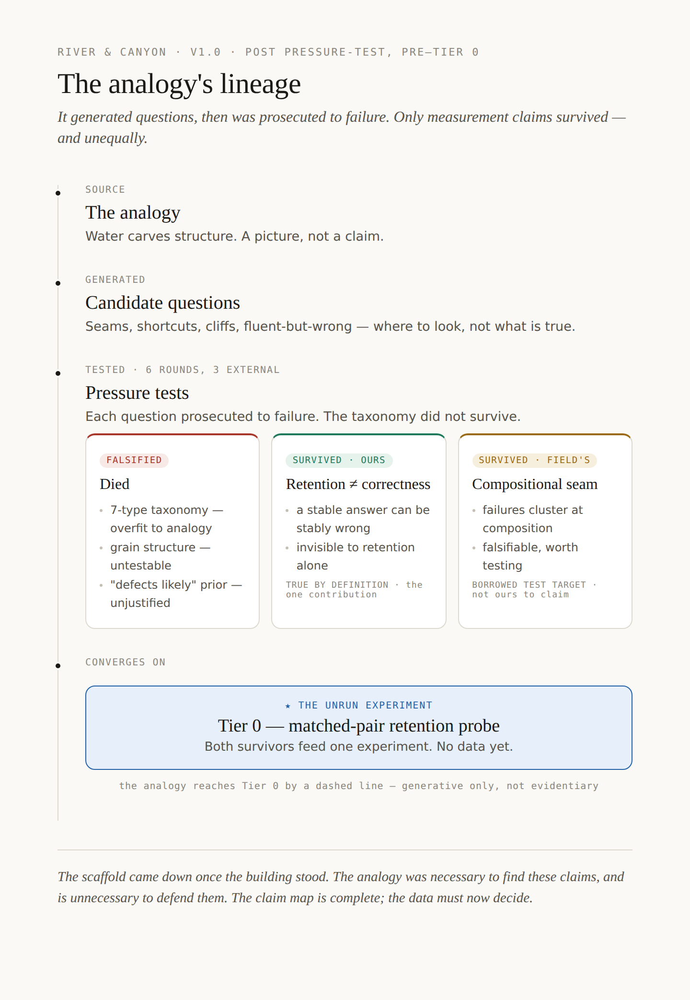
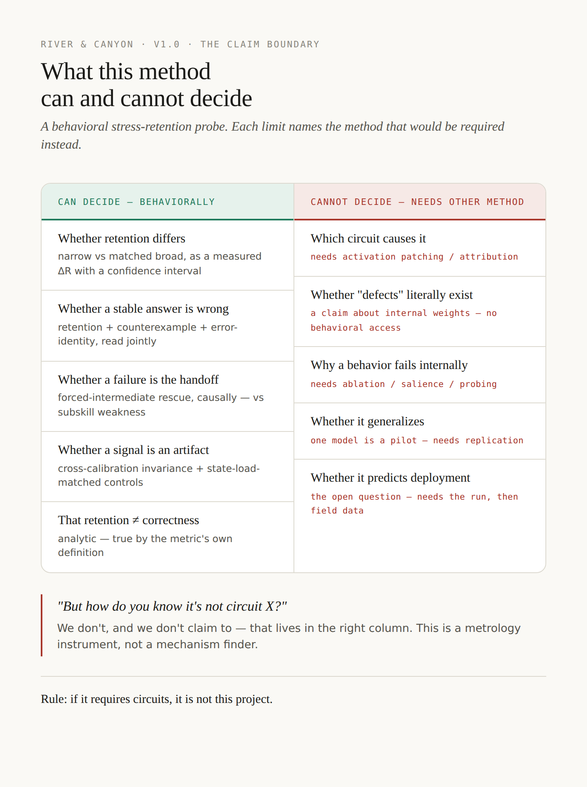
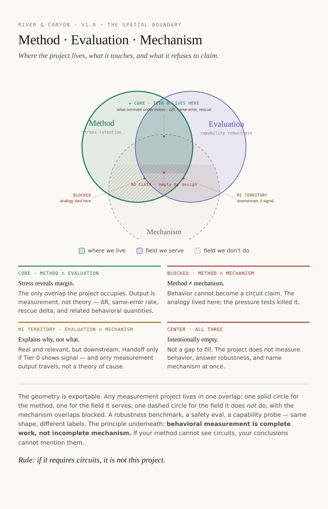
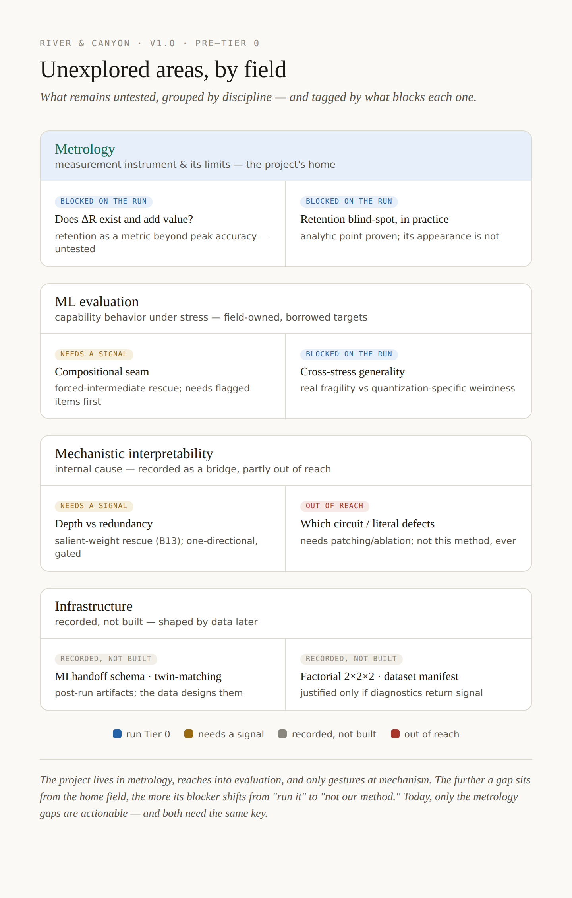
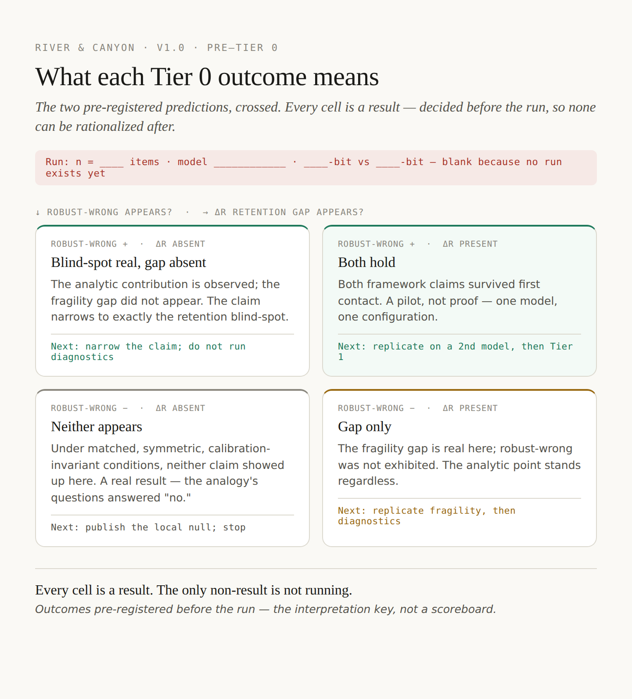
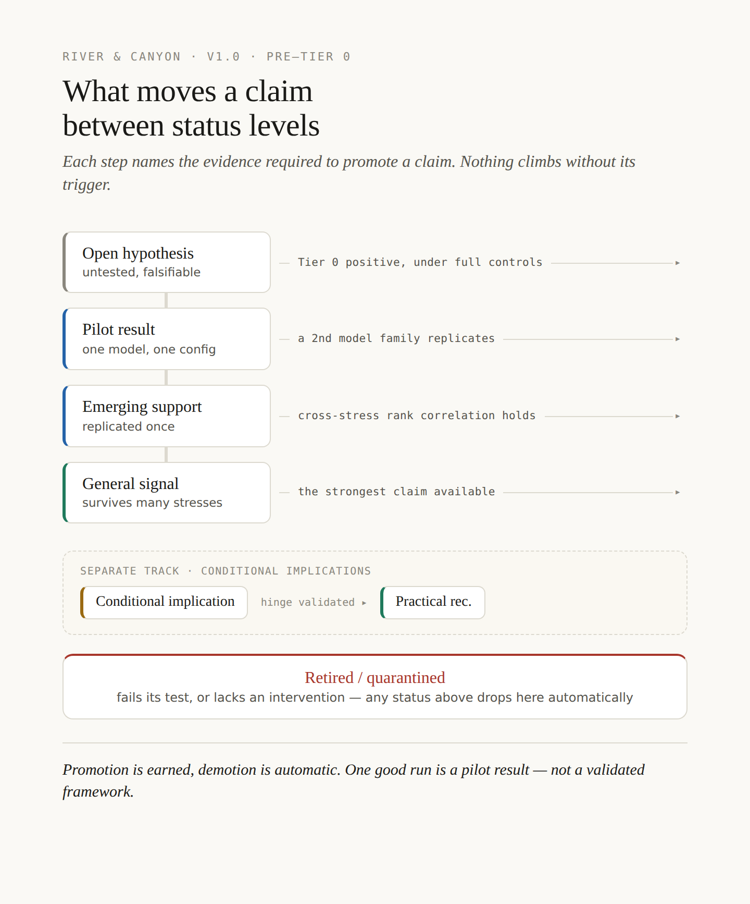

# Governance Diagrams

Six diagrams that make the project's discipline legible at a glance. Each one owns a single failure mode; together they answer — without reading the prose — what the project is, what it isn't, what's left to do, and what each result would mean.

Each figure exists as an editable HTML source (`*.html`, renders with real fonts in any browser) and a rendered image (`*.png`, for embedding). Edit the HTML and re-render when the project's logic changes. All six are stamped **v1.0 — pre-Tier 0**.

---

## The set

### 1. Lineage — what the analogy generated, and what unequally survived

Prevents nostalgia for killed ideas. Shows the river-and-canyon analogy generating questions, six pressure tests (three external) prosecuting them, most being falsified, and two surviving *unequally* — one analytic and ours (retention ≠ correctness), one falsifiable but field-owned (the compositional seam). Both feed the unrun Tier 0.

### 2. Boundary — what this method can and cannot decide

Prevents overclaiming. A can/cannot table where every "cannot" names the method that would be required instead (patching, ablation, replication). Carries the one-line answer to the deadliest reviewer question: *"how do you know it's not circuit X? — we don't, and we don't claim to."*

### 3. Venn — Method · Evaluation · Mechanism

The spatial form of the boundary. The project occupies only Method ∩ Evaluation (the core space, where Tier 0 lives). The mechanism overlaps are blocked; the three-way center is empty by design. See [`boundary-venn-insights.md`](boundary-venn-insights.md) for the governance finding this diagram produced: *behavioral measurement is complete work, not incomplete mechanism.*

### 4. Gap map — unexplored areas, by field

Prevents scope creep. Groups every untested question by discipline (metrology, ML evaluation, mechanistic interpretability, infrastructure) and tags each by what blocks it — the run, a signal, a decision, or a method limit. Makes visible that the only actionable gaps today are the metrology ones, and both need the same key.

### 5. Decision matrix — what each Tier 0 outcome means

Prevents post-result spin. The two pre-registered predictions, crossed into four cells — each with what happened, what it means, and the next move, all decided *before* the run so none can be rationalized after. Carries a blank run-slot (n, model, bit-depths) to be filled at run time. *Every cell is a result; the only non-result is not running.*

### 6. Status transitions — what promotes a claim

Prevents status inflation over time. Names the trigger required to move a claim from hypothesis → pilot → emerging → general, and the automatic demotion that retires any claim whose test fails. *Promotion is earned, demotion is automatic — one good run is a pilot result, not a validated framework.*

---

## How the maps relate to the written governance

- The **boundary** and **venn** are two views of one rule; the rule's productive consequences are written up in [`boundary-venn-insights.md`](boundary-venn-insights.md).
- The **gap map** and **decision matrix** are the visual form of the open questions tracked in [`../notes/implications.md`](../notes/implications.md) (the scored Implications Index) and its short companion [`../notes/IMPLICATIONS-SUMMARY.md`](../notes/IMPLICATIONS-SUMMARY.md).
- The **Tier 0** the diagrams point at is specified in [`../tier0-run/`](../tier0-run/): the harness (`run_tier0.py`), the matched pairs to build (`tasks.py`), the pre-registered intake (`RESULTS-INTAKE-TEMPLATE.md`), and the gated diagnostics (`DIAGNOSTIC-ADDENDUM.md`).

## A note on mechanistic interpretability (MI)

MI appears in these diagrams only as **handoff territory** — downstream, entered only if Tier 0 produces signal, and even then only measurement output travels (ΔR, same-error, rescue), never a theory of internal cause. The MI-triage idea is **captured, not built**: it lives as a recorded future-direction paragraph in [`../notes/implications.md`](../notes/implications.md) and as the gated salient-weight rescue note in [`../tier0-run/DIAGNOSTIC-ADDENDUM.md`](../tier0-run/DIAGNOSTIC-ADDENDUM.md). No MI infrastructure (handoff schema, twin-matching, dataset manifest) exists in this repo by design — those are post-Tier 0 artifacts the data must shape. The rule, from the boundary diagram: *if it requires circuits, it is not this project.*
