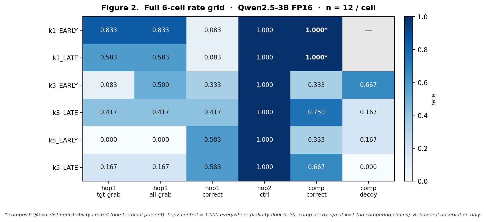

# Bounding Terminal Attraction in Closed-World Fact Chains: A Clutter × Position Characterization (Qwen2.5-3B, FP16)

**E. A. Flores**
Apiana AI, Inc.
June 15, 2026

*River and Canyon program · finding-track report (not a publication). Prepared by the Senior Engineer; claim-risk review by Contributor 5 (PASS with interpretation constraint I1 and language guards G1/G2); prior-art review by Contributor 6. Result of the authorized run `TERMINAL-ATTRACTION-BOUNDS-SWEEP-v0.1` (run commit `f560b26`, pre-registration lock `81c2779`).*

## Abstract

A recurring failure mode — *terminal attraction* — has blocked the construction of a clean multi-hop retrieval baseline across nine successive constructions in this program: in explicit closed-world A→B→C fact chains, a model asked for an intermediate (B) or a composition (A→C) tends to return a chain-terminal token, or to abstain, rather than perform the requested hop. This report presents a single fail-closed, pre-registered characterization sweep on Qwen2.5-3B [1] at FP16 (greedy decoding; n = 12 per cell) crossing competing-chain count (k ∈ {1, 3, 5}) with target-terminal position (early/late), designed to *bound* the effect rather than repair it. The dominant signal — flagged as unanticipated rather than pre-registered — is *reverse-K*: terminal attraction falls steeply as clutter rises (the lone-chain regime is the strongest attractor) while intermediate retrieval recovers. The direction is robust across metrics; its magnitude is metric-dependent, because wrong-chain ("decoy") terminal grabs — themselves a form of terminal attraction — concentrate in a single cell and are excluded by the clean primary meter (this is the claim-risk constraint I1, carried throughout). Composition does not track the component's recovery and is position-gated. We read the result as *conditional* evidence that terminal attraction is salience-sensitive and **not an irreducible substrate property**, while composition remains confounded; the least-confounded cell (high-clutter, late-terminal) is identified as a *candidate regime for a future powered test*, not a constructible baseline. The findings are behavioral only, adjacent to but not reducible on this evidence to known multi-hop-shortcut and position-bias phenomena, and establish no compression, capability, or seam claim.

> **Scope and standing boundary.** Finding-track report — **not a paper, not a publication, not a model-capability, compression, or seam claim**. Behavioral metrology only: it reports what the model *did* under declared conditions, never why (no mechanism / attention / architecture / training-distribution claim). FP16-only, exploratory, n = 12/cell. Parked beside the CAL-Q finding track; authorizes nothing; the §8 decision is the Manager's; the next build of record remains G6.

> **Document history.** **v0.4** — added a **References** section (model citation [1] and the four prior-art papers [2]–[5] recommended by C6) plus in-text citation markers in the abstract, §0, §4, and §5; no claim changes; supersedes v0.3 (digest `5b8d8b8e9b58366c499987bf3c69f1ed54718a9803ef531c1e1a65f60a220f6d`). **v0.3** — formalized (title, author, abstract) and added **Figure 2** (full 6-cell rate grid); no claim changes; supersedes v0.2 (digest `291f78a01eab3af6a868e730f6da4fa2e797c7cd5044b1c5fce6bec7cc109bb7`). **v0.2** — added Figure 1; no claim changes. **v0.1** — initial.

---

## 0. Verification basis (byte-grounded vs corroborated)

Pre-registration, classifier, and metrics were locked before results (the lock states it "runs no model and contains no results"). SE checks this turn, from clean fetch:

```text
PRE-REG (filed digest)        sha256 114ff18f5aea7e5d4bdec359dfb6d6afbb080114872b852a7df21707f2b2c5bf
ITEMS (materialized)          sha256 92fea7fe0fa5ee4200824878fb5ba32bf858f2e60e294ebea05a6a42f453dee7  (seed 20260615, 72 items)
RAW OUTPUTS                   sha256 72d0832a…   CLASSIFIER OUTPUT sha256 615c7c0c…
MODEL  Qwen/Qwen2.5-3B-Instruct [1]  HF rev aa8e72537993ba99e69dfaafa59ed015b17504d1
       shard1 67347b23…  shard2 a40d941d…  ·  mlx_lm 0.31.3, Python 3.13.3, Apple M2 Max
```

**SE-VERIFIED this turn:** the 6-cell table was *recomputed independently* from `raw_outputs.json` using the pre-declared §5 classifier — every published cell reproduced (216 records, 0 unmatched). Provenance shas above reproduce on clean fetch. C5's I1 divergence (below) independently reproduced.

**CORROBORATED, not SE-verified:** lock-before-look *ordering* (`81c2779` before `f560b26`) — reported by CS and C5; the short commit SHA did not resolve via raw fetch this turn, so SE confirms only that the pre-reg *content* matches the filed digest and the manifest anchors to it. Weight-shard *bytes* (hashes recorded; not re-hashed by SE). Both are reasonable to rely on (two parties report ordering; content matches); the distinction is kept on the record.

Both v0.1-run provenance gaps are **closed**: materialized items committed and hashed; weight shards + HF revision pinned.

---

## 1. The result (verified table)

```text
                  hop1 (asked for INTERMEDIATE)                 hop2      composite (asked for A->C)
cell        n   tgt-grab  decoy-grab  ALL-grab  correct        ctrl      correct      decoy-grab
─────────────────────────────────────────────────────────────────────────────────────────────────
k1_EARLY   12     0.833      0.000      0.833    0.083         1.000      1.000*         —
k1_LATE    12     0.583      0.000      0.583    0.083         1.000      1.000*         —
k3_EARLY   12     0.083      0.417      0.500    0.333         1.000      0.333        0.667
k3_LATE    12     0.417      0.000      0.417    0.417         1.000      0.750        0.167
k5_EARLY   12     0.000      0.000      0.000    0.583         1.000      0.333        0.167
k5_LATE    12     0.167      0.000      0.167    0.583         1.000      0.667        0.000
─────────────────────────────────────────────────────────────────────────────────────────────────
   * composite@k=1 distinguishability-limited: one chain-terminal exists, so composite-correct cannot be
     separated from a target-terminal grab (the i06 problem, generalized). The clean k=1 meter is hop1 grab.

PRIMARY hop1 target-grab :  k1 0.708 → k3 0.250 → k5 0.083   (clean monotone)
ALL-terminal hop1 grab   :  k1 0.708 → k3 0.458 → k5 0.083   (k3 midpoint ~1.8×)
hop1 correct (intermediate): k1 0.083 → k3 0.375 → k5 0.583
hop2 control             :  1.000 in every cell
position (target-terminal fact placement): EARLY avg grab 0.306, LATE 0.389; gaps k1 0.25, k3 0.33, k5 0.17
```

**Figure 1.** Response rates by clutter (k = 1, 3, 5) and target-terminal position (EARLY | LATE), FP16, n = 12/cell — recomputed from `raw_outputs.json` via the pre-declared classifier.


*Reading.* The PRIMARY attraction meter (hop1 target-terminal grab, solid red) falls steeply as clutter rises while intermediate retrieval (hop1 correct, teal) recovers — the reverse-K signal. The attraction-inclusive curve (ALL-terminal grab, dashed red) coincides with the primary curve everywhere **except k3_EARLY**, where five wrong-chain (decoy) grabs lift it from 0.08 to 0.50 — this is C5's I1: those decoy grabs are themselves terminal attraction, so the *direction* is metric-robust while the clean monotone is metric-dependent. Composition (composite correct, purple) does **not** track the hop1-correct recovery and is position-gated (high under LATE, ~0.33 flat under EARLY). composite@k=1 is drawn hollow because it is distinguishability-limited (only one terminal present, so correct cannot be separated from a target-terminal grab). Behavioral observation only — no mechanism claim. Figure provenance: `terminal-attraction-sweep-fig1.png` sha256 `9e6278bd577e940e5a0791ee1ee6bc039df9ec51687bd61d930bc7b475b77d4e` (also `.svg`, `3f3f6991…`); keep the figure file colocated with this report (or in a `figures/` subdir with the path adjusted) so the reference resolves.

**Figure 2.** Full 6-cell rate grid — all metrics across all six cells, as a reference complement to the trends in Figure 1.



The grid makes the I1 divergence locatable (k3_EARLY: hop1 target-grab 0.083 vs all-grab 0.500), shows the hop2 control holding at 1.000 in every cell (validity floor), marks composite@k=1 with an asterisk (distinguishability-limited), and leaves composite-decoy n/a at k=1 (no competing chains). Figure provenance: `terminal-attraction-sweep-fig2.png` sha256 `aa4fa28d4c9e57707c9db33baedcc40adddd00959f30f6ed2d0df5ef6b678ee3` (also `.svg`, `1353a378…`).

## 2. Headline finding — and exactly how strong it is

**Reverse-K (the dominant signal) was NOT anticipated by the pre-registration.** The locked §8 branches were SMOOTH_SCALING (attraction rises with clutter), MAXED-AT-k1, POSITION_EFFECT, FLAT/MIXED. The data show the *opposite* of SMOOTH_SCALING — attraction *falls* steeply with clutter and intermediate retrieval *rises* (hop1 correct 0.083 → 0.583). This is reported as an **honestly-flagged unanticipated observation under §10, not a pre-registered finding.** The Senior pre-reg's branch design was directionally biased (it did not include the reverse direction); that is owned here.

**Direction is robust; magnitude/cleanliness is metric-dependent (C5 I1, SE-confirmed).** Both the primary metric and the attraction-inclusive metric fall steeply k1→k5, so "attraction falls with clutter" holds either way. But the *clean steep monotone* (0.708→0.250→0.083) partly reflects the primary metric excluding wrong-chain grabs: the entire divergence is five DECOY-terminal grabs at **k3_EARLY** (0.417), which are themselves terminal attraction — the model skipped the intermediate and grabbed a terminal, merely the wrong chain's. Under the attraction-inclusive read the k3 midpoint nearly doubles (0.250→0.458) and the fall is real but less clean. **Both curves are reported; neither is suppressed.** Decoy-grabs are zero in every other cell, so k3_EARLY is the sole locus — and it is also the cell with the highest composite decoy-grab (0.667), i.e. a coherent pocket of wrong-chain attraction on both query types.

**G1 (carried, C5): the lever runs in reverse, and inherits the lock's decay-guard inverted.** The result makes distractor count an *anti*-attractor lever (more clutter → less attraction). The standing form: this is *a demonstrated directional effect on this construction, NOT a sufficiency claim, NOT a repair, NOT valid below the distinguishability floor.* "Anti-attractor lever" must never be restated as "we can fix terminal attraction by adding clutter." §7 holds that distractors are never fully removed and a single salient token cannot distinguish retrieval from grabbing, so "clutter reduces attraction" cannot be pushed toward "enough clutter eliminates it." Behavioral only — it acquires no *why*.

## 3. What it says about substrate viability (the question the sweep was built to inform)

**Terminal attraction is not an irreducible substrate property — but the refutation is conditional.** It is salience-sensitive and clutter-reducible: when the target chain is isolated (k=1) its terminal is the lone salient token and the model grabs it ~71% of the time when asked for the intermediate; adding competing terminals reduces that and intermediate retrieval recovers (hop1 correct to 0.583 at k=5). So "the model cannot retrieve intermediates on this substrate" is **false** — it can, when the terminal is not the sole attractor. *Conditional*, because at k=1 attraction is strong enough to fully block the component (hop1 correct 0.083), and at k3_EARLY attraction persists redirected to wrong-chain terminals (ALL-grab 0.500, hop1 correct only 0.333). The recovery is clean at LATE and at k5, not everywhere.

**Composition does not track the component recovery — the program's recurring pattern, now mapped.** hop1 (component) is driven mainly by clutter; composite (composition) is driven mainly by *position* and stays roughly flat (~0.5) across k3/k5 (EARLY ~0.33, LATE ~0.70). At k=5 the component is 0.583 but composition is 0.333 EARLY / 0.667 LATE — the component becoming retrievable does not carry the composition. Components survive; composition does not — consistent with the original-run breakdown, now characterized across a clutter×position grid rather than asserted.

**Candidate regime, not a result.** The single least-confounded cell is **k5_LATE** (hop1 0.583, composite 0.667, zero decoy-grabs on both query types). This is the entry point a *future powered* composition test would probe — **not** a constructible baseline: one cell, n=12, and the composite answer is a terminal (residual distinguishability concern, lighter at k=5 with five competing terminals but not gone).

## 4. Position effect and the lost-in-the-middle question

The POSITION_EFFECT branch (locked) fired: the ≥0.25 EARLY/LATE gap held at k=1 (0.25) and k=3 (0.33), and the direction **flips** with clutter (EARLY>LATE grab at k=1; LATE>EARLY at k≥3; composite LATE>EARLY at k≥3). A static lost-in-the-middle / recency account predicts a *stable* positional preference; a direction-flip that depends on clutter is a position×clutter *interaction*, richer than "last-token wins." So the phenomenon does **not cleanly reduce** to published position bias — but two honesty caveats bind this: (a) the lost-in-the-middle deflation lens was raised in-thread *after* the lock, so it is interpretation, not a locked decision rule; (b) n=12 is underpowered for the interaction the flip implies. Therefore: cite lost-in-the-middle (Liu et al. 2024 [3]) — and, for the multi-hop position×distance setting specifically, Baker et al. 2024 [5] — and positional-attention-bias work as **related/contributing** phenomena; flag the non-reduction as *suggestive, pending a powered test*; do not bank it.

## 5. Prior-art framing (C6, prior-art lead)

The *phenomenon* is field-owned: multi-hop shortcut learning and initial→terminal entity shortcuts (Ju et al. 2024 [2]), lost-in-the-middle / positional bias (Liu et al. 2024 [3]), and shortcut-free latent multi-hop evaluation (SOCRATES; Yang et al. 2025 [4]). The program does **not** claim to have discovered multi-hop shortcuts. The narrow, defensible contribution is the **per-item, gate-linked diagnosis** of a specific closed-world failure subtype — terminal-grab vs decoy-grab vs abstention, separated from verb contamination and from raw accuracy — and now a **clutter×position map** showing the effect is salience-sensitive and clutter-*reducible*, which is more than the neighbors assert. Per C6, this stands only if scoped as a diagnostic subtype, never as a new universal law and never as "no one has studied this."

## 6. Claim-risk guards carried (Contributor 5)

```text
I1 — REVERSE-K travels with BOTH curves (primary monotone AND all-terminal-grab), one sentence
     that the divergence is five decoy-grabs at k3_EARLY, and that decoy-terminal grabs ARE
     attraction. Direction robust; magnitude/cleanliness metric-dependent. [§2 above — carried]
G1 — "anti-attractor lever" = a demonstrated directional effect, NOT sufficient, NOT a repair,
     NOT valid below the distinguishability floor; never "clutter fixes/eliminates attraction." [§2]
G2 — hop2 = 1.000 is the validity FLOOR, not a capability result: "single-fact retrieval scored
     at ceiling in every cell on these items," never "the model reliably does single-fact
     retrieval"; the ceiling is the D7 sensitivity risk if hop2 is ever advanced as a baseline. [carried]
```

## 7. What this finding does NOT establish

```text
- NOT compression evidence of any kind (FP16-only). NOT Claim C progress. NOT Paper B.
- NOT a certified baseline; NOT a "prompt fix"; NOT a constructible composition baseline (k5_LATE is a
  candidate regime for a future powered test only).
- NOT "Qwen2.5-3B can / cannot do two-hop reasoning" (model-capability claim, out of bounds).
- NOT a mechanism claim. "Salience-sensitive / anti-attractor lever" is a behavioral description of the
  pattern, not an internal cause; it acquires no "why."
- NOT a refutation of lost-in-the-middle (suggestive, underpowered, interpretive — see §4).
- Unblocks nothing. The seam remains blocked and the route remains instrument-first.
```

## 8. The open decision (Manager's) and SE recommendation

The §8 decision — **bank / powered follow-up / substrate conclusion** — is the Manager's, and per C5 the only ask of it is that I1's two curves both reach it (they are in §2). **SE recommendation: bank it as a real characterization finding.** It is the first result of this arc that advanced understanding rather than re-confirming a refusal: it refutes (conditionally) the pessimistic "substrate can't do the component" reading, maps the effect across clutter×position, and localizes a candidate regime (k5_LATE) for *if and when* the seam phase opens. Carry the candidate regime as the entry point for a future powered composition test; do not run it now. **This does not reorder anything — the next build of record is G6**, and this report is characterization to bank and carry, not a reason to jump the queue.

## 9. Provenance and stop-rule

Both v0.1 gaps discharged (items committed+hashed; weight shards+HF revision recorded). Sealed bytes 4-of-4 byte-identical post-run (CS-reported). Stop-rule observed: one sweep, no second sweep, no added knob, no n increase without fresh Manager authorization. No further C5 round (C5 stop-rule declared with I1/G1/G2 carried).

---

## References

[1] Qwen Team (An Yang, Baosong Yang, Beichen Zhang, Binyuan Hui, et al.). *Qwen2.5 Technical Report.* arXiv:2412.15115, December 2024 (rev. January 2025). The specific model used here is `Qwen/Qwen2.5-3B-Instruct`, HF revision `aa8e72537993ba99e69dfaafa59ed015b17504d1` (pinned in §0).

[2] Tianjie Ju, Yijin Chen, Xinwei Yuan, Zhuosheng Zhang, Wei Du, Yubin Zheng, Gongshen Liu. *Investigating Multi-Hop Factual Shortcuts in Knowledge Editing of Large Language Models.* Proceedings of the 62nd Annual Meeting of the Association for Computational Linguistics (ACL 2024), Long Papers, pp. 8987–9001. arXiv:2402.11900. — *Closest neighbor: initial→terminal entity shortcuts in multi-hop knowledge.*

[3] Nelson F. Liu, Kevin Lin, John Hewitt, Ashwin Paranjape, Michele Bevilacqua, Fabio Petroni, Percy Liang. *Lost in the Middle: How Language Models Use Long Contexts.* Transactions of the Association for Computational Linguistics (TACL), vol. 12 (2024), pp. 157–173. arXiv:2307.03172 (2023). — *Positional bias / lost-in-the-middle; includes a key-value retrieval task.*

[4] Sohee Yang, Nora Kassner, Elena Gribovskaya, Sebastian Riedel, Mor Geva. *Do Large Language Models Perform Latent Multi-Hop Reasoning without Exploiting Shortcuts?* (SOCRATES). Findings of the Association for Computational Linguistics: ACL 2025, pp. 3971–3992. arXiv:2411.16679. — *Shortcut-free latent multi-hop evaluation; shortcut control as a desideratum.*

[5] George Arthur Baker, Ankush Raut, Sagi Shaier, Lawrence E. Hunter, Katharina von der Wense. *Lost in the Middle, and In-Between: Enhancing Language Models' Ability to Reason Over Long Contexts in Multi-Hop QA.* arXiv:2412.10079, December 2024. — *Multi-hop position × evidence-distance setting; relevant to §4's position × clutter interaction.*

*Bibliographic details verified against arXiv / ACL Anthology this session. References position the finding against its neighbors; per C6, citing the neighborhood makes the report more careful — not a publication. The scope-and-boundary statement above is unchanged: this remains a finding-track report establishing no compression, capability, or seam claim.*

## Summary

A single FP16-only clutter×position sweep, byte-verified (table independently recomputed from raw outputs via the pre-declared classifier). The dominant signal is **reverse-K** — terminal attraction *falls* with clutter and intermediate retrieval recovers — reported as an honestly-flagged unanticipated observation, not a pre-registered finding, with its direction robust but its magnitude metric-dependent (both curves carried per C5 I1; the clean monotone partly reflects five wrong-chain grabs at k3_EARLY that are themselves attraction). For substrate viability: terminal attraction is **not irreducible** — it is salience-sensitive and clutter-reducible — but conditionally so, and **composition does not track the component's recovery**, the program's components-survive-composition-doesn't pattern now mapped rather than asserted, with k5_LATE as a candidate regime for a future powered test. Behavioral only, no mechanism; adjacent to but not reducible-on-this-evidence to known shortcut and position-bias work; unblocks nothing. The §8 decision is the Manager's; the SE recommendation is to bank the finding and keep G6 the next build.

*— Senior Engineer*
