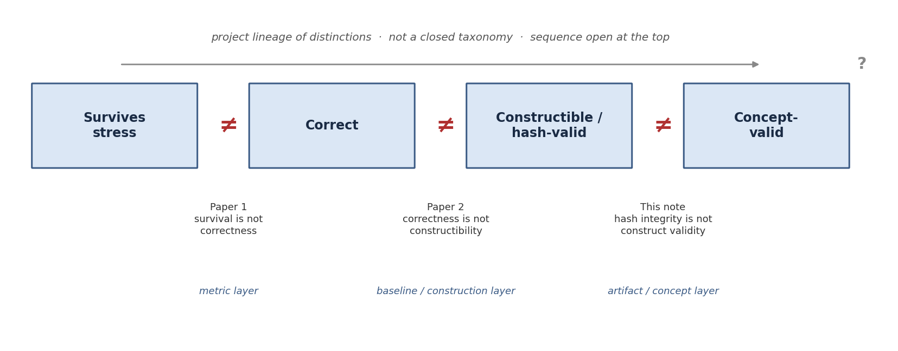
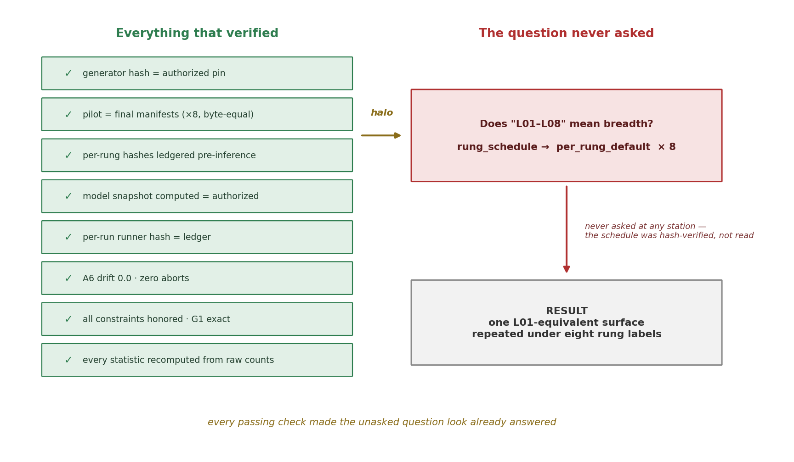
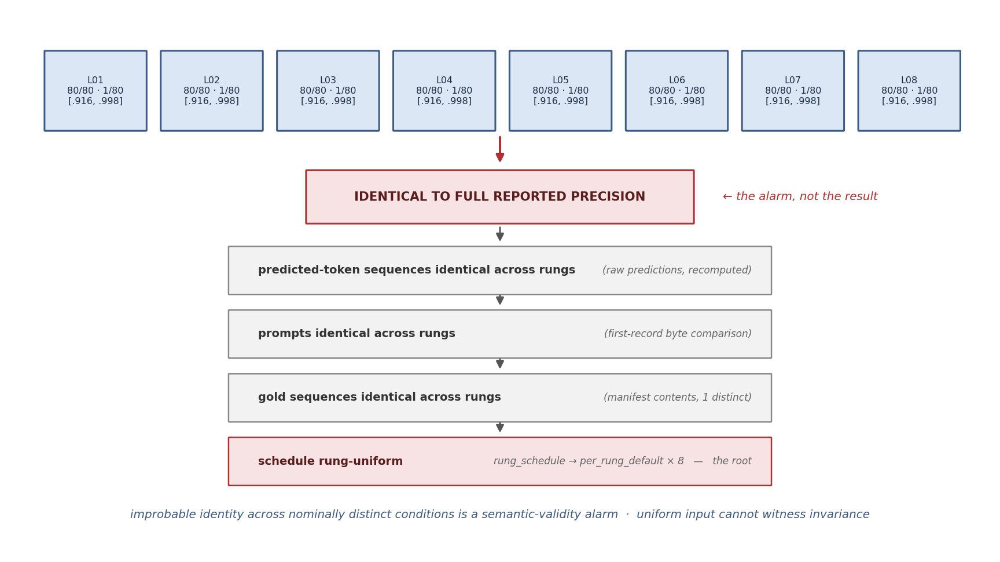
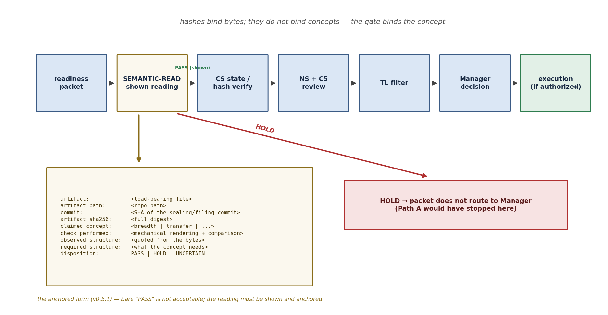

# Hash Integrity Is Not Construct Validity: Semantic-Read Requirements for Model-Facing Evaluation Artifacts

E. A. Flores · Apiana AI, Inc.

v0.7.2. River and Canyon program. Standing governance note of the behavioral stress-metrology series; methodological companion to *Survival Is Not Correctness* (Paper 1), *Correctness Is Not Constructibility* (Paper 2), and *Certification Before Retention* (Paper 3). Drafted by New Senior Engineer under Team Lead direction; review: Contributor 5 (claim risk), Contributor 6 (lineage and prior art), CS (artifact references), Team Lead filter, Manager acceptance.

**Status: Standing governance note / methodological note / claim-ledger support artifact.** This is not Paper 4, not a publication-ready paper, and not an established external contribution. It is paper-formatted by design so that, if additional cases later earn it, promotion to a methods paper should require no structural rewriting — but would require related-work expansion and additional evidence (§8), and is not implied to be paper-ready now. This note makes no model-behavior claim. It certifies nothing, measures nothing, and authorizes nothing: no model-facing execution, no schedule v2 drafting or supersession, no breadth rerun, no Path B or Path D execution, no additional token-prior generations, no quantization stress, no INT8/INT4, no candidate selection, ranking, or threshold work, no certification evaluation, no Claim C activation, no public benchmark packaging, no funder-facing release, no SBIR submission.

**Revision note (v0.7.2).** Cures the CS Item-3 HOLD finding on v0.7.1: CS received the Markdown and figures as flat siblings (the chat-interface per-file download channel does not preserve directory structure), so the v0.7.1 sentence "the asset layout of the delivered bundle and workspace now conforms" asserted conformance over a transport it had not verified — a location claim extended to a channel. Correction, with destination decided by Manager (GitHub): the `figures/` subdirectory convention is retained as the convention of record, because git checkouts and GitHub rendering preserve directory structure and resolve the relative paths natively. **Supported transports for the raw Markdown are: a git checkout, and the structure-preserving zip bundle. Per-file downloads flatten directory structure and are not a supported transport for the md+figures pair; the PDF is self-contained under every transport.** No body text, figure, path, claim, or authorization changed in this revision; the only change is this corrected statement. v0.7.1 (`92a9bbf2…5b3a`, retained): CS filing patch + accepted sharpeners (Team Lead direction on CS review of v0.6; direction authorized v0.6.1, but v0.7 from the parallel C4 stream had already superseded v0.6 — the patch is applied to head as v0.7.1 to keep the lineage linear; Team Lead to confirm the designation). Figure-path fix: the preferred option — figures as a `figures/` subdirectory beside the Markdown — is the convention of record; the Markdown paths were already `figures/fig*.png` and the asset layout of the delivered bundle and workspace now conforms, so raw Markdown renders the figures without modification. Optional sharpeners applied verbatim: S1 (downstream verification success) and S2 (absence-failure mode) at the end of §5; S3 (non-renderable artifact clause) in §6. §3 clarity edit applied with the composition byte-verified against the raw prediction files (96 candidate + 96 TP per rung, identical across all eight, totals 768+768=1,536). No claim change; no authorization change; protected elements byte-verified unchanged. v0.7 (`026755c4…90ce`, retained): Tone and scope polish per the C4 review (ACCEPT WITH MINOR REVISIONS; Team Lead direction): §1 reframed as governance infrastructure — the note presented as a governance-level companion to Papers 1–2, not a peer-level installment; strong sequence language ("one layer upstream", "recurring at each step") removed throughout, including the Figure 1 in-image annotation strip and caption (the only figure change, taken under the direction's §6 caption-adjustment clause); rhetorical phrasing dried in §§4, 6, 9; the §4 anatomy condensed with station-level analysis consolidated in §5. All binding elements unchanged; no claim change; no authorization change. v0.6 (`af5c9b48…fb78`, retained): Figure-embedded final-review edition: Figures 1–4 (house style) embedded at §§1, 2, 4, 6 with numbered captions; the Figure 3 caption carries the M3 false-negative guard and the E1 negative-use restriction so the figure cannot be lifted without them; Figure 4 shows the anchored nine-field form. Declared repair: four cross-references left stale by the v0.4 section renumbering corrected (§2 gate pointer §5→§6; §2 mechanism pointer §§4 and 6→§§4 and 7; §4 gate pointer §5→§6; reference [4] D0 pointer §7→§8) — numeral-only, not claim-relevant under the C5 stop-rule. No binding element changed. v0.5.1 (`b463123a…069a`, retained) was the narrow C5 cure: Narrow C5 cure (HOLD accepted by Team Lead, 2026-06-12): E1 — adjacent negative-use sentence placed at the §3 numeric report; E2 — citation-scope subordination sentence placed at the §3 standing sentences; E3 — Appendix A execution gloss corrected to the rung-uniform, single-surface form. Standing process rule adopted from the HOLD: **consolidation memos must enumerate all open review items by ID across referenced returns; incorporation by reference is not enumeration.** No claim change; no authorization change; all successor gates remain closed. v0.5 (`d87aee30…938b`, retained) was the Manager harmonization pass: Minor harmonization pass under Manager disposition of 2026-06-12 (PASS on C5 majors; HOLD for harmonization): (1) commit-specific anchoring fields — artifact path, commit SHA, artifact sha256 — added to the shown-read form and populated in the worked example; (2) triad / ascending-altitude framing softened per C4's standing warning; (3) the universal pipeline claim softened per C6 ("many … increasingly rely on"); (4) a traceability appendix of Path A governance anchors added, every value recomputed from repository or workspace bytes at drafting time. No claim change, no new argument, no new authorization. v0.4 (`ac1d5c6a…ce8f`, retained) was the C5 major-revision pass: Incorporates the C5 referee report (Team Lead direction, accepted): a new §5 analyzing why the existing validation corridor missed the schedule layer, with the configuration-versus-instrument-component classification correction and an open governance audit item (M1); the mechanical-rendering floor for the semantic-read gate (M2); the false-negative warning on the identity alarm (M3); a required related-work TODO pending C6/CS citation verification, and the corrected naming of the detection-signature contribution (M4); softened etiology for the label drift (M5); the cost and gate-fatigue acknowledgment (M6); and softened promotion language (M7). Non-claim and no-authorization blocks unchanged. v0.3 (`bfc5d4db…f30d`, retained) recast to house paper format; v0.2.1 reflow; v0.2 paper structure; v0.1 original. Referee disposition of record: PASS as governance note; PROMISING as future paper seed; MAJOR REVISIONS REQUIRED before any external promotion — this is an internal, non-blind review and does not substitute for external review.

## Abstract

In instrumented model-evaluation pipelines, artifact integrity does not guarantee construct validity: a path/hash-valid artifact may fail to instantiate the experimental concept it is named for. We report a case from this program — Path A (rung-uniform) — in which a fully hash-disciplined run (pinned generator, two-pass materialization, pre-inference hash recording, faithful execution, zero aborts) was construct-invalid: the sealed schedule mapped eight rung labels to one structure, so a run named "L01–L08 breadth" measured one L01-equivalent surface eight times. We split the resulting claim into a pipeline-local finding, an analytic principle (a hash binds bytes, not concepts), and an adopted governance rule (a *shown* semantic-read of load-bearing artifacts before any model-facing execution). We name and operationalize, for this governance setting, a detection signature — improbable identity across nominally distinct conditions is a semantic-validity alarm (sufficient to trigger review, not necessary for mismatch) — and a naming mechanism that places a result's qualifier inside its citable name. We recommend, without deciding, a D0 pre-gate for certification frameworks: verify the test object instantiates its named construct before evaluating any model against it. This note makes no model-behavior claim.

## 1. Position in the metrology series

This program treats stress-retention evaluation as a measurement problem. Two prior distinctions govern the interpretation of model-evaluation outcomes. *Survival is not correctness* (Paper 1): a component that still emits under stress is not thereby emitting correctly — a metric-layer rule. [1] *Correctness is not constructibility* (Paper 2): surface correctness on a composite is not evidence that the construction isolates the intended operation — a baseline/construction-layer rule. [2]

The present note adds a companion distinction at the artifact/concept pairing: **hash integrity is not construct validity.** A path/hash-valid artifact — identity-verified, provenance-bound, mutation-proof — can fail to instantiate the concept it is named for. The distinction is adopted here as a standing governance rule and methodological infrastructure. This note sits alongside the project's earlier distinctions as a governance-level companion. Papers 1 and 2 address interpretation of model-evaluation outcomes; this note addresses a pre-execution artifact-governance failure. The sequence is useful project lineage, not a closed taxonomy and not a claim that this note is a peer-level model-behavior paper.



**Figure 1.** Project lineage of distinctions: survival is not correctness (Paper 1, metric layer); correctness is not constructibility (Paper 2, baseline/construction layer); hash integrity is not construct validity (this note, artifact/concept layer; governance-level companion). Lineage, not a closed taxonomy.

## 2. Background: artifact integrity versus construct validity

Construct validity is a long-established concept (Cronbach & Meehl, 1955, and the literature descending from it). [3] This program did not discover it and claims no priority on the idea that a measure can fail to measure its construct. What is newer is the setting. Many modern evaluation pipelines increasingly rely on software-engineering integrity practices — content-addressed artifacts, cryptographic pinning, provenance chains, signed lock events — and that reliance is good: it eliminates tampering, drift, and silent mutation. But hashing is content-addressing. It certifies identity and non-mutation and is, by construction, indifferent to meaning. Psychometrics' *validity* culture — the discipline of asking whether the measurement object instantiates the construct it names — has no default seat in such pipelines.

The hazard this note names arises from that asymmetry. **Integrity discipline can create a verification halo: a fully verified artifact radiates legitimacy onto an unread concept.** Every passing check makes the unasked question — *does this object mean what its name says?* — look already answered. The tooling that prevents tampering can, by its thoroughness, camouflage misnaming. The contribution of this note is correspondingly narrow: an operational semantic-read gate for hash-disciplined model-evaluation pipelines (§6), with a required evidentiary form, plus the detection signature and naming mechanism of §§4 and 7.



**Figure 2.** The verification halo in the Path A (rung-uniform) case. Every integrity check on the left genuinely passed; the question on the right was never asked at any station, because the schedule was classified as configuration (§5). The figure documents an unread concept, not any model behavior.

## 3. Case: Path A (rung-uniform)

The case is citable only under its designator and binding characterization: *under the sealed rung-uniform schedule, the instrument did not attach any elimination label under the active six-criterion set for an L01-equivalent surface repeated under eight rung labels.*

The program authorized an eight-rung breadth run (L01–L08, token-prior control active, 1,536 inferences) against a sealed instrument whose every component was hash-bound: oracle table, bounds, schedule, manifests, generator, runner, model snapshot, decoding configuration. Execution was faithful at every layer. The materialization chain — pinned generator; pilot and final manifest passes byte-equal; per-rung hashes recorded in the ledger before inference; zero drift on re-verification — functioned exactly as designed, and post-run byte verification recomputed every artifact hash and every decision-bearing statistic from raw counts, all exact. The eight per-rung result blocks were identical to full reported precision: candidate 80/80, control 1/80, the same Newcombe–Wilson interval, eight times. These levels are reproduced solely as the identity alarm; negative-use only; they license no capability, robustness, stability, breadth, certification, or model-behavior statement.

The identity was the alarm. Recomputation from raw files revealed identical gold sequences across all eight rung manifests, identical prompts, identical predicted-token sequences — and finally the root, in the sealed schedule itself: its rung mapping assigned every label L01–L08 to one default structure. The seal defined no breadth. The 1,536 nominal inferences contained 192 distinct input–output pairs (96 candidate + 96 TP control, identical across all eight labels), genuinely executed eight times over (elapsed-time ratios against the prior run confirm real inference rather than copying). The run was held at verification, recharacterized by Manager disposition, and closed as a schedule-layer finding.

The three standing citable sentences for the case: (1) Path A (rung-uniform) showed that, under the sealed rung-uniform schedule, the active six-criterion instrument attached no elimination label to an L01-equivalent surface repeated under eight rung labels. (2) The episode exposed a semantic mismatch between the L01–L08 label and the sealed schedule bytes. (3) Breadth is untested under the current sealed schedule. For citation scope, this section's operational detail is subordinate to §11: only the designator, the binding characterization, and the three standing sentences in this section may be cited.

## 4. The failure mode and its anatomy

The claim splits three ways, with three scopes that must never fuse.

**Finding** *(demonstrated in this pipeline)*. A hash-perfect, provenance-perfect, execution-faithful run was construct-invalid. Demonstrated here; one case.

**Principle** *(analytic; general by definition)*. A hash binds bytes; it cannot bind the concept those bytes are claimed to instantiate. This is general because of what a hash *is* — content-addressing — not because of anything this program observed.

**Governance rule** *(adopted for this program)*. Model-facing readiness requires a shown semantic-read of load-bearing artifacts before execution (§6). Adopted here. Operational generality beyond this pipeline remains a hypothesis — plausible, untested, and not claimed.

The failure, stated procedurally: the label "L01–L08" carried semantic freight not instantiated by the sealed schedule (the etiology of that freight is not narrated beyond the record; intent claims would require design-trace evidence); the seal's rung mapping was uniform; and the gap surfaced only when improbable result-identity forced a reading of the conditions. Why pre-execution review did not surface it is analyzed in §5.

**Detection signature** *(reusable heuristic)*. Improbable identity across nominally distinct conditions is a semantic-validity alarm. Path A's identical per-rung blocks did not prove robustness or stability; they triggered the investigation that exposed the rung-uniform schedule. The general form: when k nominally distinct conditions return statistically improbable sameness, the result is evidence about the *conditions* before it is evidence about the *subject*. Uniform input cannot witness invariance. The alarm is inexpensive to apply — it requires only computing how surprising the observed sameness would be if the conditions were as distinct as their labels claim — and it converts the misreading most likely in practice ("consistent across all conditions") into the trigger for reading the conditions. **The warning that travels with it:** failure to observe exact identity does not prove semantic validity. Partial degeneracy, stochastic decoding, prompt variation, or output noise can hide construct invalidity behind superficially varied results. The identity alarm is *sufficient to trigger* semantic review, not *necessary to establish* semantic mismatch; no "no alarm, therefore valid" inference is permitted.



**Figure 3.** The detection signature as it fired: identical per-rung blocks were the alarm, not the result, and recomputation drilled from predictions to prompts to golds to the rung-uniform schedule root. The alarm is sufficient to trigger semantic review, not necessary to establish mismatch — absence of exact identity does not prove semantic validity. The numeric levels shown are reproduced solely as the identity alarm; negative-use only.

## 5. Why the existing validation corridor missed it

The harder question the case forces, and the most important revision of this note: this program already operated an unusually heavy validation battery — a standing pre-lock instrument-validation addendum (ideal-witness checks, degeneracy audits, control-semantics review, requirement inheritance), a joint lock event, sealed hashes, and byte verification at every delivery. Why did none of it catch a rung-uniform schedule?

The answer is a classification defect, not a diligence defect. **The schedule was treated as configuration rather than as an instrument component requiring semantic validation.** The pre-lock battery pointed its semantic attention at the components classified as behavior-facing — criteria, controls, oracle cases, bounds, manifests-as-built — and validated them deeply. The schedule entered the seal as an *input to materialization*: its bytes were hashed, its lock event was co-signed, its conformance was checked at run time — and its concept was never read, because nothing classified it as the kind of object whose concept needed reading. Every station inherited the classification.

The correction is therefore twofold, and the note must not present it as only the first: (1) a **new gate** — the shown semantic-read of §6 — and (2) a **scope correction to existing validation**: any artifact that carries an experimental concept must be classified as a load-bearing instrument component, subject to the pre-lock battery's semantic discipline, not as inert configuration. Under this correction the schedule would have been an A1-class validation subject from the start, and the rung-uniform mapping would have been a pre-lock finding rather than a post-execution one. The drift was a gap, not a corrupt file: bytes can be verified, but absences of instantiation must be asked for. The gap closed only because a downstream verification layer recomputed from raw artifacts and caught what the upstream authorization layer had not asked.

**Open governance audit item (recorded, not answered here):** what other artifacts currently share the schedule's validation classification? Candidate objects for the audit include prompt templates, scorer configurations, decoding configurations, generator parameter sets, stratification and control definitions, and any future stress-rung specifications. The audit is a governance task for the chain; this note records the question and deliberately does not answer it casually.

## 6. The governance rule: shown semantic-read before execution

The adopted gate: before any model-facing packet routes to Manager, every load-bearing artifact receives a semantic-read answering the question — **does the artifact actually instantiate the concept named in the memo?** A PASS is valid only when the reading is shown. The required form, with the worked example that would have prevented the case:

```text
artifact:                 STRATIFIED_RECIPE_SCHEDULE.json
artifact path:            experiments/2026-06-11_lane-1a-prime/validation/
                          STRATIFIED_RECIPE_SCHEDULE.json
commit:                   5a12ee8 (joint lock event v0.2)
artifact sha256:          7ad3ccddecd070074e666ffaf2178aa0afd3cfda78fc08ef375fe68a907130c5
claimed concept:          L01–L08 breadth
semantic check performed: rendered schedule and compared rung structures
observed structure:       one distinct structure repeated under eight labels
                          (rung_schedule → per_rung_default × 8)
required structure:       declared per-rung structural variation
disposition:              HOLD
```

The three anchoring fields — artifact path, commit SHA, artifact sha256 — are required, not optional: without them the reading is shown but not anchored, and a shown-but-unanchored reading cannot be re-verified against the exact bytes it claims to have read.



**Figure 4.** The semantic-read gate in the model-facing corridor, with the anchored nine-field shown-reading form and the HOLD branch. A bare PASS is not acceptable; the reading must be shown and anchored. Path A would have stopped at this gate.

A bare `PASS — concept instantiated` is not acceptable; it reproduces the halo the gate exists to dispel. The three dispositions are PASS (committed bytes instantiate the claimed concept, reading shown), HOLD (they do not), and UNCERTAIN (requires CS artifact clarification before routing). Trigger vocabulary, non-exhaustive: breadth, transfer, certification, stress, retention, constructibility. For each, the packet must answer: *which committed artifact makes this concept true, and does it.*

**The mechanical-rendering floor.** Where the artifact admits a mechanical rendering, that rendering is the *floor* of the semantic-read, and interpretive prose may supplement but never replace it. For schedules: render the instances, count distinct structures, compare observed distinctness to claimed distinctness — three operations a script can perform and a reviewer can audit. The `semantic check performed` field must state the mechanical basis where one exists; a purely interpretive reading of a mechanically renderable artifact is itself a gate deficiency. If a load-bearing artifact admits no mechanical rendering, that fact must be recorded in the shown-reading form; non-renderability is not a license for unsupported prose. This floor is what prevents the semantic-read from becoming another unchecked judgment layer — a prose ritual radiating the same halo it was built to dispel.

**Cost, acknowledged.** Semantic-read adds review time to every model-facing packet, and any mandatory artifact can become ritualized if implemented as boilerplate. The mitigation is built into the floor above: the shown-reading artifact must be mechanical where possible, brief, and auditable — a six-line form backed by a rendering, not an essay. The rule adds cost; the case documents the cost of its absence.

## 7. The designator mechanism

**Put the qualifier inside the result name.** The Path A result is citable only as *Path A (rung-uniform)* — the qualifier is part of the name, not optional commentary. A result that cannot be cited without its own caveat cannot drift: every future table row, figure caption, and summary sentence carries the correction by construction. A companion presentation rule follows from the case: one surface = one row; a result measured on one surface may not be displayed across an axis of labels except to document the label defect itself. The mechanism is small, general, and recommended for any held or recharacterized result.

## 8. Implications for certification before retention, and the related-work boundary

For Paper 3's certification window [4], this note recommends — and does not decide — a pre-gate logically prior to D1–D7:

```text
D0 — test-object semantic validity:
  Before D1–D7 certification evaluation, verify that the test object instantiates
  the construct it is named to measure.
```

The logic is one sentence: certification of a model against a construct-invalid instrument certifies nothing, so D0 is prior to the entire window. Any structural change to Paper 3 routes separately through Senior / New Senior review; nothing here amends the paper.

**Required related-work TODO (blocking for any external promotion; non-blocking for governance use).** Before this note may be promoted beyond internal governance, its prior-art boundary must be expanded and verified by C6 and CS across, at minimum: verification versus validation (the classical V&V distinction); construct validity in evaluation; measurement modeling in machine-learning evaluation; reproducibility beyond artifact availability; pseudo-tested code — tests that pass without testing the intended behavior, the software-engineering analog of the halo; and artifact validity in design science. Until those citations are verified, this note's lineage section (§2) cites only the foundational construct-validity source, and the detection signature is presented as named-and-operationalized for this governance setting, not as a general invention.

**Future possible validation (recorded, not authorized).** An external referee would likely require a seeded-defect exercise — deliberately mis-paired artifacts and concepts, offline and model-free — to estimate the gate's operating characteristics. That exercise is recorded here as future possible validation requiring a separate Manager decision; it is not authorized by this note, and no operating characteristics are claimed without it.

## 9. Tradeoff and forward pressure

The tradeoff: writing this note deferred the next run; the cost is calendar time; the benefit is a standing semantic-read gate that prevents execution against a misnamed object. The forward pressure: the program holds several methodological results and no seam evidence. The choice among Path B (pattern replication), Option S (schedule supersession), Path D (stress-prerequisite taxonomy), and consolidation remains open and is the Manager's.

## 10. Analogy note (mechanism first)

In mechanism terms, fully stated before any analogy: the execution was faithful to the committed schedule, and the committed schedule did not instantiate the claimed breadth construct. Only then, as teaching: the river followed the carved path perfectly; the map said the path crossed eight channels; the canyon floor showed one channel under eight signs. The labels were not the structure. Analogy is not evidence.

## 11. Non-claims and locks

This note makes no model-behavior claim: it establishes no capability, no incapability, no breadth behavior, no certification readiness, no retention property, no Claim C progress, no seam evidence. Its subjects are the artifact layer and this program's process. The Path A case may never be cited as a breadth, robustness, or certification result — and never over-read negatively as breadth having failed; the only citable forms are the designator, the binding characterization, and the three standing sentences of §3. The note's referee status is part of its record: internal non-blind review only; not external-paper ready; the §8 related-work TODO and the unexercised gate (no operating characteristics) are open boundaries. The finding is one case in one pipeline; the rule's external generality is a hypothesis. The §1 sequence is open and extends the project's distinctions; it is not a closed taxonomy, and this note is a governance rule, not a peer-level model-behavior result.

This note does not authorize: model-facing execution; schedule v2 drafting; schedule supersession; true breadth rerun; Path B execution; Path D execution; additional token-prior generations; scrambled-binding generations; quantization stress; INT8/INT4; candidate selection; ranking; threshold work; certification evaluation; Claim C activation; public benchmark packaging; funder-facing release; SBIR submission.

The program's standing commitments hold: gate failure is valid output; a failed validation is an instrument result, not a project failure; and this note retains its negative-result form — if no further cases arrive, it remains a single-case governance note and is never promoted.

## Appendix A — Path A (rung-uniform) traceability anchors

Traceability only; this appendix introduces no claim and no authorization. Every sha256 below was recomputed from repository or workspace bytes at the time of this revision; commit SHAs are from the repository of record (`eaflores805-Apiana/river-and-canyon`).

```text
SEALED SCHEDULE (the artifact of the case)
  path:    experiments/2026-06-11_lane-1a-prime/validation/STRATIFIED_RECIPE_SCHEDULE.json
  sha256:  7ad3ccddecd070074e666ffaf2178aa0afd3cfda78fc08ef375fe68a907130c5
  commit:  5a12ee8  (joint lock event v0.2 — the seal that defined no breadth)

EXECUTION
  commit:  70b461d  (Path A executed under eight rung labels, TP active; rung-uniform, single-surface outcome)

CLOSE-OUT DOCUMENTS OF RECORD (all filed at commit 21ca0c9)
  TL close-out packet:
    path:    governance/2026-06-11_lane-1a-prime/TL-PATH-A-RUNG-UNIFORM-CLOSEOUT-PACKET-v0.1.md
    sha256:  911b44c7cccc7e67b39b0c7d01492896b9d3cf55784a3b8e699a8726a15211cf
  Manager close-out acceptance:
    path:    governance/2026-06-11_lane-1a-prime/MANAGER-PATH-A-RUNG-UNIFORM-CLOSEOUT-ACCEPTANCE-v0.1.md
    sha256:  afc459d62c0f3762fbbabbc53859e2c3f01b541931034e899e68ab667f147ff5
  CS filing return:
    path:    governance/2026-06-11_lane-1a-prime/CS-PATH-A-CLOSEOUT-FILING-RETURN-v0.1.md
    sha256:  bc78fce8ee9a4cab95bfe657eec9c4d9240ded95df3f19315603e57a99f9c5c4

NS ADVISORY MEMOS (workspace library; carried into the documents of record above)
  byte-verification HOLD memo:  NEW-SENIOR-PATH-A-RUN-BYTE-VERIFICATION-v0.1.md  02df9835…
  HOLD disposition memo:        NEW-SENIOR-PATH-A-HOLD-DISPOSITION-v0.1.md  d12eb40d…
  close-out verification:       NEW-SENIOR-PATH-A-RUNG-UNIFORM-CLOSEOUT-VERIFICATION-v0.1.md  340a0338…
  readiness packet v0.2:        LANE1A-PRIME-PATH-A-READINESS-PACKET-v0.2.md  29cbf426…
```

## References

[1] Flores, E. A. *Survival Is Not Correctness: A Staged, Fail-Closed Metrology Protocol for Stress-Retention Evaluation.* Apiana AI, Inc., 2026. (Paper 1, this series.)

[2] Flores, E. A. *Correctness Is Not Constructibility: Pre-Stress Baseline Mapping for Behavioral Stress Metrology.* Apiana AI, Inc., 2026. (Paper 2, this series.)

[3] Cronbach, L. J., and Meehl, P. E. Construct Validity in Psychological Tests. *Psychological Bulletin* 52(4), 281–302, 1955. Cited as the foundational statement of construct validity; this note claims no priority on the concept and contributes only an operational semantic-read gate for hash-disciplined evaluation pipelines, plus the verification-halo hazard observed in this program.

[4] Flores, E. A. *Certification Before Retention: A Fail-Closed Protocol for Qualifying a Single-Hop Baseline as a Strict-Correctness Retention Substrate.* Apiana AI, Inc., 2026, v1.1. (Paper 3, this series.) The D0 recommendation of §8 addresses this protocol's certification window and routes separately.

© 2026 E. A. Flores, Apiana AI, Inc. Licensed under CC BY-NC 4.0 (https://creativecommons.org/licenses/by-nc/4.0/).
