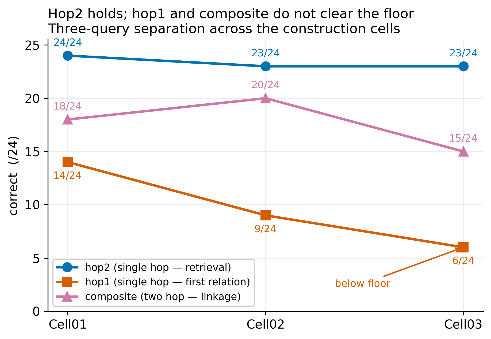
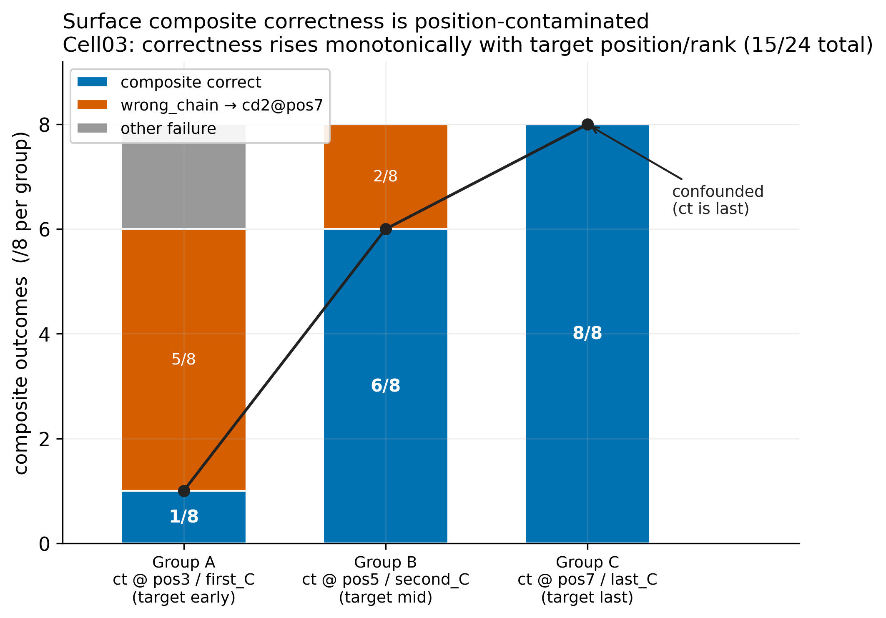
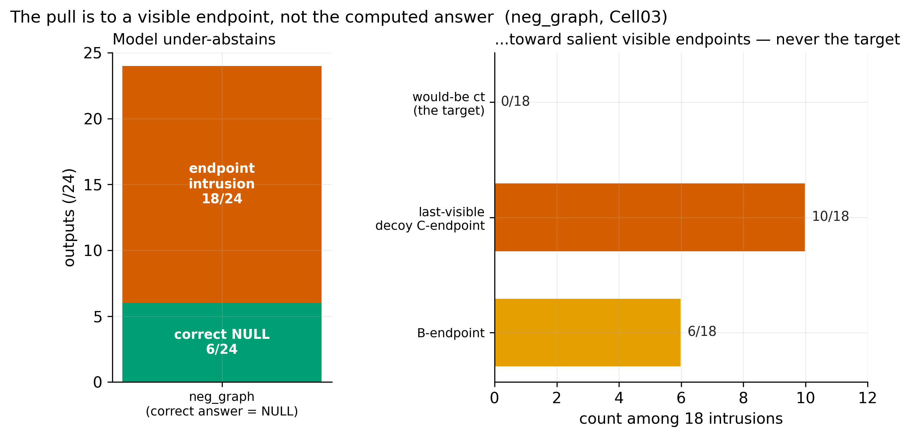
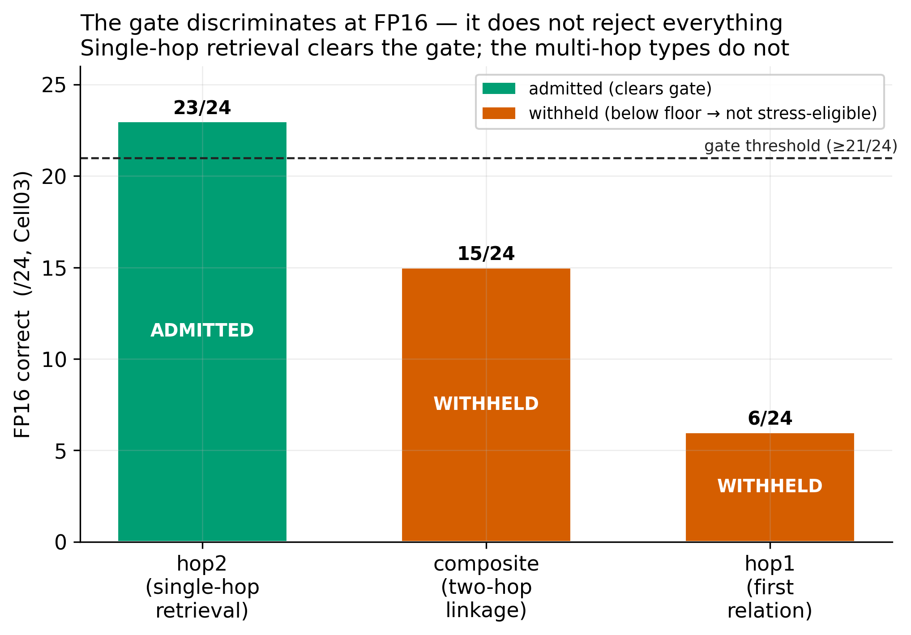

# Correctness Is Not Constructibility: Pre-Stress Baseline Mapping for Behavioral Stress Metrology

**E. A. Flores** · Apiana AI, Inc.

**Release candidate.** River and Canyon program. Companion to *Survival Is Not Correctness: A
Staged, Fail-Closed Metrology Protocol for Stress-Retention Evaluation* (Paper 1). Experimental values and
artifact hashes are attested from the locked run records and listed in Appendix B; CS independently recomputed them for the freeze/tag pass.

---

## Abstract

Behavioral stress metrology — measuring which capabilities a model retains under compression such as INT4 quantization —
presumes a trustworthy full-precision baseline. Paper 1 argues that stress-retention is uninterpretable unless the FP16
baseline is clean, and specifies fail-closed gates that withhold a result otherwise. That argument leaves one thing
unshown: that the baseline gate is ever *binding* rather than merely conservative. This paper supplies the demonstration.

In a Two-Hop Level-1 closed-world construction at 3B FP16, surface composite accuracy (15/24) appears to indicate partial
competence. A per-group decomposition shows otherwise: composite correctness rises monotonically with the (co-varying)
absolute-position / rank axis of the target endpoint — 1/8 when `ct` is at pos3, 6/8 when `ct` is at pos5, and 8/8 when `ct` is at pos7, while a pure last-position shortcut predicts 0/0/8. Surface
correctness therefore cannot be read as evidence of the intended two-hop operation. We are careful about the converse: we
do **not** claim the model failed to perform it. We show the metric cannot distinguish the intended operation from
shortcut-aligned correctness — which is exactly the
condition the baseline gate exists to catch. We further find a *component* sub-task below the constructibility floor, so
linkage cannot be isolated at all in this construction; the baseline carries two independent defects, not one. As a
control within the same instrument, single-hop retrieval (the hop2 query) is near-ceiling at FP16 and clears
the gate while the multi-hop types do not, showing the gate discriminates rather than rejecting everything. The hop2
result is an internal FP16 gate-discrimination control, **not** a certified stress target; any future stress run on hop2
requires a hop2-specific shortcut/position probe. No compression rungs were run on this construction; we make no
retention-under-stress claim.

The contribution is a worked constructibility map: diagnostic case evidence from one small, closed-world 3B construction that illustrates why the gate must exist. Paper 1
says survival under stress is not correctness; this paper adds that **surface** correctness is not constructibility, and
that baseline accuracy must be verified as *operationally performed* before any compression-retention claim is made. We do
not claim this holds across all tasks or models; we show what an unclean baseline looks like when decomposed, and why the
gate must withhold it.

---

## 1. Introduction

A growing line of work treats compression — quantization, pruning, distillation — as a behavioral stress test: hold the
task fixed, vary the precision, and read off which capabilities degrade. The implicit contract is that the full-precision
run is the reference against which degradation is measured. If the reference is itself untrustworthy, every downstream
retention number inherits that untrustworthiness.

Paper 1 formalizes one half of the threat: a *wrong* answer can survive compression, so agreement between FP16 and INT4
outputs does not imply preserved capability — it may be preserved error. Its remedy is a staged, fail-closed protocol
that separates baseline correctness, stressed correctness, and same-error identity, and that withholds any seam-directed
stress result when the FP16 baseline does not clear a constructibility gate.

This paper addresses the other half, and the one most easily overlooked: the FP16 baseline can be *correct* without the
intended operation having been performed. Surface accuracy at full precision can be inflated by task geometry — the
arrangement of distractors, positions, and answer tokens — so that a model scores well by a shortcut that coincides with
the correct answer. If such a baseline were admitted as "clean," a subsequent compression study would be measuring the
retention of a shortcut, not of the capability the study claims to be about.

We make this concrete. Across a three-cell lineage of a Two-Hop Level-1 closed-world task at 3B FP16, we map what an
*unclean baseline* actually looks like when it is decomposed carefully rather than summarized by an aggregate score. The
map is the result. It shows that the baseline gate of Paper 1 catches real, structured defects, and it shows precisely
which defects.

**Claim status (stated up front).** This paper supports one empirical claim — that the constructibility floor of this
construction is a structured, bounded, mappable failure surface at 3B FP16, and is not cleared (Claim B). It makes **no** claim about
compression-induced degradation of composition (the "seam," Claim C); that line is blocked at the baseline and is not
reached here. It makes **no** mechanistic claim about why the model behaves as it does. All findings are behavioral.

---

## 2. Background and relationship to Paper 1

The two papers are one research line in two layers. Paper 1 is *Survival Is Not Correctness: A Staged, Fail-Closed
Metrology Protocol for Stress-Retention Evaluation*; this paper is its evidence companion.

> **Paper 1 (protocol):** *Why* stress-retention metrics need gates. Survival under stress is not correctness.
>
> **Paper 2 (this — evidence):** *What* the FP16 gate actually catches in a controlled construction. Correctness at
> baseline is not constructibility.

Paper 1 is a measurement contract. Its central instruments — dual scoring (strict format compliance vs. content
retention), fail-closed gates, and a same-error identity check — are taken as given here and summarized in §3.2. Paper 1
reports that its seam-directed line was withheld at FP16: the instrument correctly produced no INT8/INT4 composition
result because the baseline never qualified. That is a null with a reason, and a reader is entitled to ask whether the
reason is real or whether the gate is simply over-cautious bookkeeping.

This paper answers that question. The per-group gradient in §4.3 is a case where the gate is *binding*: a baseline that
an aggregate score would have admitted (15/24, well above chance) is shown by decomposition to be **operationally
non-identifying** — its surface correctness cannot certify that the intended operation was performed.
Without this demonstration, Paper 1's gate is an assertion; with it, the gate is shown to catch something a naive
baseline check would miss.

**Claim B vs. the seam.** This paper's result is **Claim B**: that the constructibility floor of this construction is a
stable, mappable object at 3B FP16. It is deliberately separate from the compression-stress measurement — the *seam*,
Claim C — which is gated on first obtaining a baseline that clears the floor. No cell here cleared it, so the seam is
neither measured nor claimed; a floor-clearing cell would be a separate unlock. Paper 1 supplies the measurement method
these cells use; this paper supplies the constructibility result built on it. (Single-hop retrieval, hop2, is the one
query type that clears the FP16 gate and the natural first candidate for any future stress run, but no compression rung
has been run on this construction.)

---

## 3. Method

### 3.1 Construction: Two-Hop Level-1 closed world

The task is a synthetic, closed-world two-hop linkage. Each item defines a small set of facts of two relation types and
asks one of four query types:

- **hop1** (single hop): given A, return A's B. The answer is a B-domain token (`bt`).
- **hop2** (single hop): given B, return B's C. The answer is a C-domain token (`ct`). hop2 is a query type *within* each cell, not a separate key-value task.
- **composite** (two hops): given A, return the C reached via A→B→C. The answer is `ct`.
- a **negative-graph** (`neg_graph`) control: a query whose correct answer is NULL because the linking fact is absent;
  used to measure unwarranted endpoint emission.

The closed world is deliberate: every candidate answer is present in context, so a failure is a selection/linkage
failure, not a knowledge gap. The central object of study is the **constructibility floor** — the minimum conditions
under which a clean two-hop probe can exist at all, prior to any compression stress.

Cells 01–03 form a lineage in which successive construction artifacts were identified and removed. All three use a
three-chain, seven-fact layout with 24 items at 3B FP16 (Qwen2.5-3B-Instruct, deterministic greedy decoding). **Cell01**
is a mixed-position baseline: the target endpoint `ct` is placed early/middle/late (pos2/pos4/pos6) in three sub-groups of
eight, with no adjacency manipulation and no C-rank balancing. **Cell02** tests the position/ordering hypothesis by
fixing the target endpoint to a single position for all 24 items. Cell02 places `ct` uniformly at pos6 (second-to-last), while `cd2`, not `ct`, occupies pos7, the final
context position; the historical "ct-last" label is therefore a misnomer. It does not disentangle cues:
with `ct` pinned to one position it simultaneously fixes adjacency, position, rank, and answer-domain cues at once. **Cell03** is the controlled cell and the focus of
the quantitative results: it breaks hop1→hop2 adjacency by interposition (gap = 2, all items) and balances `ct` across
absolute positions (pos3/pos5/pos7) and C-ranks (first/second/third) in three groups of eight. A consequence of the
Cell03 construction — important for interpretation and disclosed in §7 — is that the C-endpoints sit in rank order at
fixed positions, so for the target, **rank and absolute position co-vary**; the construction also fixes the second decoy
endpoint `cd2` at the last context position (pos7) in two of the three groups.

### 3.2 Instrument (from Paper 1)

We apply Paper 1's fail-closed instrument family and gate semantics. The Cell03 scorer instantiation includes the Gate 5
dummy-policy amendment recorded in the artifact record (amended scorer hashed below); the instrument family is otherwise
as specified in Paper 1:

- **Dual scoring.** Strict format/scaffold compliance is scored separately from content retention, so that a content
  failure is never laundered as a format issue or vice versa.
- **Fail-closed gates.** Gate 1 (format scaffold integrity), Gate 2 (baseline correctness threshold), Gate 3 (a
  diagnostic ceiling on specific failure classes), and Gate 5 (a deterministic-shortcut probe: a battery of rank- and
  position-indexed dummy policies whose maximum score bounds how far a context-blind shortcut could get). A cell that
  fails any binding gate is **not stress-eligible**; its result is a constructibility-boundary observation, not a
  retention measurement.
- **Intrusion taxonomy.** Every non-correct output is classified into a fixed top-level taxonomy
  (non_context_return, wrong_chain_selection, target_chain_wrong_neighbor; with abstention/NULL and an
  UNCLASSIFIED_OFF_FRAME residue tracked separately). Taxonomy *saturation* — all outputs classified, no new top-level
  class required, bounded UNCLASSIFIED — is the evidence that a floor is mappable rather than arbitrary.

Scorer and manifest hashes are recorded in the artifact record (amended scorer `sha256:b65c6803…`; Cell03 manifest `sha256:7d5099cb…`); they are
attested from that record and to be re-verified before submission.

> **On Gate 5.** Gate 5 bounds deterministic dummy-policy shortcuts; it does **not** prove endpoint anchoring is absent.
> Endpoint-return behavior remains a diagnostic signal tracked separately in the intrusion taxonomy and the negative-graph
> analysis (§4.4).

---

## 4. Results

### 4.1 The component pattern: hop2 holds; hop1 and composite do not clear the floor

Across Cells 01–03 the three answer-bearing query types separate cleanly (Figure 1; the neg_graph NULL control is treated in §4.4):

| Query type | Cell01 | Cell02 | Cell03 |
|---|---|---|---|
| hop2 (single hop) | 24/24 | 23/24 | 23/24 |
| hop1 (single hop) | 14/24 | 9/24 | 6/24 |
| composite (two hop) | 18/24 | 20/24 | 15/24 |




**Figure 1.** Hop2 holds; hop1 and composite do not clear the floor. Per-cell accuracy by query type (/24): single-hop hop2 stays at or near ceiling across the cells while hop1 declines (14→9→6) and composite is non-monotone. Connecting lines are visual guides across distinct construction cells, not a fitted trend or ordered stress variable.

hop2 is at or near ceiling throughout: basic single-hop retrieval of the second relation is intact. hop1 declines across
the lineage and is **below the constructibility floor** in Cell03 (6/24). Composite is non-monotone and, as §4.3 shows,
position-contaminated.

The Cell03 scorer amendment added Gate 5 dummy-policy logic and did not change the query-type accuracy/content scoring used
for this table; the Cell01/02 (scorer `060afad9`) and Cell03 (scorer `b65c6803`) query-type counts are therefore comparable
for the reported accuracy table (amendment-scope confirmation and its evidentiary basis in Appendix B).

The immediate consequence is a constraint on interpretation that we return to in §5: because a *component* hop (hop1) is
below floor, composite behavior cannot be attributed to the *linking* operation. A clean linkage measurement requires
its components to be constructible first; here one is not.

### 4.2 Format vs content failure

Gate 1 (format scaffold) passes in Cell01 (24/24 all query types) and Cell03 (0 format-scaffold failures across 96
outputs); Cell02 fails Gate 1 on a single hop2 item (i08, an isolated format-compliance loss), which makes Cell02's
downstream gates diagnostic rather than binding. Where Gate 1 holds, the residual failures are about content and selection,
not output shape. In Cell03, Gate 2 fails (composite below threshold → Branch 3, not stress-eligible; in Paper 1's branch vocabulary this is the same fail-closed withholding it reports as *Branch F / NOT FEASIBLE*); Gate 3's diagnostic
ceiling is exceeded by composite wrong_chain_selection (7/24 against a 3/24 ceiling); Gate 5 passes (max deterministic dummy 8/24),
confirming that the balanced design did not reintroduce a pinned rank/position shortcut at the dummy level. This Gate 5
pass does not remove the endpoint-return finding; it only rules out the tested deterministic rank/position dummy policies
as high-scoring explanations.

### 4.3 The constructibility-map result: surface composite correctness is position-contaminated

Decomposing Cell03 composite by group exposes what the aggregate hides:

| Group | target `ct` | composite correct | wrong_chain |
|---|---|---|---|
| A | pos3 / first_C (early) | 1/8 | 5/8 → `cd2@pos7` |
| B | pos5 / second_C (mid) | 6/8 | 2/8 → `cd2@pos7` |
| C | pos7 / third_C / last_C | 8/8 | 0/8 |
| **total** | | **15/24** | **7/24** |

(Group A's remaining 2/8 are both NULL abstentions, classified non_context_return — items i04 and i07; see Appendix B.
Groups B and C have no residual: 6+2 = 8 and 8+0 = 8.)



**Figure 2.** Surface composite correctness is position-contaminated (Cell03). A pure last-position shortcut predicts a step (0/0/8); the observed pattern is monotone (1/6/8). Group B (6/8, target mid, decoy still last) rules out a **pure** last-position shortcut, but does not prove the intended two-hop operation: its residual success could reflect the intended operation, a target-recency advantage, or another non-last-position cue (not distinguishable here). Non-identifiability, stated symmetrically.


Composite correctness rises monotonically as the target endpoint approaches the last context position: 1/8 → 6/8 → 8/8 (Figure 2).
All seven wrong_chain returns are the same token, the last-position decoy `cd2@pos7`. **The discriminating contrast is
A vs. B:** in both groups the last context endpoint is the decoy `cd2`, yet correctness rises from 1/8 to 6/8 when the
target moves from pos3 to pos5 — a rise a pure last-position shortcut cannot produce, since in both groups the last slot
holds the decoy, not the target. Group C, where the target itself is last, scores 8/8 but does **not** independently
identify the intended operation: there, the intended operation and a last-position preference both predict success. Group C therefore confirms
the alignment problem; the A-vs-B contrast is what rules out the pure shortcut.

The interpretation we draw is **non-identifiability, stated symmetrically** — the aggregate metric cannot separate
the intended two-hop operation from shortcut-aligned correctness, and the data rule out *both* extreme readings:

1. **Not an unconfounded two-hop measure.** Aggregate composite correctness (15/24) is not 15/24 instances of the intended operation: it co-varies with a
   property of the construction (target endpoint position/rank), so a "correct" answer can be shortcut-aligned rather
   than a product of the intended operation.
2. **Not a pure shortcut either.** A pure last-position shortcut predicts a *step* — **0/0/8** across Groups A/B/C (wrong
   wherever the last slot holds the decoy) — but the observed pattern is **monotone, 1/6/8**. As the A-vs-B contrast
   shows, Group B's rise to 6/8 constitutes positive evidence of success that cannot be explained by a pure last-position rule. That success
   could reflect the intended two-hop operation, a target-recency advantage, or another non-last-position cue; this design
   cannot distinguish those possibilities.
3. **Therefore the honest claim is metrological, not a capability verdict.** Group B (6/8) prevents a pure terminal-slot
   shortcut account from being sufficient, while the residual success remains non-identifying: the current metric cannot
   resolve whether it reflects the intended operation, a target-recency proximity, or another non-terminal-slot cue. The
   discipline: *correctness does not establish that the intended operation was performed* — nor does the gradient
   establish that it was not.

This is the binding case promised in §2. An aggregate baseline check would have admitted 15/24. The decomposition shows
that admitting it would have meant running a compression study on a baseline whose correctness is, in unknown proportion,
an artifact of where the answer sits.

Groups A/B/C contain eight items each. This decomposition is diagnostic case evidence from a fixed 24-item construction
(n=8 per positional group), not a statistical estimate of a model-general effect: the claim rests on the
construction-derived contrast between the pure last-position prediction 0/0/8 and the observed 1/6/8, and is the
non-identifiability of *this* baseline in this closed-world task geometry — not a population-level claim about the
prevalence of the observed gradient.

### 4.4 The pull is behavioral, not only a fixture

A natural objection is that the last-position effect is merely the `cd2@pos7` construction regularity. The negative-graph
control argues otherwise. On `neg_graph`, where the correct answer is NULL and the would-be target `ct` is absent from
context, the model nonetheless emits an endpoint in 18/24 cases (Figure 3). Of those 18 intrusions, **0 are the would-be `ct`**, 10
are the last-visible decoy C-endpoint, 6 return the target chain's B-domain token (`bt`), and 2 are other off-target endpoint emissions. The same
last-visible-endpoint pull appears *without* the `cd2@pos7` fixture and without the target being present at all. This
indicates the last-position/last-endpoint preference
is a behavioral tendency, partially de-confounded from the specific construction regularity, and it confirms that the
intrusions are not target-specific: the model emits a salient visible endpoint, not the computed answer. We scope this
precisely: it weakens **answer-domain salience as a context-independent attractor** (the model does not reach for `ct`
when `ct` is not visible). It does **not** resolve the within-context question — whether hop1 ct-anchoring, when `ct` *is*
visible, is driven by answer-role or chain-terminal role — which remains open. This reinforces the baseline-validity problem:
endpoint emission persists even when no target exists. Positive-query correctness therefore cannot be assumed to reflect
the intended linkage operation.




**Figure 3.** The endpoint pull is behavioral, not only a fixture. On neg_graph (correct answer NULL, target absent), 18/24 outputs still emit an endpoint; none is the would-be target, and the largest share is the last-visible decoy C-endpoint — the pull appears without the cd2@pos7 fixture and without the target present.

### 4.5 The floor is structured and mappable

All 288 outputs (96 per cell × 3 cells) are classified by the locked eight-class taxonomy; **no new top-level class was
required** across the lineage. This is not the same as "no unclassified outputs exist": four Cell03 outputs (hop1 only)
fell into the existing UNCLASSIFIED_OFF_FRAME class — a 1.4% rate overall (4.2% within Cell03, tripping a >2% watch
trigger) — all attributable to a single structural cause (a neighbor-proximity artifact), with no spread to composite or
neg_graph. Three failure classes are non-zero in every cell: non_context_return, wrong_chain_selection, and
target_chain_wrong_neighbor. On hop1, ct-anchoring appears in all three cells (hop1-only counts: 3, 11, 6); the same top-level failure class also appears in neg_graph through a distinct B-domain endpoint-return pattern (11, 1, 6) — two sub-patterns under one shared top-level label, not one behavior — yielding total target_chain_wrong_neighbor counts of 14, 12, and 12 across Cells 01–03. A
mappable, taxonomy-bounded failure surface — recurring classes, bounded and attributable residue, no taxonomy expansion — rather
than noise, is the positive content of Claim B: the constructibility floor of this construction is a structured, bounded, mappable failure surface
that can be characterized, even though no cell clears it.

---

## 5. The constructibility argument

Two independent defects keep this baseline from qualifying, and naming both is sharper than a single seam-shaped story.

**Defect 1 — a component is below floor.** hop1 at 6/24 means the first relation is not reliably retrieved in isolation.
Any composite behavior therefore cannot be cleanly attributed to *linkage*: a composite failure could be a hop1 failure
propagating, and a composite success could occur without the intervening token being correctly recovered. Linkage is not
isolable while a component is broken.

**Defect 2 — the composite metric is position-contaminated.** Even setting aside hop1, §4.3 shows composite correctness
tracks the target's position/rank axis, so the metric does not cleanly measure the linking operation.

Either defect alone would disqualify the baseline under Paper 1's gate; both are present. This is why the seam line (does
INT4 preferentially degrade composition?) is not merely *unrun* but *blocked on a precondition*: there is no construction
in this lineage where a clean two-hop baseline exists to be stressed. Reporting an INT8/INT4 composition result here
would have been the precise failure Paper 1 was built to prevent.

We emphasize the direction of the claim. The result is **"correctness does not establish that the intended operation was
performed,"** not "the intended operation did not occur." The construction cannot license the stronger statement, and we
do not make it.

---

## 6. Internal FP16 gate-discrimination control

A gate that rejects everything is not an instrument. The constructibility check earns its place because it also *passes* a
simpler task at FP16 — an internal control that sits inside the same instrument. The **hop2** query type is a single-hop
B→C lookup ("B maps to what?"). Across the three cells it is at or near ceiling at
FP16 (24/24, 23/24, 23/24) and clears the FP16 single-hop accuracy gate, while the multi-hop types (hop1, composite) do not.



**Figure 4.** The gate discriminates (FP16). Single-hop hop2 is admitted at near-ceiling accuracy while the multi-hop types are withheld; the gate is not rejecting everything. No compression rungs were run.

The same gate that withholds the two-hop baseline admits single-hop retrieval. The constructibility floor is therefore
**localized to the multi-hop query types**, not to retrieval in general.

The contrast is the point: "verify constructibility before stress" is convincing because the gate admits a near-ceiling
single-hop task while rejecting the multi-hop ones at full precision (Figure 4) — it is not trivially rejecting everything. That is
the difference between a cautionary tale and an instrument.

We are explicit about the boundary of this control. **No compression rungs were run on this construction** — INT8 and INT4 were
never executed because no cell became stress-eligible (no stress measurement was entered). The positive control therefore establishes
only that the gate admits a near-ceiling single-hop task at FP16; it does **not** establish that hop2 is robust under quantization.
We also bound the word *constructible* here: hop2's status rests on near-ceiling FP16 accuracy together with the fact that
the multi-hop position/endpoint contamination of §4.3 does not apply to a single B→C lookup — not on a separate
hop2-specific shortcut probe. By the same accuracy-is-not-constructibility logic this paper argues, certifying hop2's own
shortcut-freeness is a precondition for any future stress rung on it (§9), and we do not pre-suppose it here.
Any "retains under compression" reading is unsupported by the current artifacts and is not claimed here. Whether a
constructible task survives stress is the open question for a future stress phase (§9).

---

## 7. Limitations and disclosures

- **Position and rank co-vary.** In Cell03 the C-endpoints sit in rank order at fixed positions, so the target's
  absolute position and C-rank move together. The §4.3 gradient is therefore attributable to a single "last / highest-rank
  C-endpoint" axis; this construction cannot separate a position effect from a rank effect.
- **`cd2@pos7` is construction-fixed** in Groups A and B. The composite last-position effect is correspondingly
  confounded with that regularity; §4.4 (neg_graph) only *partially* de-confounds it.
- **hop1 below floor** is, for the constructibility argument, a finding (Defect 1); it is also a limit — it precludes any
  isolated linkage claim from this lineage.
- **Abstention is unstable.** The model over-abstains on hop1 (NULL returns among failures) yet under-abstains on
  neg_graph (18/24 intrusions). This NULL-calibration instability is real and unresolved; it is flagged as future work,
  not explained here.
- **Single model, single construction family.** All results are 3B FP16 on one task lineage (the hop2 single-hop control
  is a query type within the same cells, not a separate task). No generalization to other scales, architectures, or task
  families is claimed, and no compression rung was run on this construction.
- **Behavioral only.** No mechanistic claim is made; the generative analogy that motivated the program is a
  question-generator, not evidence about internal structure.
- **Thresholds are local; the gate layout is not the thresholds.** The fail-closed gate *layout* is portable as an
  evaluation discipline, but the threshold values used here are local to this construction, model scale, vocabulary,
  scoring contract, and task geometry. Portability of absolute thresholds across model families, scales, or task families
  is not established here and requires independent validation.
- **Provenance.** Per-cell hashes are attested from the artifact record and listed in full in Appendix B; CS independently recomputed them for the freeze/tag pass. Group-level composite figures are attested and artifact-backed; the Group A = 1/8 value, first re-derived
  from the published totals, is confirmed directly in the decomposition packet.

---

## 8. Related work and positioning

Every component phenomenon this paper touches is field-owned. We claim none of them as a discovery. The contribution is
their *integration into a fail-closed pre-stress gate for behavioral stress metrology*, demonstrated on a locked
synthetic construction. We state this explicitly to fix the novelty perimeter:

> We do not claim to discover that correctness is not capability, that position/rank effects exist, that shortcut
> learning exists, that multi-hop reasoning can fail, that multi-hop evaluation needs shortcut controls, that final-answer
> correctness can diverge from process correctness, or that compression metrics can hide behavior change. Given those
> known risks, our contribution is a fail-closed behavioral-metrology framing and a worked constructibility map showing
> that full-precision **surface** correctness can be insufficient to **certify** the intended operation, before any
> compression-stress retention result is interpreted.

In one sentence: the contribution is not the discovery that surface correctness can be shortcut-aligned — that risk is
field-owned — but the use of that known risk as a binding pre-stress admission gate for compression-retention claims, with
a worked constructibility map showing why the gate withholds a superficially usable FP16 baseline.

**Compressed-model evaluation.** Dutta et al. (2024) show that compressed and baseline models can share aggregate
accuracy while individual predictions "flip," arguing accuracy and perplexity are necessary but not sufficient for
evaluating compressed models. This is the closest neighbor and a motivating result; the distinction is directional.
Dutta et al. compare *stressed* output to baseline and find divergence at equal accuracy. We address the *upstream*
problem: whether the full-precision baseline itself certifies the intended operation, before stress is applied. Their
result makes the case that post-stress accuracy is untrustworthy; ours makes the case that the pre-stress baseline can be
untrustworthy too.

**Construct validity and correctness-vs-process.** Bean et al. (2025) argue LLM benchmark claims require construct
validity. Wen et al. (2026), in a clinical MCQA setting, use prompt permutation and null-answer variants to show that
context matching can masquerade as reasoning and that models fail in null-answer scenarios. Lightman et al. (2024)
distinguish outcome from process supervision. We instantiate this family of concerns for a stress-metrology setting
rather than proposing construct validity, context-vs-matching, or process-vs-outcome as new. Our title deliberately
echoes "context matching is not reasoning": the parallel is acknowledged, and the difference is that we use the
distinction as a *pre-stress gate*, not as a benchmark-validity finding in itself.

**Shortcut-free multi-hop evaluation.** Closest in spirit to our concern, Yang et al. (2025; SOCRATES) construct a
shortcut-free evaluation of *latent* multi-hop reasoning, removing test cases answerable through training-data
co-occurrence, frequency priors, or partial matches, and report that latent composability is *overestimated* without
such filtering. The shared lesson — naive correctness overstates the underlying operation unless shortcuts are
controlled — is exactly the spirit of this paper. We differ in shortcut type, target, and use: their shortcuts are
training-data artifacts and their target is latent factual reasoning *ability*, evaluated by filtering a benchmark; our
shortcuts are *in-context* position/rank/endpoint contamination in a closed-world synthetic instrument, and our target is
*baseline validity for stress* — a constructibility map used as a pre-stress gate, not a multi-hop-ability benchmark. We
do not propose a shortcut-free multi-hop benchmark or evaluate latent factual reasoning.

**Position, order, and shortcut effects.** Position sensitivity in long-context retrieval (Liu et al., 2024, "lost in
the middle"), option-order sensitivity in multiple choice (Pezeshkpour & Hruschka, 2024), and shortcut / spurious-cue
reliance (Shuieh et al., 2025; Yuan et al., 2024) are all established. We treat the position/rank contamination of §4.3
and the endpoint pull of §4.4 as *known threats operationalized as gate failures*, not as new effects. In particular, the
under-abstention we observe on the negative-graph control (§4.4) is consistent with the null-answer failures reported by
Wen et al.; we do not present abstention failure as novel.

**Quantization context.** Format-sensitivity studies (Kurtic et al., 2025) and task-specific reasoning degradation under
low-bit quantization (Li et al., 2025) motivate the stress line but are downstream of this paper. We make no
format-general robustness claim and no claim that quantization damaged composition; that line (the seam, Claim C) remains
gated precisely because the baseline did not qualify.

*All cited works are verified against arXiv, the ACL Anthology, or the publisher of record, and the reference list
follows the companion paper's citation format.*

---

## 9. Future work

The most direct next measurement is to take a demonstrably constructible single-hop task through actual compression,
producing the program's first genuine stress-retention result under the fail-closed protocol. The directions below work
toward that.

- **A constructible linkage baseline requires different task geometry**, not another variant of this cell. In particular,
  a Cell04 framed as "separate answer-role from chain-terminal salience" is structurally confounded in two-hop, because
  the composite answer *is* the chain terminal; it would not produce a clean baseline.
- **Decouple position from rank**, and decouple decoy placement from target placement, so the endpoint-preference axis
  can be attributed.
- **Abstention calibration** as its own probe (the over/under-abstention asymmetry of §7).
- **Take a constructible task to stress.** Single-hop retrieval (hop2) is the one query type that clears the gate at
  FP16; running it (and any constructible linkage task) through INT8/INT4 is the natural next step into the stress phase — but only after
  hop2 is itself certified shortcut-free (a hop2-specific shortcut/position probe), not merely near-ceiling, since by this
  paper's own argument accuracy does not establish constructibility. The first such rung should be framed as
  instrument-validation-under-stress on a constructible single-lookup task, not as composition or seam evidence. Whether a
  *linkage* task can be made constructible enough to carry a seam measurement is the open program question (reaching a stress measurement at all), and it remains gated on the above. No stress rung has yet been run on this construction.

---

## 10. Conclusion

Behavioral stress metrology is only as trustworthy as its baseline. Paper 1 showed that survival under stress is not
correctness; this paper shows that **surface** correctness at baseline is not constructibility. In a controlled two-hop
construction, a respectable-looking FP16 composite score dissolves under decomposition into a position-contaminated
gradient: correctness does not establish that the intended operation was performed, nor does the gradient establish that
it was not — the residual success could reflect the intended two-hop operation, target-recency, or another non-last-position cue, and
the metric cannot distinguish them. Separately, a component sub-task sits below the floor entirely, so linkage cannot be
isolated regardless. As an internal FP16 gate-discrimination control, single-hop retrieval clears the gate while the
multi-hop types do not, so the gate discriminates rather than rejecting everything (no compression rungs were run; hop2 is
an FP16 control, not a certified stress target). The gate is therefore binding and discriminating, not merely cautious.
Before asking what survives compression, verify that the baseline task is actually being performed.

---

## Appendix A — claim ledger linkage

This paper reports Claim B (constructibility floor mappable, not cleared) and updates program claim #5 (precision-demanding
tasks retain less under quantization) to *blocked on a precondition*. It makes no statement on Claim C (the seam), which
remains blocked. See Claim Ledger v0.2.

## Appendix B — artifacts and provenance

**Verification status.** All experimental values, counts, and hashes in this appendix are **attested from the locked artifact files** (read from the locked run records and experiment log) and were **independently recomputed by CS for the freeze/tag pass**: the 13/13 Appendix B hash prefixes matched the on-disk artifacts, and no cited artifact was modified after recomputation. The reference list was verified against arXiv, the ACL Anthology, or the publisher of record, and each full
hash below was cross-checked against the first-8 pointer carried in earlier drafts;
all matched. **Recomputation:** canonical hashes are `sha256` over the locked file (`sha256sum <file>`).

Full `sha256` of the locked Cell01–03 artifacts (attested from the locked files):

```
manifests
  items_twohop_l1_cell01.json  00a7adf88165a174b66c5f6045282d37c6c9efb63c3823eff666e00cb8024a28
  items_twohop_l1_cell02.json  b81d471616f8830fba76b99b9e1b04e23d3e4af13284c27627481ae89528f4c9
  items_twohop_l1_cell03.json  7d5099cbdccf1f2175e6c693ea851cab73109665d3420be345a475bf835240a1
runners
  runner_twohop_l1.py          f346e4f2cf93b881e129ba25bea469e2f6349ce1b6d430f8ddfb7269f3d0d7ce
  runner_twohop_l1_cell02.py   d14f6424340699785a8bdc12a8bb6c2b7cb33f96069de49e1fcb945bbc12b0fa
  runner_twohop_l1_cell03.py   f23d99dfefcf6d12378b97246c28f5488fed7c8f755145211f67f7f93ed804b2
scorer (Cell03, amended)
  scorer_twohop_l1.py          b65c6803017b8b04ac25d4bd84c5fb5ff61692ed41d609e099b181fa58e4ddde
results JSON
  cell01-1780912218.json       6de8b67c0267a65f088e7bccd68b3cd070c675938c71470dd97a5411daca6f47
  cell02-1780933041.json       47b5eaa9b954645ca2572fe20873a0255776f60f29b0a544d8c350dcddc181ca
  cell03-1780948339.json       f29783622fb14caca1c2a5829da8b874836add5d111356ea42be1f7d4a7b73f7
results summaries
  cell01-ALL.md                696a1e0c078caf4c04051456aa40d536011f7ef82e1008ebc6f754fd3a7cc343
  cell02-ALL.md                b4274643abb6de4807e53f572ba9416a4a40633c06a54ea4c55bae06bbf36a09
  cell03-ALL.md                6c6c6dfc40e79c709b25544ec01cb581e26fc230c6a62aed50035b2161b45f61
```

Construction by cell: 01 = mixed `ct` pos2/4/6 (baseline); 02 = `ct` uniformly at pos6 (second-to-last) with `cd2` last at pos7 (the historical "ct-last" label is a misnomer); 03 = adjacency broken + pos/rank
balanced. **One residual hash gap:** Cell01/02 were scored with an earlier state of `scorer_twohop_l1.py` (first-8
`060afad9`), prior to the Cell03 amendment that produced `b65c6803`. Because that pre-amendment state predates version
control, its full hash is not recoverable by recomputation — a documentation-provenance limitation (see caveat below),
not a data-integrity issue; the Cell01/02 result and summary hashes above are unaffected. **Scorer-amendment scope (CS-confirmed).**
The `060afad9`→`b65c6803` amendment is additive: it modified only `compute_dummy_baseline_scores()` (adding three dummy
policies and six unit tests) and left the classification path unchanged — `classify_output()`, which sets `is_correct`,
`failure_class`, `returned_token`, and `returned_role` for every query type, together with `score_scaffold()`,
`score_format()`, and `_extract_answer_token()`, are unmodified; the 14 pre-existing unit tests pass. Figure 1 / §4.1
accuracy counts derive from `is_correct`, so the Cell01/02 (`060afad9`) and Cell03 (`b65c6803`) counts are comparable, and
no rescore or rerun is warranted. Evidentiary basis: direct function-level inspection for `b65c6803`; **indirect** for
`060afad9` (the amendment plan as authored before execution — a byte-level diff is impossible because that state predates
version control). This is the same provenance limitation noted above; the result and summary hashes are unaffected.

Model: Qwen2.5-3B-Instruct, snapshot `aa8e7253…` (asserted; runner-provenance backing deferred to B1), FP16, deterministic greedy (temp 0), mlx_lm 0.19.3. Cell03 Gate-5
max_det 8/24; taxonomy 288/288 classified, no new class, 4 UNCLASSIFIED_OFF_FRAME (Cell03 hop1). **Voided run:**
Cell01 `1780911140.json` (mlx_lm 0.8.0 incompatibility, 96/96 FSF; `sha256` `1adeb548d4e83bdb730f4c708d91a11f6506995e87d87a433ebbf16aa9fa0c8e`) — must not be cited.

**Cell03 composite fixture — last-slot (pos7) occupancy (attested construction spec).** This is the construction fact
behind the 0/0/8 pure-shortcut prediction in §4.3 / Figure 2:

```
Group A:  all 8 items   pos7 = cd2   (decoy last)
Group B:  all 8 items   pos7 = cd2   (decoy last)
Group C:  all 8 items   pos7 = ct    (target last)
```

A pure last-position shortcut (return the pos7 token) therefore predicts exactly 0/8, 0/8, 8/8 — the step from which the
observed 1/6/8 departs. **Documentation-provenance caveat:** the tier0-run working directory was not under version control
when the synthesis and log edits were made, so pre-edit document states are not independently reconstructable. This is a
documentation-provenance gap, not a data-integrity issue; version control is now in place for subsequent edits.

**Group A composite breakdown (Cell03, /8), attested.** i06 correct (1); i01, i02, i03, i05, i08 wrong_chain →
`cd2@pos7` (5); i04, i07 non_context_return, both NULL abstentions (`ANSWER: NULL`) (2). Total 8.

**Cell03 hop1 UNCLASSIFIED_OFF_FRAME items (4), attested.** i10 returns `ZGUPE` (role: other_context — the `ad2`
return); i17, i21, i22 return `ZFWWT` / `ZFXFK` / `ZFAHA` (role: inert_filler). Pointer:
`RESULTS-TWOHOP-L1-cell03-1780948339.json`, records `twohop_l1_c03_i10/i17/i21/i22`, field `raw_output`. All four are
neighbor-proximity off-frame returns, consistent with the single structural cause noted in §4.5; no spread to composite
or neg_graph.

**Positive control provenance.** The hop2 single-hop control is a query type *within* the three cell manifests, not a
separate artifact; its outputs live in the same `RESULTS-TWOHOP-L1-cell0X-*.json`. No separate key-value manifest exists,
and no compression rung was run on this construction.

**Remaining provenance items.** Resolved this revision: full 64-char hashes (above, attested and first-8-matched against
earlier drafts); the Group A 2/8 breakdown; the four UNCLASSIFIED_OFF_FRAME items; and confirmation of the scorer-amendment
scope (additive, Gate-5-only). Still open: the pre-amendment `060afad9` scorer full hash, which is unrecoverable as
documented above; and, lower priority, the Cell01/02 per-item intrusion-diagnostic fields, since per-item positions are
manifest-derived rather than run-JSON-derived. These attested values were independently recomputed by CS for the freeze/tag pass (see Verification status above).

## References

Bean, Andrew M., Ryan Othniel Kearns, Angelika Romanou, Franziska Sofia Hafner, Harry Mayne, Jan Batzner, Negar Foroutan, et al. 2025. "Measuring What Matters: Construct Validity in Large Language Model Benchmarks." In Proceedings of the 39th Conference on Neural Information Processing Systems (NeurIPS 2025), Datasets and Benchmarks Track. arXiv:2511.04703. https://doi.org/10.48550/arXiv.2511.04703.

Dutta, Abhinav, Sanjeev Krishnan, Nipun Kwatra, and Ramachandran Ramjee. 2024. "Accuracy is Not All You Need." In Advances in Neural Information Processing Systems 37 (NeurIPS 2024), 124347–124390. Neural Information Processing Systems Foundation, Inc. https://doi.org/10.52202/079017-3950. arXiv:2407.09141.

Flores, E. A. 2026. *Survival Is Not Correctness: A Staged, Fail-Closed Metrology Protocol for Stress-Retention Evaluation*. River and Canyon program, Apiana AI, Inc. https://github.com/eaflores805-Apiana/river-and-canyon/tree/main/papers/paper1-survival-is-not-correctness.

Kurtic, Eldar, Alexandre Noll Marques, Shubhra Pandit, Mark Kurtz, and Dan Alistarh. 2025. "'Give Me BF16 or Give Me Death'? Accuracy-Performance Trade-Offs in LLM Quantization." In Proceedings of the 63rd Annual Meeting of the Association for Computational Linguistics (Volume 1: Long Papers), 26872–26886. Vienna, Austria: Association for Computational Linguistics. https://doi.org/10.18653/v1/2025.acl-long.1304.

Li, Zhen, Yupeng Su, Songmiao Wang, Runming Yang, Congkai Xie, Aofan Liu, Ming Li, Jiannong Cao, Yuan Xie, Ngai Wong, and Hongxia Yang. 2025. "Quantization Meets Reasoning: Exploring and Mitigating Degradation of Low-Bit LLMs in Mathematical Reasoning." arXiv:2505.11574. https://doi.org/10.48550/arXiv.2505.11574.

Lightman, Hunter, Vineet Kosaraju, Yura Burda, Harri Edwards, Bowen Baker, Teddy Lee, Jan Leike, John Schulman, Ilya Sutskever, and Karl Cobbe. 2024. "Let's Verify Step by Step." In The Twelfth International Conference on Learning Representations (ICLR 2024). arXiv:2305.20050. https://doi.org/10.48550/arXiv.2305.20050.

Liu, Nelson F., Kevin Lin, John Hewitt, Ashwin Paranjape, Michele Bevilacqua, Fabio Petroni, and Percy Liang. 2024. "Lost in the Middle: How Language Models Use Long Contexts." Transactions of the Association for Computational Linguistics 12: 157–173. https://doi.org/10.1162/tacl_a_00638.

Pezeshkpour, Pouya, and Estevam Hruschka. 2024. "Large Language Models Sensitivity to The Order of Options in Multiple-Choice Questions." In Findings of the Association for Computational Linguistics: NAACL 2024, 2006–2017. Mexico City, Mexico: Association for Computational Linguistics. https://doi.org/10.18653/v1/2024.findings-naacl.130. arXiv:2308.11483.

Shuieh, Julia, Prasann Singhal, Apaar Shanker, John Heyer, George Pu, and Samuel Denton. 2025. "Assessing Robustness to Spurious Correlations in Post-Training Language Models." SCSL Workshop at the Thirteenth International Conference on Learning Representations (ICLR 2025). arXiv:2505.05704. https://doi.org/10.48550/arXiv.2505.05704.

Wen, Andrew, Qiuhao Lu, Yu-Neng Chuang, Guanchu Wang, Jiayi Yuan, Jiamu Zhang, Liwei Wang, et al. 2026. "Context Matching Is Not Reasoning When Performing Generalized Clinical Evaluation of Generative Language Models." npj Digital Medicine 9: 71. https://doi.org/10.1038/s41746-025-02253-2.

Yang, Sohee, Nora Kassner, Elena Gribovskaya, Sebastian Riedel, and Mor Geva. 2025. "Do Large Language Models Perform Latent Multi-Hop Reasoning without Exploiting Shortcuts?" In Findings of the Association for Computational Linguistics: ACL 2025, 3971–3992. Vienna, Austria: Association for Computational Linguistics. https://doi.org/10.18653/v1/2025.findings-acl.205. arXiv:2411.16679.

Yuan, Yu, Lili Zhao, Kai Zhang, Guangting Zheng, and Qi Liu. 2024. "Do LLMs Overcome Shortcut Learning? An Evaluation of Shortcut Challenges in Large Language Models." In Proceedings of the 2024 Conference on Empirical Methods in Natural Language Processing, 12188–12200. Miami, Florida, USA: Association for Computational Linguistics. https://doi.org/10.18653/v1/2024.emnlp-main.679. arXiv:2410.13343.

---

*© 2026 E. A. Flores, Apiana AI, Inc. Licensed under CC BY-NC 4.0 (https://creativecommons.org/licenses/by-nc/4.0/).*
