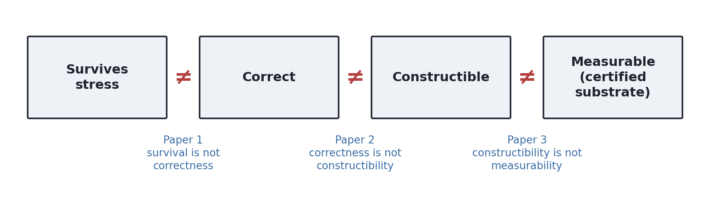
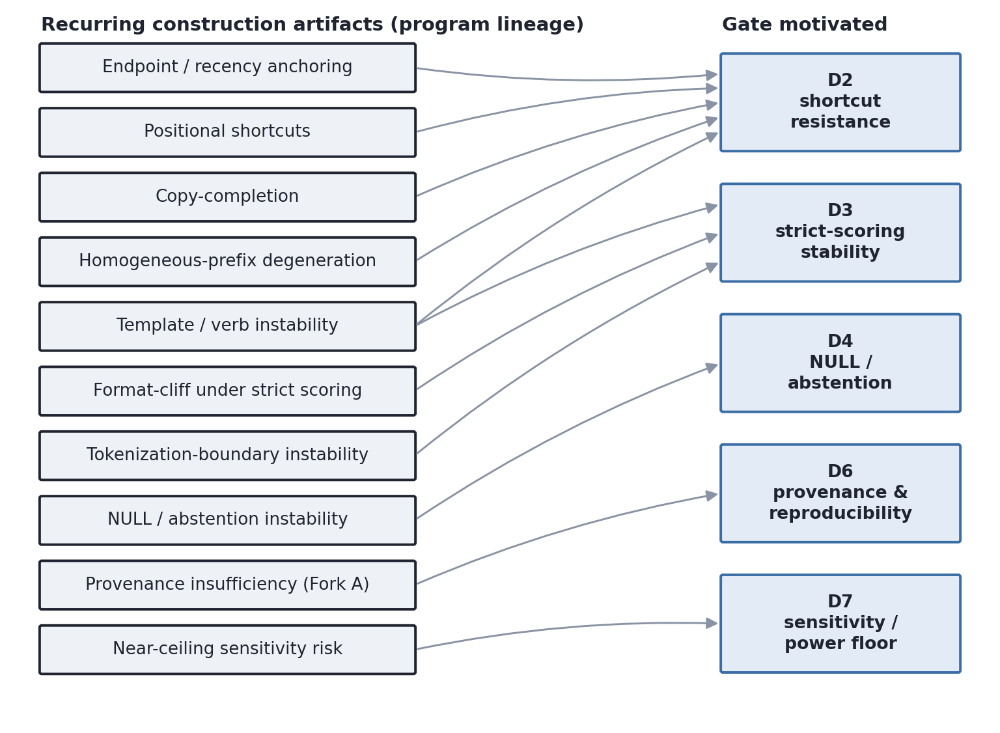
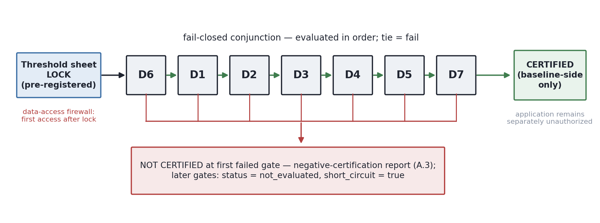
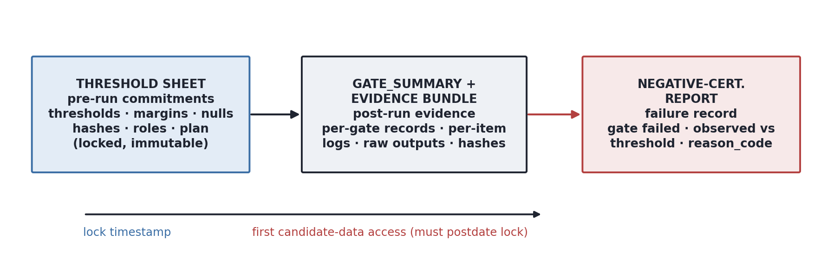

# Certification Before Retention: A Fail-Closed Protocol for Qualifying a Single-Hop Baseline as a Strict-Correctness Retention Substrate

**E. A. Flores** · Apiana AI, Inc.

**v1.0.** River and Canyon program. Paper 3 of the behavioral stress-metrology series; companion to *Survival Is Not Correctness* (Paper 1) and *Correctness Is Not Constructibility* (Paper 2).

**Status: Protocol / methods paper. No candidate has been certified; no retention has been measured; no stress run has been performed. Applying this protocol requires the active B1 validity harness and separate Manager authorization. B1 v2 provides the infrastructure substrate, but no candidate selection, threshold lock, certification evaluation, or compression run is authorized by this paper.**

**Framework version: `paper3-certification-protocol-v1.0`.** This is the stable identifier carried by the `framework_version` field in the Appendix A.1 threshold sheet and the A.2 `gate_summary` schema. Any revision of this protocol increments the identifier; a threshold sheet locks against exactly one framework version, and **threshold sheets lock only against a released framework version, not a draft identifier**. This released identifier is lock-eligible from the release tag onward. The B1 harness remains compatible by design: B1 validates `framework_version` as config-vs-sheet agreement and does not hardcode the manuscript version.

---

## Abstract

This is the third paper in a metrology series whose object is not a model but a *measurement*: what it takes to read a capability under compression stress and have the reading mean something. The first paper established that **survival is not correctness** — a component that still emits under stress is not thereby emitting correctly — and gave a staged, fail-closed scoring protocol that separates strict correctness from mere format survival. The second established that **correctness is not constructibility** — surface correctness on a composite task is not evidence that the construction isolates the intended operation — and showed, for a specific two-hop construction, that its constructibility floor is mappable but not cleared, so no stress reading on it would be interpretable.

This paper takes the next step back. Even a correct, constructible single-hop baseline is not automatically a valid *substrate* for strict-correctness retention measurement. Before any compression rung is run, the baseline must be **certified**: shown to be correct above native emission bias, not explained by a construction shortcut, stable under strict scoring, calibrated for abstention, matched on load where it is compared, backed by reproducible provenance, and sensitive enough to resolve a pre-registered minimum detectable retention drop. We define this certification as a fail-closed conjunction of seven gates (D1–D7), each with a pre-registered decision rule and a fixed interpretation of pass, fail, and not-evaluated outcomes. We give the per-candidate threshold sheet, a portable `gate_summary` proof-of-status schema, and a negative-certification report form in which "not certified" is a result of record, not a failed experiment.

The protocol is distilled from the program's construction lineage and its measurement requirements: the gates formalize defenses against construction artifacts the program encountered, or against baseline-side measurement confounds exposed by that lineage. The protocol ships as a ruler. Applying it to a selected candidate — and reporting whether that candidate is certified, not certified, or not evaluable — is a separate downstream result that requires the active B1 validity harness and separate Manager authorization, and is out of scope here.

**Non-claims.** This paper certifies no candidate; measures and claims no retention; runs no compression stress; treats no baseline's unstressed behavior as evidence of stress-readiness; claims no end-to-end retention interpretability; makes no claim about the existence of a compositional seam (Claim C); selects no candidate; makes no deployment-reliability or benchmark-superiority claim; and authorizes no run. Passing all gates does not predict that a future stress run will pass any stress-side precondition.

---

## 1. The metrology series

The series treats stress-retention evaluation as a measurement problem and works backward from the reading to the preconditions that make it interpretable.

**Survival is not correctness (Paper 1).** Reporting that a model still produces output under compression conflates two different things: that it emitted, and that it emitted the right answer. A retention metric built on survival overstates what is retained, because it credits format-valid but incorrect output. Paper 1 gives a staged, fail-closed scoring protocol that separates strict correctness from format survival and refuses to read retention off the latter. [1] This separation is adjacent to decomposed-scoring work in prompt-compression evaluation, where constraint compliance and semantic accuracy are measured separately [3]; this paper adapts that general decomposed-scoring discipline to baseline certification, not to claim CDCT as weight-quantization evidence. Prior compression-evaluation work has likewise shown that similar aggregate accuracy can hide item-level answer flips in compressed models [4], motivating evaluation beyond accuracy alone; Paper 3 adds a pre-stress baseline-certification gate before any future strict-correctness retention measurement is interpreted.

**Correctness is not constructibility (Paper 2).** Surface correctness on a composite — for example, a two-hop task — is not evidence that the construction actually requires the composite operation. A construction can be solvable by a shortcut (position, salient endpoint, copy-completion), in which case correctness is real but uninformative about the intended capability. Paper 2 maps the *constructibility floor* of a specific two-hop Level-1 construction and reports that the floor is mappable but not cleared: the construction cannot carry a linkage reading, so a stress measurement on it would not be interpretable. [2]

**Certification before retention (Paper 3, this paper).** The two prior results leave a gap. Suppose a single-hop baseline is correct and the construction is clean. That is still not sufficient for it to be a valid substrate for strict-correctness retention measurement. Whether a future stress reading on the baseline would be interpretable depends on baseline-side properties that must be checked *before* the stress run: correctness above emission bias, shortcut resistance, strict-scoring stability, abstention calibration, load-matching, reproducible provenance, and measurement sensitivity. This paper asks the certification question and defines the protocol that answers it, fail-closed:

> *Can a single-hop candidate baseline be certified as a valid substrate for future strict-correctness
> retention measurement?*

Certification is a validity instrument, not a seam tool. It does not measure retention, does not run stress, and bears in no way on whether a compositional seam exists. It is a precondition, and it ships independently of any run. The series' three gaps are summarized in Figure 1.



**Figure 1.** Each step a baseline can pass while failing the next. Survival is not correctness (Paper 1); correctness is not constructibility (Paper 2); constructibility is not measurability — a constructible baseline is not automatically a certified substrate for strict-correctness retention measurement (this paper).

---

## 2. Empirical motivation: the construction lineage as a constructibility-space map

The gates in this protocol are motivated by the program's construction lineage together with the measurement requirements that lineage exposed: the arc of constructions that preceded this protocol, together with the three Two-Hop Level-1 cells reported in Paper 2. [2] Across that lineage, no clean seam adjudication was obtained. That is not a record of failed searches for a seam; it is a record of the *space* not yet being defined well enough to ask the question cleanly. Each construction surfaced a distinct, characterizable artifact that would have made a naive correctness reading misleading.

We use this lineage as **motivation and boundary evidence**, not as certification evidence. It explains why each gate is needed; it does not certify any candidate, and no number from the lineage is reused as a certification result. Any candidate evaluated under this protocol must be evaluated afresh under the certification harness (§4, §8).

The recurring artifacts, and the gate each one motivates:

**Endpoint and recency anchoring** *(motivates D2).* Output tracks the most recent or most salient endpoint token rather than the queried relation. Correctness can be produced by anchoring on a last-value or salient endpoint instead of performing retrieval — so a high score can coexist with no retrieval at all. This family includes last-value anchoring, target-recency, and salient-endpoint attraction; it was the most persistent artifact in the lineage, relocating under successive positional manipulations rather than disappearing.

**Positional shortcuts** *(motivates D2).* When the answer is recoverable from a fixed position, the construction is solvable by reading that slot, and correctness becomes a position effect rather than an operation.

**Copy-completion** *(motivates D2).* When the target appears as a copyable surface span, the model can complete by copying rather than by the intended operation, and correctness is again uninformative.

**Homogeneous-prefix degeneration** *(motivates D2).* Repeated or homogeneous prefixes degrade retrieval into a degenerate prefix-completion regime; correctness then reflects prefix structure, not the queried relation.

**Template / verb instability** *(motivates D2 and D3).* Behavior shifted with template and verb choices that should have been incidental — verb-template instability and verb-narrowing — showing that apparent capability could be an artifact of the surface template rather than the construction's content.

**Format-cliff behavior under strict scoring** *(motivates D3).* Strict scoring collapsed or diverged sharply from content scoring under small format variations. A baseline perched on a format cliff cannot carry a retention comparison: a drop under stress would be unattributable between capability loss and format sensitivity.

**Tokenization-boundary / segmentation instability** *(motivates D3).* Target entities, keys, and format indicators did not always preserve their BPE segmentation across construction permutations, so a permutation could change tokenization rather than only content. A baseline whose tokenization shifts under permutation cannot carry a clean comparison for those permutations, for the same reason as a format cliff. (This is the tokenization half of D3, checked offline.)

**NULL / abstention instability** *(motivates D4).* Abstention and error were not reliably separable, so no-answer behavior could not be interpreted. Without a stable NULL contract, any reading that depends on abstention is unsupported.

**Provenance insufficiency** *(motivates D6).* Some historical artifacts were not reproducible or auditable to the standard required to serve as evidence — the condition that disqualified the single-hop key-value compression history (Fork A) from being treated as live evidence. Artifact-backed status proved necessary but not sufficient.

**Near-ceiling sensitivity risk** *(motivates D7).* A baseline can be clean and yet useless for measurement if it sits so near ceiling, or carries so few items, that a real retention drop would be indistinguishable from noise. Cleanliness does not imply sensitivity.

Read together, these are a map of the constructibility space: the directions in which a single-hop baseline can look correct while being unmeasurable (Figure 2). The protocol below is the formal defense against each direction.



**Figure 2.** The lineage as motivation. Each recurring construction artifact from the program's history maps to the certification gate it motivates. Motivation and boundary evidence only — no lineage number is certification evidence (§2, §4 D2). D1 and D5 are motivated by measurement requirements (native emission bias; load confounds) rather than a single lineage artifact.

---

## 3. Certification scope

Scope is stated narrowly and negatively, because the failure mode this protocol most needs to prevent is over-reading a certification.

A certified candidate establishes that the **baseline-side preconditions** for a future strict-correctness retention measurement have been met. **Stress-side preconditions — identical rung application, item-level same-error logging under stress, and a drop exceeding the pre-registered sensitivity floor — must be verified separately at the authorized stress rung.** Certification means: *the baseline is not the reason a future retention measurement would be uninterpretable.* It does not mean: *a future retention measurement is guaranteed to be interpretable.* End-to-end interpretability is a joint property of the certified baseline and the separately-verified stress rung.

Certification is **not authorization** and **not a seam claim** (see §9). Throughout, *fail-closed* means: defaulting to *not certified* unless every declared prerequisite is satisfied under the pre-registered decision rules.

---

## 4. The certification gates (D1–D7)

Each gate has a control objective and a decision rule. Threshold *values* are deliberately not set in this paper; they are per-candidate fields, fixed and pre-registered before any evaluation (§7, Appendix A.1). The gates are a fail-closed conjunction (§5).

**D1 — Baseline correctness floor.** Controls whether the baseline is correct often enough under strict scoring, and above native emission bias, to carry a future same-item retention comparison. The candidate must clear the strict-scoring floor at the unstressed condition (subject to the §5 tie rule: equality to the floor is not a pass) and clear not only flat random chance but an **unconditioned token-prior (or equivalent dummy-policy) control**, so correctness reflects task behavior rather than native emission bias. Abstentions count as not correct for D1 unless a different rule is explicitly pre-registered. Operational certification — correct-by-operation rather than by-shortcut — is the joint result of D1–D7, not D1 alone. The threshold sheet must specify the token-prior / dummy-policy control construction: acceptable forms include a null-context or scrambled-entity version of the exact prompt template, or an equivalent pre-registered dummy-policy control; the control must preserve format and output contract while removing task-relevant bindings. The token-prior / dummy-policy control is candidate-specific and must be pre-registered; passing D1 does not imply robustness to undeclared emission biases. *(A token-prior / dummy-policy control is required by this protocol; its execution is not authorized here and requires separate authorization.)*

**D2 — Shortcut resistance.** Controls the central artifact of §2: correctness that is actually a position, recency, endpoint, copy-completion, or prefix-degeneration effect. Observed performance must depart from each declared shortcut's pre-registered prediction by at least the declared margin; consistency with any single shortcut account is a failure. For each shortcut in the battery the candidate pre-registers a null model, a statistical or rule-based test, a departure margin, a tie/adjudication rule, a failure condition, and a per-item contingency table. The battery covers at minimum: pure last-position, target-recency, salient-endpoint attraction, copy-completion, and homogeneous-prefix degeneration. **Consistency with any single shortcut prediction, including target-recency, salience, or position variants, fails D2.** Passing D2 rules out only the declared battery, not all possible shortcuts; departure is assessed against pre-registered predictions only, with no post-hoc redefinition, and the battery code itself is hashed and locked with the threshold sheet (`D2_battery_code_hash`). The certification artifacts must preserve item-level returned-token, returned-role, and shortcut-class diagnostics sufficient for later same-error identity comparison under an authorized stress rung; **D2 itself adjudicates baseline shortcut resistance through the pre-registered shortcut battery, not through same-error identity alone.** **D2 does not reuse Paper 2 numbers as certification evidence; any selected candidate is evaluated afresh under the certification harness.** The battery must include at least one adversarial probe per shortcut family, designed to elicit the shortcut if present; probe behavior must be recorded to demonstrate battery sensitivity. Battery sensitivity is demonstrated against the pre-registered deterministic shortcut implementations — dummy-policy outputs computed offline — not inferred from the candidate's failure to exhibit the shortcut. (This is a threshold-sheet / candidate-stage requirement and authorizes no run.) A D2 pass concerns FP16 shortcut-freeness only; it does not certify that the model will not shortcut-substitute under compression. Shortcut substitution under stress is detectable only through item-level same-error identity at an authorized rung, and is not certified here.

**D3 — Strict-scoring stability.** Controls the format-cliff and tokenization-boundary artifacts. The strict-minus-content correctness gap at the unstressed condition must be within the declared bound; and target entities, keys, and format indicators must preserve **tokenization boundaries** across the declared permutations, or the candidate is not certified for those permutations. (Tokenization-boundary checking is an offline check and requires no model run.) D3 reports the strict-minus-content gap distribution and archives the strict-vs-content confusion matrix. Where item strata are declared, gaps are reported by stratum; exceeding the pre-registered bound in any required stratum fails D3.

**D4 — NULL / abstention calibration.** Controls NULL-contract instability. Where the construction has a valid NULL condition, it must record abstention distinctly from a wrong answer, with the baseline abstention rate inside the declared band. Where D4 applies, the abstention band is two-sided with declared lower and upper bounds; universal abstention or universal answer fails D4. The NULL classifier path must be deterministic, versioned, and hashed, with calibration evidence archived where a NULL condition is certified. If the construction includes no valid NULL condition, the candidate is not certified for comparisons requiring abstention, no-answer, or no-link interpretation; D4 is not forced as an artificial condition, but unsupported no-answer interpretations are blocked.

**D5 — Load-matching / construction symmetry.** Controls difficulty confounds. Any matched comparison the candidate is certified to support must be load-matched, within tolerance, on **structural difficulty proxies derived from manifest / item metadata only** — token length, context-window utilization, graph distance, number of hops, number of keys, nesting depth, distractor count, distractor entropy, answer-position distribution, token-prefix overlap, NULL/non-NULL balance, and the like. Model-accuracy-based or observed-failure-based difficulty definitions are not permitted: difficulty may not be defined by whether the model answered the item correctly. For same-item baseline-to-stress retention, D5 records same-manifest, same-item, same-prompt-template, and same-scorer identity across future rungs; for any cross-candidate or matched-control comparison, D5 additionally requires structural load matching on the declared manifest-derived proxies. For standalone same-item retention certification, the matched-comparison load-matching subgate may be marked not applicable, but the same-manifest / same-item / same-prompt-template / same-scorer identity check remains required; for cross-candidate or matched-control comparisons, the structural load-matching subgate is additionally required.

**D6 — Provenance and reproducibility.** Controls the auditability gap that disqualified Fork A. D6 requires runner-backed provenance, locked artifact hashes, model-snapshot or model-weight attestation, prompt / scorer / runner hashes, an analysis-script hash, precision-rung metadata where applicable, a pre-registration reference, and CS reproducibility signoff. The Fork A bar is carried forward: artifact-backed status is necessary but not sufficient — the artifact must additionally be locked, traceable to the instrument of record or a declared equivalent, tied to the certified baseline, governed by pre-registered conditions, and compatible with same-error identity reporting. **Raw model outputs for every item must be retained, not only aggregate scores.** **Certification cannot proceed past D6 unless the active B1 harness supplies the required provenance fields for the selected candidate and that candidate has been authorized for certification evaluation (§8).** **Data-access firewall:** the first candidate-data access timestamp must occur after threshold-sheet lock. The firewall applies to fresh certification-evaluation data produced under the B1 harness for this certification attempt. It is triggered by functional evaluation, scoring, gate computation, or candidate-output inspection before threshold-sheet lock; any such access results in automatic *not certified*. Administrative filesystem access, schema validation, or shallow file reads that do not inspect candidate outputs or compute gate evidence do not trigger the firewall, but must be logged. Output-free validation of file existence, schema shape, or hash availability does not trigger the firewall. Both `threshold_sheet_lock_timestamp` and `first_candidate_data_access_timestamp` must be UTC ISO-8601 and harness-populated, not manually entered. Historical or published information about a candidate construction may inform threshold design, but it is not certification evidence and does not trigger the data-access firewall. Historical-knowledge shading is controlled by pre-lock threshold-sheet review, Manager/Senior/CS signoff, and role separation between threshold author, candidate constructor, and evaluator (Appendix A.1; see also the §5 evaluation order and the §7 expiration rules).

**D7 — Retention-measurement sensitivity / power floor.** Controls whether a clean baseline can actually resolve a future drop. The candidate must specify a minimum detectable retention drop and show that the declared item count, together with the pre-registered baseline-noise model or derivation rule, can resolve it. The derivation type is pre-registered (`D7_derivation_type` — e.g. binomial headroom, bootstrap over items, repeated-baseline variance, or a declared analytic bound). In deterministic decoding, the baseline-noise model refers to item-sampling / finite-N uncertainty or a pre-registered derivation rule, not decode stochasticity, unless stochastic decoding is explicitly declared. D7 uses same-item paired comparison under strict scoring, and inconclusive sensitivity calculations fail closed. D7 sensitivity is evaluated using **N_effective**, defined as N_declared minus voided items and missing required items. If voided or missing required items exceed the pre-registered `max_voided_items`, certification fails with `reason_code = void_budget_exceeded`; if N_effective no longer supports the pre-registered sensitivity calculation, D7 fails closed. This prevents a candidate from certifying at N_declared while silently evaluating at a smaller N. The threshold sheet may additionally require per-item ceiling and floor margins demonstrating that the baseline is not saturated at 0 or 1 on any declared stratum. If the candidate is so near ceiling, or carries so few items, that the minimum detectable drop sits inside single-item or baseline noise, it is not certified for retention measurement. *(Activation-outlier telemetry — kurtosis, hidden-state outlier rates, residual-stream peak-to-mean — is not a baseline-certification requirement and is not part of D6 or D7; it is a stress-side validation concern outside the scope of this protocol and requires separate authorization.)*

---

## 5. Evaluation order and decision logic

Certification is a **fail-closed conjunction**: a candidate is certified only if all applicable gates pass; any single failure yields *not certified*. The default state is not-certified, and certification is earned gate by gate against thresholds fixed in advance.

The gates are evaluated in an order chosen so that provenance and correctness-floor failures stop review before interpretive gates are treated as meaningful:

```
1. D6 — provenance precheck
2. D1 — baseline correctness floor
3. D2 — shortcut resistance
4. D3 — strict-scoring stability
5. D4 — NULL / abstention calibration
6. D5 — load-matching / construction symmetry
7. D7 — retention-measurement sensitivity
```

A published certification report may show each gate as **pass, fail, or not evaluated** — the last for a gate not reached because review short-circuited at an earlier failure. The pipeline is summarized in Figure 3.



**Figure 3.** The fail-closed conjunction. Threshold-sheet lock precedes any candidate-data access (the data-access firewall); gates are evaluated D6 → D1 → D2 → D3 → D4 → D5 → D7 with tie = fail; the first failed gate yields *not certified* and a negative-certification report, with later gates emitted as `not_evaluated` / `short_circuit = true`; passing all gates certifies the baseline side only — application remains separately unauthorized.

**General decision rules (apply to every gate):**

- *Tie equals fail.* If `observed_value` equals `threshold_value` for any gate, the gate fails. Equality to a bound is not a pass; record `reason_code = at_bound`.
- *Voided-run / missing-data rule.* Voided items are logged with reason codes, excluded from all gate statistics, and not renormalized post hoc. Missing required probe outputs for a gate result in fail-closed *not certified* for that gate.
- *Worst-case repeats.* If the threshold sheet declares multiple independent FP16 baseline repeats, the pass/fail decision for every applicable gate uses the worst-case result across repeats. The repeat count and aggregation rule must be pre-registered.
- *Adjudication.* Borderline or disputed certification decisions require documented adjudication by Senior, CS, Team Lead, and Manager or Manager delegate; Manager has final authority, and the rationale is archived in governance. Adjudication resolves classification, evidence, and procedural disputes only. It may not modify any pre-registered threshold, margin, statistical test, or decision rule after candidate data is observed, and it may not convert a failing gate into a pass. Adjudication outcomes are fail-closed: an adjudication may void or fail a result, or require a new certification attempt, but may not rescue a failed gate.

**Negative certification is a result of record.** A candidate that fails gate D_k yields the finding: *single-hop candidate baseline C cannot be certified for strict-correctness retention measurement because it fails D_k at the pre-registered threshold.* This is a constructibility-boundary outcome in the same family as Paper 2, not a failed experiment. The reporting form is given in Appendix A.3. **If no candidate passes the conjunction, the result is a mapped certification boundary, not evidence that the protocol is unusable.**

---

## 6. Pre-registered certification outcomes

The interpretation of each gate's outcome is fixed before any candidate data exists. These are interpretation rules, not predictions; they define what an outcome is *allowed to mean*.

**Section-level non-claim.** *Certification establishes baseline-side readiness only. It certifies no candidate; measures or claims no retention; runs no compression stress; treats no unstressed behavior as evidence of stress-readiness; claims no end-to-end retention interpretability; makes no compositional- seam (Claim C) claim; selects no candidate; makes no deployment-reliability or benchmark-superiority claim; and authorizes no run. Passing all gates does not predict that a future stress run will pass any stress-side precondition. Stress-side preconditions — identical rung application, item-level same-error logging under stress, and a drop exceeding the pre-registered sensitivity floor — must be verified separately at an authorized rung.*

**Interpretation of `not_evaluated`.** A gate marked `not_evaluated` means certification review short-circuited at an earlier failed or missing prerequisite gate. It is not evidence that the unevaluated gate would pass or fail; it is recorded only to preserve the audit trail.

- **D1.** *Success condition:* the baseline answers correctly often enough, above native emission bias, to carry a same-item retention comparison. *Failure condition:* too weak or emission-bias-driven to support retention measurement. *Scientific interpretation:* correctness at the unstressed condition is task behavior, not native emission bias, within the declared control. *Explicit non-claim:* a pass does not establish correctness is by-operation rather than by-shortcut, and does not imply robustness to undeclared emission biases.
- **D2.** *Success condition:* observed performance departs from every declared shortcut prediction by the pre-registered margin. *Failure condition:* consistency with any declared shortcut account, or an insensitive battery. *Scientific interpretation:* correctness is not explained by the declared shortcut battery. *Explicit non-claim:* rules out only the declared battery, not all shortcuts; Paper 2 numbers are not evidence.
- **D3.** *Success condition:* the strict-minus-content gap is within bound and tokenization boundaries are preserved across declared permutations. *Failure condition:* scoring is cliff-perched or tokenization-sensitive (for the affected permutations). *Scientific interpretation:* the baseline-side format and tokenization checks do not identify a cliff that would make a future drop uninterpretable. *Explicit non-claim:* stability at the unstressed condition does not predict stability under stress.
- **D4.** *Success condition:* abstention is separable from error within the declared two-sided band, or the candidate is scoped to exclude abstention interpretation. *Failure condition:* a claimed NULL whose abstention is indistinguishable from error, or universal abstention / universal answer. *Scientific interpretation:* no-answer behavior is interpretable within the certified scope. *Explicit non-claim:* D4 does not create a NULL where none exists; a scoped-out D4 is not an actively tested NULL pass.
- **D5.** *Success condition:* for same-item retention, the candidate records same-manifest, same-item, same-prompt-template, and same-scorer identity across future rungs; for matched comparisons, the declared structural load proxies are matched within tolerance. *Failure condition:* same-item identity is not preserved, or load remains a confound for the claimed matched comparison. *Scientific interpretation:* D5 removes declared baseline-side item-identity or structural load-matching confounds within the certified scope. *Explicit non-claim:* passing D5 does not validate the stress comparison itself and does not establish end-to-end retention interpretability.
- **D6.** *Success condition:* runner-backed provenance, locked hashes, attestation, and CS reproducibility signoff are all in place. *Failure condition:* any asserted-only, unlocked, or unreproducible element — and review short-circuits, since D6 is the precheck. *Scientific interpretation:* the certified baseline is reproducible and auditable. *Explicit non-claim:* artifact-backed is necessary but not sufficient; provenance does not establish capability.
- **D7.** *Success condition:* the pre-registered minimum detectable drop is resolvable at N_effective under the locked baseline-noise model or derivation rule. *Failure condition:* near-ceiling, underpowered, void-budget exceeded, or an inconclusive sensitivity calculation. *Scientific interpretation:* the baseline is sensitive enough that a real drop of the declared size could be detected. *Explicit non-claim:* concerns detectability of a future drop, not its existence or magnitude.

---

## 7. No post-hoc tuning; expiration and invalidation

**No post-hoc tuning.** All thresholds, shortcut null models, margins, statistical tests, token-prior controls, tokenization guards, structural proxies, and adjudication rules must be fixed before candidate evaluation. They may not be changed after observing candidate behavior in order to obtain certification. Adjudication may resolve documented ambiguity in evidence classification or procedure; it may not revise pre-registered thresholds, margins, statistical tests, or decision rules after candidate data is observed. A completed, pre-registered threshold sheet (Appendix A.1) is a precondition for certification review.

**Expiration and invalidation.** Certification is construction-specific and expires on any change to the manifest, runner, scorer, prompt template, model snapshot or model-weight hash, decoding config, analysis script, B1 harness schema version, or threshold sheet. Thresholds are construction-specific, model-specific, scale-specific, task-specific, and harness-specific; they do not automatically transfer across models, snapshots, prompts, precision rungs, scales, tasks, or harness versions. A new model or scale requires re-derived thresholds and a new threshold-sheet lock. Any correction after publication requires a new pre-registration and a new certification attempt.

---

## 8. Dependency on B1, and the downstream result

This protocol ships now; **applying** it does not. D6 creates a hard dependency on the B1 validity harness, and D5's structural-proxy computation, D2's per-item contingency tables, and item-level same-error logging are likewise harness functions. The B1 v2 harness — merged and locked as infrastructure — provides this substrate. It supplies runner-backed provenance capture; reproduction of certified runs; and artifact locking with hash capture over the manifest, runner, scorer, and analysis script. It produces per-item logs; deterministic structural-proxy computation from manifest JSON; item-level same-error identity logging; and per-item outcome logs supporting the D7 power calculation under the pre-registered baseline-noise model or derivation rule. It also captures the data-access timestamps needed to enforce the Appendix A.1 data-access firewall. **B1 merge locks infrastructure; B1 merge does not activate Paper 3.** Certification cannot proceed past D6 unless the active B1 harness supplies the required provenance fields for the selected candidate and that candidate has been authorized for certification evaluation.

The certified-baseline *result* is a separate, downstream output. Applying this protocol to a selected candidate under B1 provenance — and reporting whether that candidate is certified, not certified, or not evaluable — requires separate Manager authorization, and is reserved for a later result paper. This paper deliberately selects no candidate and sets no threshold value. (As recorded with the program: a near-ceiling single-hop control would not be eligible on inherited artifacts; any eligibility would require evaluation afresh under B1 provenance, under separate authorization; and the Fork A artifacts are not an eligible candidate.)

---

## 9. Non-claims and locks

This paper does **not**: certify any candidate; measure or claim retention; run any compression stress; treat any baseline's unstressed behavior as evidence of stress-readiness; claim end-to-end retention interpretability; claim or test the existence of a compositional seam (Claim C); select any candidate; or make any deployment-reliability or benchmark-superiority claim. It authorizes no run. Passing all gates does not predict that a future stress run will pass any stress-side precondition.

It does **not authorize**: candidate selection; threshold values; new runs; re-runs; unconditioned token-prior runs; activation logging; INT8 / INT4 execution; multi-model execution; reactivation of the Fork A history; a seam/linkage (Claim C) result; application of this protocol; or public benchmark packaging.

The program's standing commitments hold: certification is a validity gate, not a seam tool; readiness is not authorization; and every paper in this series retains a negative-result form — here, negative certification.

---

## Appendix A — Pre-registration artifacts

### A.1 Per-candidate threshold sheet

No candidate is eligible for certification review without a completed, pre-registered copy of this sheet. All values are fixed before evaluation (§7). The pre-registration artifacts separate into three layers: the **threshold sheet** holds pre-run commitments only; the **`gate_summary` / evidence bundle** (A.2) holds post-run evidence; the **negative-certification report** (A.3) holds the failure record. Fields knowable only after evaluation do not belong on the threshold sheet — expected artifact locations are declared here as path *patterns*; actual paths are evidence-bundle outputs. The three layers are summarized in Figure 4.



**Figure 4.** Pre-registration separates into three layers. The threshold sheet holds pre-run commitments only (locked and hashed before any candidate-data access); the `gate_summary` and evidence bundle hold post-run evidence; the negative-certification report holds the failure record. The lock timestamp must precede the first candidate-data access timestamp.

```
# — identity, environment, instrument —
candidate_name
scope_of_certification
model_snapshot_hash
prompt_template_hash
scorer_hash
runner_hash
analysis_script_hash
decoding_settings                    # subfields: temperature, top_p, top_k, max_tokens,
                                     #   stop_sequences, seed, deterministic_flags
decoding_settings_hash
container_or_environment_hash
dependency_manifest_ref
mlx_lm_version
python_version
B1_harness_schema_version

# — D1 correctness floor & token-prior control —
D1_floor_value
D1_token_prior_control_spec
D1_token_prior_control_return_rule
D1_token_prior_control_prompt_or_metadata_source
D1_token_prior_control_scoring_rule
D1_token_prior_control_ceiling
N_declared
power_or_precision_rationale

# — statistical plan —
statistical_plan
statistical_primary_test
statistical_CI_method
statistical_bootstrap_or_permutation_plan_if_applicable
minimum_N_rationale

# — D2 shortcut resistance —
D2_shortcut_battery
D2_battery_code_hash
D2_adversarial_probe_specs           # ≥1 adversarial probe per shortcut family
D2_null_model_specs
D2_departure_margins
D2_adjudication_rules
D2_expected_contingency_table_artifact_path_pattern
D2_failure_reason_code_enum          # declared enum of possible D2 failure codes

# — D3 strict-scoring stability —
D3_strict_scoring_definition
D3_content_scoring_definition
D3_gap_bound
D3_expected_gap_distribution_artifact_path_pattern
D3_expected_confusion_matrix_artifact_path_pattern
D3_item_type_strata
D3_tokenization_boundary_guard

# — D4 NULL / abstention —
D4_NULL_contract
D4_abstention_classifier             # deterministic, versioned, hashed
D4_abstention_band_lower
D4_abstention_band_upper
D4_applicability_scope

# — D5 load-matching / identity —
D5_structural_difficulty_proxies
D5_match_tolerance
D5_overlap_metric
D5_minimum_overlap_threshold
D5_supported_comparisons

# — D6 provenance —
D6_locked_artifact_set
D6_runner_provenance_attestation

# — D7 sensitivity / power —
D7_minimum_detectable_drop
D7_derivation_type                   # e.g. binomial headroom | bootstrap over items |
                                     #   repeated-baseline variance | declared analytic bound
D7_baseline_noise_model_or_derivation_rule
D7_headroom_requirement
max_voided_items
D7_N_effective_rule                  # N_effective = N_declared − voided − missing required items
baseline_repeat_count_and_aggregation_rule   # worst-case across repeats if >1 (§5)

# — decision & reporting —
stop_go_criteria
negative_certification_reporting_rule
pre_registration_reference
audit_contact
```

Each candidate must include a pre-registered statistical plan specifying minimum N, power or precision rationale, primary test, CI method, and any bootstrap/permutation procedure. No candidate is eligible for certification review without this plan. No universal minimum N is imposed by this protocol; `minimum_N_rationale` is per-candidate and pre-registered.

**Governance and role-separation fields (locked with the sheet).**

```
threshold_sheet_version
threshold_sheet_content_hash
threshold_sheet_lock_timestamp
first_candidate_data_access_timestamp_expected_path
governance_archive_path
framework_version
overwrite_prohibited                 # true
threshold_author
threshold_locker
candidate_constructor
evaluator
CS_reproducer
Manager_authorizer
Manager_signoff
Senior_signoff
CS_signoff
```

`threshold_sheet_content_hash` is SHA-256 over the canonical JSON serialization of the locked threshold sheet with sorted keys and no whitespace; it is not the hash of the Markdown rendering. The `threshold_sheet_content_hash` and the model-weight hash must be independently recomputed by a second engineer, with both computation transcripts archived under governance. The threshold sheet records the lock timestamp and the expected location of the first-candidate-data-access record; the actual `first_candidate_data_access_timestamp` is harness-populated after lock and belongs to the evidence bundle / `gate_summary`, not to the locked threshold-sheet content hash. Both timestamps must be UTC ISO-8601 and harness-populated, not manually entered.

**Immutability.** Any edit to a locked threshold sheet creates a new version with a new hash. Locked threshold sheets must not be overwritten. Any attempted overwrite must be treated as a governance violation, rejected by review, and recorded in the governance archive when detected.

**Data-access firewall.** The first candidate-data access timestamp must occur after threshold-sheet lock. The firewall applies to fresh certification-evaluation data produced under the B1 harness for this certification attempt; it is triggered by functional evaluation, scoring, gate computation, or candidate-output inspection before threshold-sheet lock, and any such access results in automatic *not certified*. Administrative filesystem access, schema validation, or shallow file reads that do not inspect candidate outputs or compute gate evidence do not trigger the firewall, but must be logged (full definition in D6, §4). Output-free validation of file existence, schema shape, or hash availability does not trigger the firewall. Historical or published information does not trigger the firewall.

**Role separation.** The evaluator must not be the same person who authored the thresholds or constructed the candidate, except by recorded Manager approval. Exceptions must be recorded in governance.

### A.2 `gate_summary` schema

`gate_summary` is the portable proof of certification status: one record per gate. Each gate must reference the specific table, JSON path, or artifact file that constitutes its pass/fail evidence. (`threshold_sheet_hash` here, and `locked_threshold_sheet_hash` in A.3, denote the same value as the A.1 `threshold_sheet_content_hash` of the locked sheet.)

```
gate_id
status                 # pass | fail | not_evaluated
observed_value
threshold_value
delta
reason_code
evidence_artifact_path # the specific table / JSON path / file that is the pass/fail evidence
evidence_artifact_hash # hash of that evidence artifact — NOT of the gate_summary file itself
evaluated_by
evaluated_at
short_circuit          # true if review stopped before this gate was reached
framework_version
threshold_sheet_hash
analysis_script_hash
decoding_settings_hash # ties each gate record to the exact locked decoding configuration
threshold_sheet_lock_timestamp
first_candidate_data_access_timestamp   # harness-populated after lock; evidence-side, not sheet-side
data_access_firewall_status             # clear | violated
data_access_firewall_reason_code
D4_applicability_status                 # applicable | scoped_out
D4_scope_exclusion_reason               # populated when scoped_out (e.g. scoped_out_no_null_claim)
```

`evidence_artifact_hash` references the specific table, JSON path, or file that constitutes the pass/fail evidence, not the `gate_summary` file itself. Gates not reached because review short-circuited must still be emitted: `status = not_evaluated`, `short_circuit = true`, and `evidence_artifact_hash = null`.

**Evidence-bundle outputs (post-evaluation; produced by the harness, not pre-registered):**

```
D2_per_item_contingency_table_path
D3_strict_content_gap_distribution_path
D3_strict_content_confusion_matrix_path
```

**Per-item decision log schema (one record per item; candidate-specific values absent until candidate selection and threshold lock):**

```
per_item_decision_log_schema_version
per_item_decision_log_schema_hash
item_id
manifest_hash
runner_id
scorer_version_hash
prompt_template_hash
D1_flag
D2_shortcut_verdicts
D3_strict_vs_content_delta
D4_abstention_label
D5_difficulty_proxies
same_error_identity_key
raw_output_reference
```

### A.3 Negative-certification report

Pre-registered; filed when any gate fails.

```
candidate
locked_threshold_sheet_hash
gate_failed
observed_value
threshold_value
per_item_log_path
reason_code
interpretation_statement
```

**Interpretation rule (fail).** If any gate fails, the finding is not "the experiment failed." The finding is: *the candidate was not certified, and the failed gate identifies why future strict-correctness retention measurement would be uninterpretable.*

**Interpretation rule (all pass).** *The candidate is certified as a valid baseline-side substrate for a future retention measurement, which remains separately unauthorized.*

---

## References

[1] Flores, E. A. *Survival Is Not Correctness: A Staged, Fail-Closed Metrology Protocol for Stress-Retention Evaluation.* Apiana AI, Inc., 2026. (Paper 1, this series.)

[2] Flores, E. A. *Correctness Is Not Constructibility: Pre-Stress Baseline Mapping for Behavioral Stress Metrology.* Apiana AI, Inc., 2026. (Paper 2, this series.)

[3] Baxi, R. *Separating Constraint Compliance from Semantic Accuracy: A Novel Benchmark for Evaluating Instruction-Following Under Compression.* arXiv:2512.17920v1 [cs.CL], December 2, 2025. doi:10.48550/arXiv.2512.17920. Introduces the Compression-Decay Comprehension Test (CDCT). Cited as adjacent prior art for decomposed scoring — the separation of constraint compliance from semantic accuracy under *prompt* compression, showing that format/constraint behavior and semantic correctness can move independently. Paper 3 adapts a related decomposed-scoring discipline to baseline certification for future stress-retention measurement, without treating CDCT as weight-quantization evidence: CDCT concerns prompt-compression / instruction-following evaluation and is not evidence regarding INT8/INT4 weight quantization, compression-retention measurement, same-error identity, or failure taxonomy under numerical stress.

[4] Dutta, A., Krishnan, S., Kwatra, N., and Ramjee, R. *Accuracy is Not All You Need.* Advances in Neural Information Processing Systems 37 (NeurIPS 2024), Main Conference Track, 124347–124390. doi:10.52202/079017-3950. arXiv:2407.09141v1 [cs.LG], 2024. Dutta et al. show that compressed models can preserve similar aggregate accuracy while producing substantial item-level answer flips, motivating evaluation beyond accuracy alone; they propose flips and KL-divergence as distance metrics for compressed-model behavioral divergence. Paper 3 uses this as adjacent compression-evaluation prior art, while adding a pre-stress baseline-certification gate before any future strict-correctness retention measurement is interpreted. Dutta et al. do not propose retention certification, same-error identity reporting, or a fail-closed baseline-admission contract; those are contributions of this series, not claims inherited from [4].

---

*© 2026 E. A. Flores, Apiana AI, Inc. Licensed under CC BY-NC 4.0 (https://creativecommons.org/licenses/by-nc/4.0/).*
