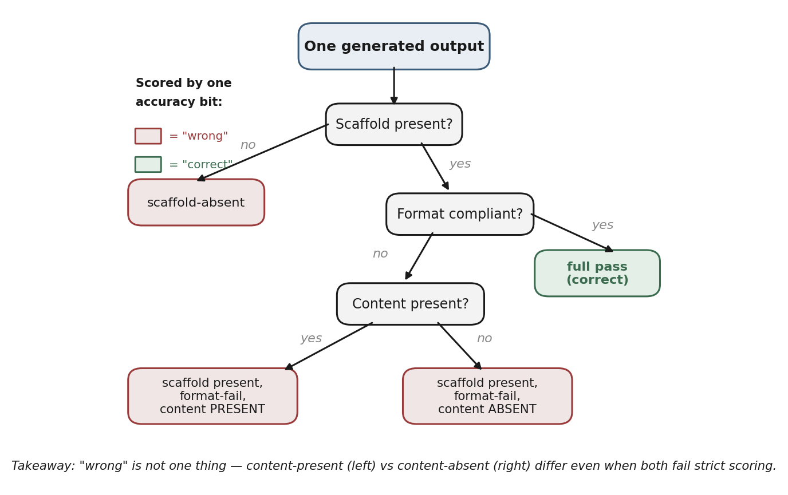
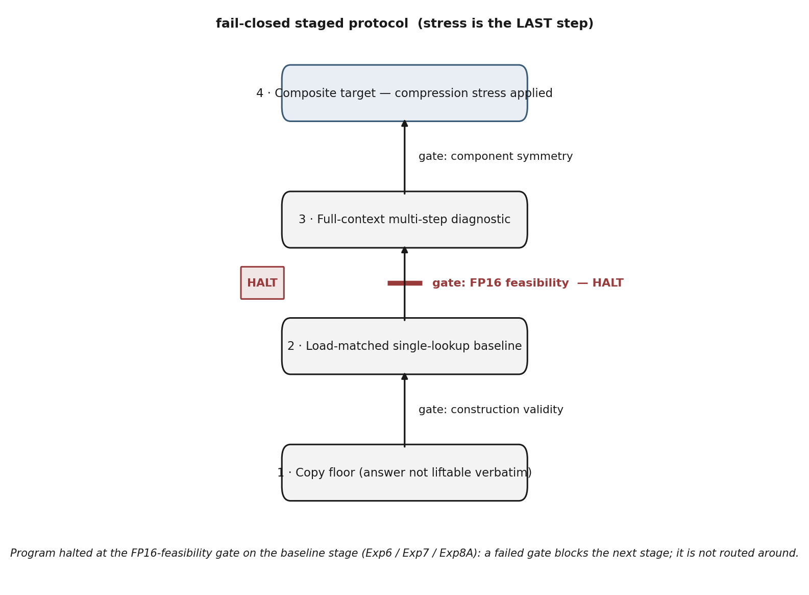
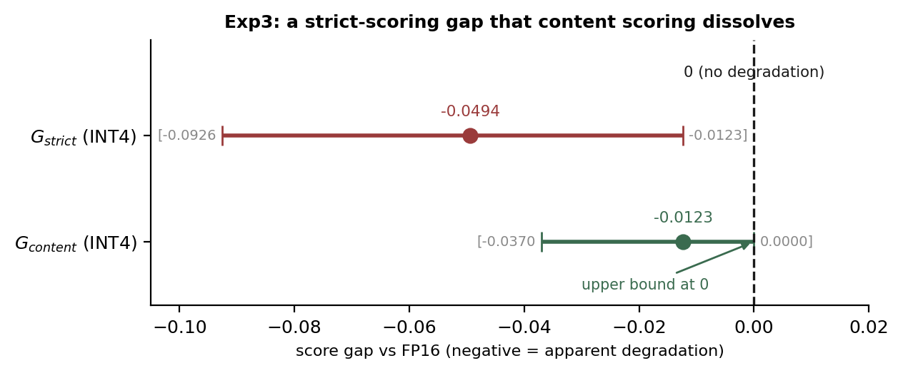
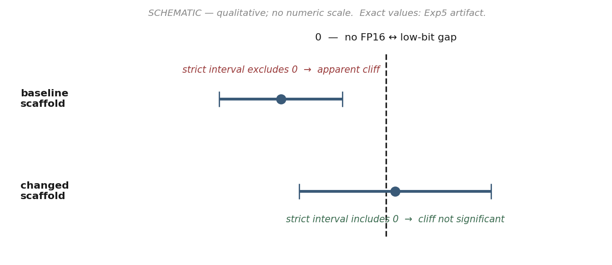
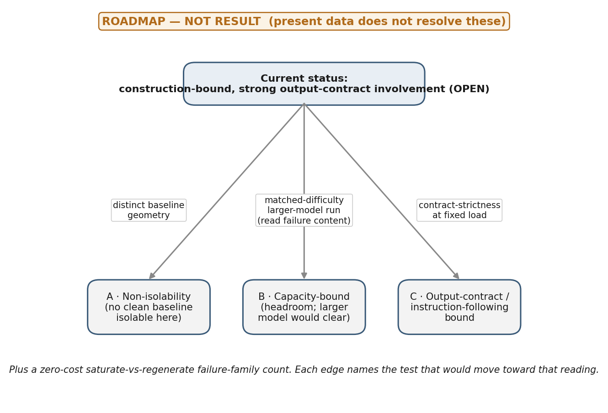

# Survival Is Not Correctness: A Staged, Fail-Closed Metrology Protocol for Stress-Retention Evaluation

### Lessons from a blocked seam-under-quantization test

**E. A. Flores** · Apiana AI, Inc.

*A staged, fail-closed protocol for interpreting stress-retention results,
developed when a seam-directed stress test repeatedly failed its reference-precision baseline. The paper
reports two distinct result families — earlier chain-task runs that completed FP16/INT8/INT4 sweeps, and
a purpose-built seam-directed line (Exp6–Exp8B) blocked at FP16 only — and makes no claim that a
compositional seam exists or that the full instrument has produced a clean seam measurement. Same-error
identity is specified and operationalized, not established as having adjudicated a compression-retention
result. Documented provenance gaps are disclosed rather than smoothed.*

-----

## Abstract

Quantizing a model's weights and measuring which behaviors "survive" is a common way to ask whether
compression damages capability. We argue, and demonstrate within a single program, that this
measurement is unsafe unless the reference-precision (FP16) baseline is first shown to be clean. A
retention or agreement metric reports high preservation precisely when the compressed model reproduces
the reference output — *including when that output is wrong* — so persistence can encode preserved
error rather than preserved capability. We present a staged, fail-closed metrology protocol that gates a
compression-stress sweep behind an explicit FP16 feasibility check, scores generated output on separable
axes (scaffold, format, content), and reports correctness as a three-part contract — baseline
correctness, stressed correctness, and same-error identity — rather than as one retention number. The
program had two result families, and the abstract represents both, distinctly. **Earlier chain-task runs
completed FP16 / INT8 / INT4 sweeps** and produced scoring-artifact and bounded-null evidence. **The
seam-directed stress sweep was blocked at FP16 only, and only for the purpose-built Exp6–Exp8B
construction sequence**, where the instrument identified baseline instability before any compression was
applied (a *Branch F / NOT FEASIBLE* outcome). That construction sequence was adaptive and included a
chain-to-flat architecture change; across it the observed failure surface did not converge across
classes, and some earlier failure classes became undefined under the later architecture rather than
being repaired away. The program's **original target was a seam-directed stress test**; what it validated
is not a seam result but **the measurement contract forced into existence by recurrent baseline failures
in that seam-directed line**. The paper's claim is methodological and bounded: **before compression
stress can be interpreted, the FP16 baseline must be clean; in this program the staged instrument
identified baseline instability before quantization and withheld an uninterpretable stress sweep.** This
is not a consolation for a missing seam result — the validated, reusable contribution is the instrument's
discipline. This paper does **not** establish that
compositional-seam testing under quantization is broadly difficult; it establishes that *under these
constructions and gates, the seam-directed stress test did not become interpretable*. We make no claim
about whether a compositional seam exists, and none about quantization's effect on composition.

-----

> ### What we do not claim
> - We do **not** claim a compositional seam exists or does not exist.
> - We do **not** claim INT8/INT4 causes or prevents compositional failure.
> - We do **not** infer mechanisms from behavioral outputs.
> - We do **not** generalize beyond the tested constructions, models, tokenizers, and decoding settings.
>
> *(Full claim-status ledger in §8; expanded non-claims in §10.)*

-----

## 1. Introduction — the false-claim risk (motivation)

A natural way to probe whether weight quantization harms multi-hop or compositional behavior is to run
a task at full precision and at a low bit-depth, compute how much of the behavior is retained, and read
a drop as evidence of a "seam" that compression tears. The method is tempting and, as stated, unsafe.

Two failure modes make a naive retention reading misleading. First, a retention or FP16↔INT4 *agreement*
metric is maximized when the low-bit model reproduces the full-precision output — so an item the model
gets *wrong* at both precisions, identically, counts as fully "retained." Persistence of a mistake is
indistinguishable, under retention alone, from persistence of a capability. Second, an apparent *drop*
can be manufactured by a strict output-contract scorer reacting to format rather than content: the
answer may be present and correct while a rigid scorer marks it failed. Both modes convert a scoring or
baseline artifact into what looks like a capability result.

This motivates an instrument whose default is to *withhold interpretation of a stress sweep* until the
reference baseline has been shown to be clean and shortcut-free. We did not set out to build that
instrument. The original target was a seam-directed stress test — whether low-bit quantization tears
multi-hop composition — and the instrument is what the attempt produced. Across a sequence of
purpose-built constructions, the baseline prerequisites failed repeatedly (**recurrent constructibility
failures** — failures of the task design to clear the pre-registered FP16 feasibility gate under fixed
scoring and validator rules; §7), and each failure exposed a *different* route by which a naive
stress-retention claim could have become uninterpretable; the protocol hardened in response to those
failures rather than being designed in advance. The contribution of this paper is that instrument — a fail-closed staged protocol,
a three-axis scorer, and a correctness-conditioned reporting contract — together with the program that
forced it into existence and shows what it catches. We are precise about what "the instrument is the
contribution" means: its **validated components are ready to reuse**, but the full instrument has
**not** yet produced a clean seam measurement, and we claim no such measurement here.

## 2. Related work and the novelty boundary

Three lines of prior work bound the contribution. A compliance-versus-semantic distinction under
*prompt* compression has been formalized previously, establishing that output-contract adherence and
answer content are separable measurements. Rigid-scoring effects — strict scoring manufacturing
apparent failure — have likewise been described. Quantization's effect on reasoning specifically has
been studied as a degradation question (Li et al. 2025), and quantization-*format* sensitivity and
accuracy–performance trade-offs as a separate axis (Kurtic et al. 2025); we keep those two lines
distinct (Appendix B). Closest to this program, **prior work on compressed-model behavior has reported
item-level stability and preserved-error patterns, showing that aggregate metrics can hide item-level
changes** (Dutta et al. 2024), and has read persistence largely *as* robustness.

A fourth adjacent line concerns **position bias** — primacy/recency effects and the "lost-in-the-middle"
degradation of access to information placed mid-context (Liu et al. 2024). Our failure taxonomy includes
position-correlated classes (first-position anchoring, last-context-position decoy anchoring,
penultimate return, and wrong-position-object returns), so we acknowledge this literature explicitly and
bound our relation to it: **we do not claim discovery of position effects.** What we claim is a
fail-closed *measurement framing* that treats position-sensitive failures as **gating hazards** —
diagnostic evidence that a baseline is not shortcut-free, in a closed-world synthetic construction — not
as a finding about position bias itself.

The surviving contribution is an inversion plus an embedding. Beyond the lines above, prior work has
documented position effects in long-context use and answer ordering, option-order sensitivity and
LLM-judge position bias, shortcut learning and spurious correlations, aggregate-metric failures under
compression, item-level answer flips under compression, quantization-format sensitivity, and
task-sensitive degradation under low-bit quantization. **This paper does not claim to discover those
phenomena.** Its contribution is a fail-closed behavioral metrology framing for stress-retention
experiments: retained behavior is not interpreted as retained capability unless **baseline correctness,
stressed correctness, and same-error identity are jointly recorded**, with format/scaffold and position
artifacts treated as **gates rather than as positive evidence**. Where prior behavioral-stability work
reads persistence as robustness, we treat persistence on an unclean baseline as preserved error and gate
it out before any retention number is interpreted.

The novelty perimeter is deliberately cautious. **In the reviewed sources, we did not find, in this
pass, a source that requires the exact three-part reporting contract of baseline correctness, stressed
correctness, and same-error identity as a fail-closed gate for interpreting stress-retention as
retained capability.** We state this bounded claim and explicitly do **not** claim that no prior work
does this. A source-backed prior-art comparison — including the
position-bias, compression-robustness, and quantization-format citations and three flagged overlap
risks — appears in Appendix B; the contribution above does not rest on how any single comparison
resolves.

## 3. Survival is not correctness

The central reporting move is to stop collapsing two different questions into one number.

- **Retention / agreement** asks: *did the behavior persist from the reference precision to the
  compressed one?*
- **Correctness** asks: *is the behavior right?*

High agreement on a wrong answer is preserved error, not preserved capability. To keep the two apart we
report correctness as a three-part contract:

1. **Baseline correctness** — was the item correct at the reference precision at all? An item that fails
   at reference cannot contribute to a retention claim.
2. **Stressed correctness** — is the item correct under compression, scored for *content*, not contract?
3. **Same-error identity** — when an output persists across precisions, is it the *same error*? This is
   what would separate a preserved capability from a preserved mistake, and it is logged as a specific
   returned token and role for every failure. We **specify and operationalize** this part of the
   contract; because the seam-directed construction never reached a clean stress sweep, this paper does
   **not** yet exhibit same-error identity adjudicating a compression-retention result. Future
   stress-retention runs should report it whenever retained behavior is interpreted as retained
   capability.

We formalize and operationalize this contract; we do not claim to have discovered that compliance and
semantics differ. The contribution is the discipline of conditioning any retention statement on all
three parts, so that "X% retained" can never again mean "X% of a wrong answer was faithfully kept."

## 4. Three-axis scoring: scaffold, format, content

The contract above requires a scorer that can locate a failure rather than score it as an undifferentiated
"wrong." We score the *same* generated output on three independent axes.

**Table T3a — the three scoring axes.** All three are scored on the same generated output; the content
score is what conditions retention on correctness (§3).

| Axis | Question | Pass example | Fail example | Role in the contract |
|---|---|---|---|---|
| Scaffold presence | Did the output use the required answer scaffold at all? | `ANSWER: File K` | free text, no `ANSWER:` | separates contract-abandonment from contract-filled-wrong |
| Format compliance (**G_strict**) | Given the scaffold, does the clipped output meet the exact contract? | `ANSWER: File K` | `ANSWER: the box stores File K` | strict, position-sensitive score; the axis most easily mistaken for capability loss |
| Content (**G_content**) | Is the target content present, contract aside? | `the box stores File K` (content present) | `File Q` / `0` (content absent) | the answer-bearing score; supplies *stressed correctness* |

*Scorer history (so credit is assigned correctly).* The format/content separation is what Exp3
demonstrated — that an apparent low-bit degradation under strict scoring dissolved under a content
rescore (§7). The **scaffold-presence axis was added later**, to separate scaffold *abandonment* (no
`ANSWER:` at all) from a scaffold that is present but filled with a wrong answer. The three-axis scorer
as presented here is therefore the matured instrument; Exp3 established the two-axis (format vs content)
core, not the full three-axis split.

**Table T3b — supporting controls.** These make a flat or null aggregate legible item-by-item rather
than opaque, which is what lets the program's nulls be read rather than discarded.

| Control | What it enforces |
|---|---|
| `included_in_G` eligibility + zero-baseline exclusion | an item failing at the reference precision cannot contribute to retention (no manufactured retention from a floor-failing item) |
| atomic / dummy baselines | detect scorer/harness corruption and ensure trivial inputs do not pass — **artifact-backed (Table D): worst-case dummy 0.375 vs 0.875 gate; no shortcut baseline clears the gate** |
| calibration-invariance gate | a reported gap does not depend on a scoring-label choice |
| same-error identity | every failure is logged as a specific returned token and role — the substrate of the failure taxonomy (§6) |

The contribution is **not the three-axis split itself** — format/content separation has prior-art
precedent (§2) — but the **fail-closed embedding of that scorer into a staged protocol whose gates must
be passed before any retention or stress result is interpreted.** The split is what caught the
scoring-layer artifact reported in §7, and that embedding is reportable as a methods contribution
independent of any seam outcome.



**Figure 1.** The three scoring axes applied to one generated output. A single accuracy bit would
collapse the three left-hand verdicts into "wrong"; the separable axes keep them distinct — in
particular, *content-present* and *content-absent* failures are not the same event. *Takeaway: "wrong"
is not one thing.*

-----

## 5. The staged, fail-closed protocol

This is the center of the paper. The protocol orders measurement as a sequence of gates, each of which
is **fail-closed**: a failure blocks the next stage rather than routing around it. Compression stress is
the *last* step, reached only after the baseline has been shown to be correct, shortcut-free, and
load-matched.

The stages, in order, with the gate that must pass before the next stage is permitted:

1. **Copy floor** — establish that the answer cannot be lifted verbatim from the prompt (the shortcut
   the baseline must defeat). *Gate: construction validity.*
2. **Load-matched single-lookup baseline** — establish that a single fact can be selected under the same
   context load as the harder task. *Gate: FP16 feasibility* (the baseline is correct at reference
   precision at a pre-registered rate).
3. **Full-context multi-step diagnostic** — establish that the component checks are clean and symmetric
   with the composite measurement. *Gate: component symmetry.*
4. **Composite target** — only here is compression stress applied. *Gate: the prior gates passed.*

The instrument also carries dummy baselines (a known-good and a known-degenerate input) that **detect
scorer/harness corruption and copy-shortcut passing**, alongside a provenance discipline (§5.1) so that
bit-depth and decoding conditions are explicit rather than assumed. These are **artifact-backed** (Table
D; per-condition breakdown in Appendix A, Table A.1): the worst-case dummy baseline scores **0.375** against the **0.875** feasibility
gate — a **0.500** margin — so **no position-anchoring or copy dummy baseline can clear the gate**. The
shortcut-resistance property therefore holds for the tested construction and validator set: a copy or
position shortcut cannot pass the bar the real task must pass. As with every result here, this is
bounded to the tested construction and validators, not asserted in general.

**Table D — dummy-baseline shortcut check (summary).** *The reported score is the worst case across the
position-anchoring / copy dummy baselines; the full per-condition breakdown is in Appendix A (Table A.1).
Result applies to the tested construction and validator set.*

| Dummy baseline type | Score | Gate | Pass/fail | Shortcut ruled out | Source |
|---|---|---|---|---|---|
| Position-anchoring / copy dummy (worst case across dummies) | 0.375 | 0.875 | **FAIL (correct)** — margin 0.500 | yes — cannot clear the gate the real task must clear | Appendix A, Table A.1 |

*Counterfactual (why the gate matters).* Without the FP16 gate, a naive workflow could have proceeded
straight to INT8/INT4 and interpreted low-bit agreement (or low-bit failure) as a stress result. The
staged protocol instead halted at baseline instability, preventing the false conversion of a
construction or scoring artifact into a compression claim. The value of the instrument is precisely the
halt that did *not* produce a number.

The consequence is that an unclean baseline cannot produce a stress reading at all: the protocol halts.
That is the property the program below repeatedly exercised.

### 5.1 Provenance: bit-depth and decoding

Two provenance facts are load-bearing for every claim in this paper and are stated explicitly.

**Table P1 — bit-depth provenance.** Which precisions were actually run, and how each experiment may be
read. This is a manuscript-wide rule: the purpose-built construction experiments are **FP16-only** and
therefore cannot be read as quantization effects of any kind.

| Experiment | Model | Precisions run | How it may be read |
|---|---|---|---|
| Tier 0A | 7B | FP16 + INT8 + INT4 | instrument validation (saturated at ceiling) |
| Tier 0B | 1.5B | FP16 + INT8 + INT4 | exclusion logic / robust-wrong machinery (candidates floored pre-stress) |
| Exp2 | 7B | FP16 + INT8 + INT4 | a bounded local null on this family |
| Exp3 | 1.5B | FP16 + INT8 + INT4 | scoring-layer artifact finding (see §7) |
| Exp4 Cal A | 1.5B | FP16 + INT8 + INT4 | dual-scorer reproducibility (replay, not independent replication) |
| Exp5 | 1.5B | FP16 + INT8 + INT4 | scaffold-sensitivity finding |
| Exp6 | 1.5B | **FP16 only** | construction/feasibility — **not** a quantization effect |
| Exp7 | 1.5B | **FP16 only** | construction/feasibility — **not** a quantization effect |
| Exp8A | 1.5B | **FP16 only** | construction/feasibility — **not** a quantization effect |
| Exp8B | 1.5B | **FP16 only** | construction/feasibility — **not** a quantization effect |

**Table P2 — decoding provenance (FP16 construction experiments).** All four were deterministic; the
only difference is artifact self-description, which we report rather than smooth over.

| Experiment | Decoding | Decoding-metadata storage |
|---|---|---|
| Exp6 | greedy, temp 0.0, max_tokens 512, single draw | **reconstructed from runner source (not stored in artifact)** |
| Exp7 | greedy, temp 0.0, max_tokens 512, single draw | **reconstructed from runner source (not stored in artifact)** |
| Exp8A | greedy, temp 0.0, max_tokens 16, single draw | **stored in output JSON** (`temperature 0.0, max_tokens 16`) |
| Exp8B | greedy, temp 0.0, single draw | stored directly in output JSON |

Decoding is deterministic for all four (greedy, temperature 0.0, single draw, FP16, same model). The
provenance differs by **storage**: Exp8A and Exp8B store their decoding settings in the output JSON
(Exp8A: `temperature 0.0, max_tokens 16`), while Exp6/7 decoding is reconstructed from runner source and
is not stored in the artifact. We report this rather than assert uniform self-description.

*Provenance gaps (documented, not smoothed).* The construction-run artifacts carry
gaps that were inspected directly and found **not recoverable**; we disclose them because the paper's claim
*is* artifact discipline. For **Exp6 and Exp7**, the tokenizer, runner, and scorer hashes were not
stored in the result artifact and **cannot be recovered post-hoc**: tokenizer identity is established by
model tag only, and runner identity and decoding settings rest on source inspection rather than
artifact-stored provenance (Exp6/7 decoding: `temperature 0.0, max_tokens 512`). Exp7's **manifest hash
is artifact-backed** (`sha256:177c5f7f…20e`); Exp6's is not. For **Exp8A**, the run predates the locked
three-axis scorer: the pre-amendment two-axis `scorer_hash` was not recorded and **cannot be recovered**,
`scaffold_class` is **absent from all Exp8A result items**, and Exp8A was **not rescored** under the
amended scorer. Concretely, **Exp8A L2_02 and L2_03 were recorded in the artifact as `UNCLASSIFIED` with
raw outputs `ANSWER: 0` and `ANSWER: 10`**; under the later amended taxonomy they would map to
`DEGENERATE_NONCONTEXT` / `RETURNED_NON_CONTEXT_TOKEN`, but because Exp8A was not rescored, the
artifact-backed tables (T2a, T4) retain `UNCLASSIFIED`. Its decoding, by contrast, **is** artifact-stored
(above). Accordingly, we do **not** describe Exp6, Exp7, or pre-amendment Exp8A as **fully
reproducible**; each carries a **documented provenance gap** that limits reproducibility claims for that
run without affecting the paper's central metrology contribution.



**Figure 2.** The staged, fail-closed protocol. Each gate must pass before the next stage; a failed gate
blocks progression rather than being bypassed. In this program the gate withheld authorization at
the FP16-feasibility check on the baseline stage (Exp6 / Exp7 / Exp8A), before any compression was
applied. *Takeaway: compression stress is the last step, not the first.*

-----

## 6. Failure-class taxonomy

Same-error identity (§3) is logged against a taxonomy, so that a failure is a *located* class rather
than an undifferentiated miss. Classification follows a pre-registered precedence: a returned token is
labeled by the first matching rule — correct target; then a wrong object **present in the context** at a
position; then the subject token; then a token present in **no** context position, which is then
subclassed. Precedence is what prevents an in-context token from being mislabeled as non-context.

*Terminology gloss (no mechanism).* We use "anchoring" **behaviorally**, to mean a position-correlated
returned-token pattern (e.g., returning whatever sits in the first or last context position). It is
**not** an attention or mechanism claim; nothing in this taxonomy asserts why a token was returned, only
which token was returned and where it sat.

The taxonomy is split into two tables that were previously conflated: **T2a** covers *output/content*
failure classes (what the model returned), and **T2b** covers *FLOOR / baseline-exclusion reason*
classes (why an item was removed from retention before any stress). They are different kinds of object
and are now separated.

**Table T2a — output / content failure classes.** (Precision = bit-depth at which the class was observed
in this program. Status/boundary states what the class is and what it does not license.)

| Class | Behavioral description | Exemplar (item → return) | Source · precision | Status & boundary |
|---|---|---|---|---|
| FORMAT_COMPLIANCE_LOSS | Target content present; output contract violated | clipped-answer violation | Exp3/4 · INT4 | scoring-layer; dissolved under content rescore; behavioral, no mechanism |
| COMPOUND_NOUN_DROP | Multi-token target reduced to a sub-span | "silver token" → "token" | Exp3/4 · INT4 | scoring-layer edge case; not a content-loss claim |
| CONTENT_LOSS | Target content absent (input-echo; semantic inversion) | ACTIVE → INACTIVE | Exp5 · INT4 | confounded (scaffold-induced possible); not seam evidence |
| COPY_COMPLETION | Answer lifted verbatim rather than selected | — | copy-floor · FP16 | the shortcut the baseline must defeat |
| FIRST_POSITION_ANCHORING / first-value distractor | Returns the first-positioned distractor value (position-correlated; see gloss) | SA2 → FLIPN | Exp7 · **FP16** | construction artifact, not a quantization effect |
| last-context-position decoy anchoring | Returns the last-position decoy, not the terminal (position-correlated) | SA6 → BROXN (terminal NORVA) | Exp7 · **FP16** | construction artifact; manifest-verified label |
| penultimate return | Returns the penultimate chain element | — | Exp7 · **FP16** | construction artifact |
| over-traversal to terminal | Returns the chain terminal, which was not last in context | SA8 → VEFLM (decoy WULFT) | Exp7 · **FP16** | construction artifact; **chain-only — undefined under the later flat construction** |
| full-context component contamination | Component check pulled toward a salient endpoint/distractor | — | Exp7 · **FP16** | shows component checks were not clean baselines |
| RETURNED_OBJ_POS_k / WRONG_IN_CONTEXT_OBJECT | Returns a wrong object **present in the context** at position k (incl. confusable neighbors) | Exp8B L2_03 → `OHIBX` (pos 1); Exp8B L2_04 → `PBCVX` (pos 2; aux `target_edit_distance = 2`) | Exp8B · **FP16** | observed Exp8B failures — discrimination failures; in-context by precedence; behavioral, no mechanism |
| RETURNED_SUBJECT_TOKEN | Returns the subject token rather than the object | — | — · FP16 | precedence class; no logged instance |
| **RETURNED_NON_CONTEXT_TOKEN** (parent) | Output is a token present in **no** context position | — | Exp8A · **FP16** | observed at Exp8A only; construction/feasibility failure; not a quantization effect |
| → DEGENERATE_NONCONTEXT | Numeric / null-like / placeholder-like / answer-domain collapse, not close to any context token | Exp8A raw `ANSWER: 0`, `ANSWER: 10` | Exp8A · **FP16** | behavioral, no mechanism; **this class was introduced in a *subsequent* scorer amendment — the Exp8A artifact recorded these items as `UNCLASSIFIED` (no `scaffold_class`, no pre-amendment `scorer_hash`), and Exp8A was not rescored; the artifact-backed item-level class is `UNCLASSIFIED` (see §5.1 and Table T4)** |
| → NEAR_MISS_TARGET | Non-context, alphabetic synthetic-token-shaped return with character Levenshtein **≤ 1** from target (pre-registered) | — (no observed instance) | — · FP16 | pre-registered threshold; **no instance** — L2_04 excluded (in-context *and* edit-distance 2 > 1) |
| → OTHER_NONCONTEXT | Non-context token, neither degenerate nor near-target | — | — | **hypothetical / future taxonomy only — no observed instance**; not cited as observed |

**Table T2b — FLOOR / baseline-exclusion reason classes.** These are *reasons an item was excluded from
retention before any stress*, not output classes — a different axis from T2a (content-identity). **The
parent FLOOR rule is load-bearing; the three subclasses below are descriptive diagnostic labels only.**
The paper's retention claims rely solely on the parent exclusion rule, not on any subclass assignment.

*Parent rule (load-bearing).* An item that failed or was excluded at the reference precision (FP16),
before stress, is disqualified from retention computation. **Inclusion:** `content_class ≠
RETURNED_TARGET_OBJ` at FP16, **or** the item was flagged ineligible at FP16 (`included_in_G = False`).
**Exclusion:** any item correct and eligible at FP16. This rule — *items that fail or are excluded at
FP16 do not enter retention* — is the one the retention conclusions depend on.

*Subclasses (descriptive / non-load-bearing).* The labels below are diagnostic annotations. They do
**not** alter inclusion/exclusion from retention, and they do **not** support any paper conclusion
independently.

| Class | Exclusion reason | Exemplar | Source · precision | Status & boundary |
|---|---|---|---|---|
| **FLOOR** (parent) | Failed/excluded at FP16, pre-stress (`content_class ≠ RETURNED_TARGET_OBJ` **or** `included_in_G = False`) | — | Tier0B/Exp8 · FP16 | **load-bearing**; excluded from retention; not a stress result |
| → NULL_OK | Excluded for a benign reason; flat null acceptable | atomic control held; saturated item | Tier0 · FP16 | descriptive only |
| → WORDING_FAIL(candidate) | Floored via an apparent wording / output-contract artifact; *candidate* reading pending a counterfactual wording test | Exp8A numeric returns | Exp8A · FP16 | descriptive only; **candidate**, not a final determination |
| → BASELINE_FAIL | Apparent genuine capability floor at reference precision | P04 | Tier0B · FP16 | descriptive only; boundary with WORDING_FAIL provisional |

*Boundary (provisional — not smoothed).* The WORDING_FAIL ↔ BASELINE_FAIL boundary depends on a
counterfactual wording test that was only **partially informative** in the current artifacts: Exp8A
`L2_02` recovered under rewording (supporting a wording-failure reading), whereas `L2_03` did not cleanly
recover and migrated to a wrong-in-context object, leaving its subclass ambiguous. We therefore tag
Exp8A numeric items as `WORDING_FAIL(candidate)` rather than force a clean assignment, and we do **not**
claim the paper has adjudicated *why* each floored item failed beyond what the artifacts support. This
ambiguity is acceptable precisely because the subclasses are non-load-bearing: no retention conclusion
turns on it.

## 7. Failure lineage and the Branch F result

**Table T1 — experiment lineage.** Each row carries its bit-depth provenance (§5.1). Tier0–Exp5 ran
actual INT sweeps and produced scoring-layer artifacts and bounded local nulls; Exp6–Exp8B are
FP16-only construction work and reached no stress sweep.

| Experiment | Model | Bit-depths run | Purpose | Gate | Result | Licenses | Does NOT license |
|---|---|---|---|---|---|---|---|
| Tier 0A | 7B | FP16+INT8+INT4 | chain retention smoke | — | saturated at ceiling, ΔR=0 | instrument validation | any seam read (items too easy) |
| Tier 0B | 1.5B | FP16+INT8+INT4 | chain retention smoke | — | flat ΔR; informative exclusions | exclusion logic, robust-wrong machinery | seam read (candidates floored pre-stress) |
| Exp2 | 7B | FP16+INT8+INT4 | harder chain ladder | calibration-invariance: passed | calibrated local null (ΔR≈0) | a bounded local null on this family | seam adjudication; generalization |
| Exp3 | 1.5B | FP16+INT8+INT4 | chain, strict scoring | — | strict gap dissolved under content rescore | scoring-layer artifact finding | a content-level degradation claim |
| Exp4 Cal A | 1.5B | FP16+INT8+INT4 | rescore/calibration | provenance: replay | label-invariance in one setup | dual-scorer reproducibility | independent replication |
| Exp5 | 1.5B | FP16+INT8+INT4 | forced-scaffold control | — | format cliff not reproduced | scaffold-sensitivity finding | a stable-INT4 cliff claim |
| Exp6 | 1.5B | **FP16 only** | purpose-built construction | FP16 feasibility: FAILED | construction failure (anchoring, skeleton instability) | "tasks defective, model untested" | any quantization or seam read |
| Exp7 | 1.5B | **FP16 only** | construction repair | FP16 feasibility: FAILED | more construction families exposed | the failure-family catalogue | any quantization or seam read |
| Exp8A | 1.5B | **FP16 only** | load-matched baseline | FP16 feasibility: 6/8 < 7/8 | numeric non-context returns | the baseline-difficulty finding | baseline established; any stress |
| Exp8B | 1.5B | **FP16 only** | paired wording probe | feasibility: not clean (6/8) | failures moved into wrong-in-context-object returns (L2_03 pos 1 `OHIBX`, L2_04 pos 2 `PBCVX`) | a contract-axis wording observation | baseline; n≥20; INT8/INT4; seam |

**The Branch F result.** No purpose-built construction (Exp6–Exp8B) reached a clean FP16 baseline. Each
failed the construction-validity / FP16-feasibility gate for construction reasons — positional and decoy
anchoring, over-traversal, numeric non-context returns, wrong-in-context-object returns — none of which
is a compression effect, because no compression was applied. The pre-registered consequence of an unmet
feasibility gate is *Branch F / NOT FEASIBLE*: the stress sweep is not run, no expansion to n≥20 is
authorized, and no INT8/INT4 reading is produced. This is the protocol working as designed — the
**gate withheld authorization for the stress sweep** rather than producing an uninterpretable result.

### 7.1 The Exp8A → Exp8B paired transition

**Table T4 — Exp8A → Exp8B paired transition matrix (FP16, n=8, deterministic).** Items are paired
across a single wording change; outcome and class are **artifact-backed** (per-run artifacts; classes
per §6). Identical aggregate pass counts at both wordings
(6/8 → 6/8) mask a churning failure *surface*.

| Item | Exp8A output · class | Exp8B output · class | Transition |
|---|---|---|---|
| 5 stable-pass items (artifact-backed; not individually itemized) | target · PASS | target · PASS | **stable pass** |
| L2_02 | `ANSWER: 0` · `UNCLASSIFIED` (artifact; fail) | target · PASS | **rescued** — numeric non-context → correct |
| L2_03 | `ANSWER: 10` · `UNCLASSIFIED` (artifact; fail) | `OHIBX` · `RETURNED_OBJ_POS_1` (fail) | **migrated** — numeric non-context → positional (wrong in-context, pos 1) |
| L2_04 | `PCIVX` · target (pass) | `PBCVX` · `RETURNED_OBJ_POS_2` (fail) | **destabilized** — correct → positional (wrong in-context, pos 2) |

Summary 2×2 (item counts):

| | Exp8B PASS | Exp8B FAIL |
|---|---|---|
| **Exp8A PASS** | 5 | 1 (L2_04) |
| **Exp8A FAIL** | 1 (L2_02) | 1 (L2_03, **class changed**) |

The off-diagonal cells are the point. One rescue and one regression net to the same 6/8, and the single
Fail→Fail item did not stay put either — its class changed from non-context to wrong-in-context. A
pass-rate readout alone would have reported "no change"; the failure-content readout shows that the
wording change moved failures off the numeric non-context surface and onto the in-context wrong-object
surface, without stabilizing the baseline or licensing expansion. (The full eight-row matrix is
**artifact-backed** and shown inline above: five stable passes, one rescued item (L2_02), one migrated
failure (L2_03), and one destabilized item (L2_04). The five stable-pass item IDs are not itemized here
but are present in the artifacts, not inferred. These transitions are case material from a deterministic
n=8 run, not a statistical estimate, and carry no mechanism or causal claim.)

*On L2_04 specifically.* The precedence rule assigns L2_04's return (`PBCVX`) to wrong-in-context-object
(it is present in the context, and its edit distance from the target is 2, above the NEAR_MISS ≤1
threshold). But because `PBCVX` is also orthographically close to the target, the
**fidelity reading (a near-miss output) and the discrimination reading (a wrong in-context object) are
not behaviorally separable for that single item.** The precedence label is the one we report; the
orthographic-similarity annotation is retained as auxiliary and does not, by itself, resolve which
reading holds.

### 7.2 Failure-surface non-convergence across an adaptive construction sequence

The central observation of the construction stage is that, across an **adaptive construction sequence —
which included a chain-to-flat architecture change** — the **observed failure surface did not converge
across classes.** These were **recurrent constructibility failures, each exposing a different route by
which a naive stress-retention claim could have become uninterpretable.** Exp6/7 used a multi-hop chain
construction and exhibited chain-specific failures (first-value and last-context-position decoy
anchoring, over-traversal to the terminal); Exp8A/B used a **flat five-fact lookup** and exhibited
different failures (numeric non-context returns at Exp8A — `ANSWER: 0`, `ANSWER: 10`, artifact class
`UNCLASSIFIED`; wrong-in-context-object returns at Exp8B — a position-1 wrong object and a position-2
confusable neighbor). Crucially, the earlier chain-specific classes were **not repaired away**: classes
such as over-traversal-to-terminal **became undefined under the later flat architecture**, where there
is no chain to over-traverse. Each failure was observed under deterministic, single-draw decoding
(§5.1), so these are item-level categorical observations, not frequency tendencies, and we do not report
formal dominance counts.

This is not a seam result, and it is deliberately *not* described as a single failure mode "migrating."
It is evidence that the baseline did not stabilize across the construction changes, with part of the
non-convergence attributable to the construction architecture itself changing. It is scoped strictly as
behavioral case material; it is **not** a claim that one underlying weakness relocated (that would be
mechanism), and it does **not** discharge the open possibility that a clean baseline for this
construction is difficult or impossible to build at this scale.



**Figure 3.** Exp3, INT4. The strict-format gap (−0.0494, CI [−0.0926, −0.0123]) against the content
gap (−0.0123, CI [−0.0370, 0.0000]) on the same outputs; the content interval's upper bound sits at
zero. *Takeaway: the apparent low-bit degradation was an output-contract artifact, not content loss.*



**Figure 4.** Exp5 (**non-bar qualitative schematic — no numeric scale; exact values are in the Exp5
artifact**). The strict-format confidence interval under the baseline versus the changed scaffold/task
setup, shown as interval position relative to zero rather than as quantitative bars: under the changed
setup the strict interval moves to **include zero** (the apparent cliff is not significant). Positions
are qualitative and illustrative, not measured. *Takeaway: the cliff was sensitive to the changed
scaffold/task setup — sensitivity, not scaffold-only causality.*

-----

## 8. Claim-status table (claim ledger)

The program is governed by a claim ledger: only behavioral evidence is logged, mechanism claims are
blocked, and narrative cannot overwrite the ledger. The table states each claim and its status.

| ID | Claim | Status | Basis / boundary |
|---|---|---|---|
| C0 | Survival ≠ correctness: retention/agreement can report high preservation on a preserved *error*; correctness requires baseline correctness + stressed correctness + same-error identity | **Formalized here** (methodological) | prior art exists on the underlying distinction; the contribution is the disciplined contract |
| C1 | A fail-closed FP16-feasibility gate placed before any stress sweep prevents uninterpretable stress readings | **Established here** | demonstrated — the gate blocked Exp6–8B before any compression |
| C2 | Format vs content separation distinguishes output-contract artifacts from content findings; the matured scorer adds a scaffold-presence axis | **Established here** | Exp3 demonstrated the format/content separation (an apparent low-bit degradation dissolved under content rescore); the scaffold axis was added *later* to separate scaffold abandonment from scaffold-filled-wrong |
| C3 | A format cliff seen under one setup was sensitive to the changed scaffold/task setup, not a stable low-bit property | **Established here** | Exp5: the cliff was not reproduced under the changed scaffold/task setup (sensitivity, not scaffold-only causality) |
| C4 | Across an adaptive construction sequence (including a chain-to-flat architecture change), the observed failure surface did not converge; some earlier classes became undefined under the later architecture rather than being repaired away | **Documented here as behavioral case material** | Exp6–8B lineage; case material, not a broad established phenomenon; no formal dominance counts; not mechanism; does not discharge non-isolability |
| C5 | Branch F / NOT FEASIBLE: no purpose-built construction reached a clean FP16 baseline; the stress sweep was not run | **Established here** (program result) | Exp6–8B all failed the feasibility gate; no n≥20, no INT8/INT4 |
| C6 | Same-error identity is **specified and required** by the retention-vs-correctness contract: when an output persists across precisions, the contract requires recording whether it is the *same* error | **Specified and operationalized here** (methodological); **not yet exhibited adjudicating a compression-retention result**, as no clean stress sweep was reached | every failure logged as a specific returned token and role; future stress-retention runs should report it whenever retained behavior is read as retained capability |
| N1 | The compositional seam exists | **Not claimed** | never adjudicated — no clean baseline, no stress sweep |
| N2 | The compositional seam does not exist | **Not claimed** | same |
| N3 | INT4 breaks composition | **Not claimed** | no stress sweep was reached on the purpose-built construction |
| N4 | INT4 preserves composition | **Not claimed** | same |
| N5 | The model cannot reason / bind / retrieve generally | **Not claimed** | failures do not isolate a capability; the tokens are semantically empty |
| N6 | A mechanistic explanation of any failure | **Blocked by design** | out of scope; the program is behavioral-only |
| O1 | Whether a clean baseline for this construction clears the FP16 gate at named larger model sizes (a two-rung check at named sizes) | **Open** | a parallel measurement track (§12); pass/fail at named sizes, not a monotone threshold; this paper does not depend on its outcome |

## 9. Interpretation (bounded; held open)

The program leaves the source of the baseline difficulty an open question, and we present the candidate
readings as exactly that — a roadmap, not a result.

- **Construction-bound** — the difficulty is in the construction, and a different construction would be
  clean. The program is currently consistent with this, with strong output-contract involvement.
- **Capacity-bound** — the difficulty is model headroom, and a larger model on the same construction
  would be clean.
- **Output-contract / instruction-following-bound** — the difficulty is contract adherence rather than
  fact selection.
- **Non-isolability** — a clean baseline for this construction may not be behaviorally isolable on this
  architecture at this scale.

These are not mutually exclusive and the present data does not adjudicate them. The evidence that would
move between them is specific and inexpensive to name: a matched-difficulty larger-model run (cuts
scale but confounds capacity against contract — read failure *content*, not pass-rate); contract-
strictness variation at fixed load (separates capacity from contract); a distinct baseline geometry
(separates construction-bound from non-isolability); and a saturate-versus-regenerate failure-family
count. This is the basis of the parallel track in §12; none of it is required for this paper.



**Figure 5.** Roadmap, not result. From the current (open) status to the three live readings, with each
edge labeled by the test that would move the interpretation toward it. *The present data do not resolve
between these readings; the figure is a plan, not a finding.*

**Two readings, held open together.** At the top level, two interpretations remain equally live and we
lean on neither. (1) *Seam-directed stress testing has demanding baseline prerequisites* — in this
controlled setting, constructing the clean, shortcut-free, load-matched, endpoint-proof baseline a valid
stress test requires was nontrivial. (2) *This construction, at this model scale, may not cleanly
isolate the intended behavior.* These are different claims, and the evidence here does not choose between
them. **The data are also consistent with the possibility that retrieval under load is difficult to
isolate cleanly at this model scale even under improved construction** — a statement about measurement
non-isolability, not about the phenomenon. Critically, non-isolability of a *measurement* is **not**
non-existence of the phenomenon: nothing here bears on whether a compositional seam exists. The earned
statement is narrower than either reading — **under these constructions and gates, the seam-directed
stress test did not become interpretable.**

**What the instrument would discriminate, if run cleanly.** If a future construction clears the FP16
baseline and the component gates, the protocol is designed to distinguish among outcomes that retention
alone would confound. A candidate linkage-specific signal would require component checks to remain
correct under stress while linked/composite traversal degrades disproportionately. A local null would
occur if components and composite retain together. Component failure, scaffold failure, or format
failure would make the linkage interpretation *uninterpretable* rather than positive evidence. **The
present paper does not predict which future outcome will occur; it defines the gates required before any
such outcome can be interpreted.**

-----

## 10. Non-claims (explicit)

**Scope.** This paper does **not** establish that compositional-seam testing under quantization is
broadly difficult. It establishes that *this* program's purpose-built construction did not reach a valid
stress sweep under the stated gates.

This paper does **not** claim: that a compositional seam exists; that a compositional seam does not
exist; that INT4 breaks composition; that INT4 preserves composition; that the model cannot reason,
cannot bind, or cannot retrieve in general; or any mechanistic explanation of any observed behavior.
It makes no population-level claim from small-N deterministic draws, and it reads none of the FP16-only
construction experiments (Exp6–Exp8B) as a quantization effect of any kind. Terms such as "seam,"
"quantization," "retrieval," "binding," "reasoning," and "compositionality" appear in this paper only as
motivation or as bounded non-claims, never as a finding.

## 11. Limitations and threats to validity

The purpose-built construction work used a single model family at a single small scale, so the Branch F
outcome is a statement about *this construction on this model*, not about constructions in general. The
per-item case material comes from small, deterministic, single-draw runs: independence would require new
items, not new invocations of the same items, and no item count here supports a population estimate. The
construction-run provenance carries **documented gaps found not recoverable** (§5.1, Appendix
A): Exp6/Exp7 lack tokenizer/runner/scorer hashes and have decoding reconstructed from source (Exp7's
manifest hash is artifact-backed; Exp6's is not), and Exp8A — which predates the locked three-axis
scorer — lacks a pre-amendment `scorer_hash` and `scaffold_class` and was **not rescored**, so its
numeric items retain the artifact label `UNCLASSIFIED` (the later `DEGENERATE_NONCONTEXT` class was
introduced afterward; Exp8A's decoding, by contrast, *is* artifact-stored). We therefore do not present
Exp6, Exp7, or pre-amendment Exp8A as **fully reproducible**.
The compliance-versus-semantic distinction has prior precedence (§2), which bounds the novelty of the
split itself; our contribution is the fail-closed embedding and the correctness-conditioned contract,
not the distinction. The FLOOR taxonomy (Table T2b) separates a **load-bearing parent rule** — items floored at
FP16 are excluded from retention — from **descriptive subclasses**; the program's conclusions depend
only on the parent rule, not on the WORDING_FAIL ↔ BASELINE_FAIL subclass boundary, which remains
provisional and is not smoothed. The taxonomy also has an acknowledged limit at the item level: for
Exp8B `L2_04`, the fidelity reading (an orthographically near miss) and the discrimination reading (a
wrong in-context object) are **not behaviorally separable** from the output alone (§7.1) — a reminder
that a located failure class is a description, not an inference about cause.

The program was **adaptive**: models, task families, prompt constructions, and scorer axes changed in
response to interim findings. The results should therefore be read as a **staged
instrument-development and feasibility program, not as independent replications of a fixed benchmark.**
This limits generality, but it is also what exposed the failure surfaces the protocol was designed to
locate.

As a specific instance of that adaptivity, the Exp6–Exp8B sequence included a **chain-to-flat
architecture change** (§7.2). The non-convergence of the failure surface across that sequence is
therefore partly a consequence of the construction architecture itself changing, and some earlier
failure classes became *undefined* under the later architecture rather than being repaired. We do not
present the sequence as repeated trials of one fixed task.

## 12. Future work — a parallel measurement track (not required for this paper)

The open question in §9 motivates a separate, parallel measurement track, **Synthetic Key-Value
Selection Constructibility**, defined operationally as: *a frozen-construction test of whether a model,
given a synthetic key, can select and emit its paired synthetic value from a fixed five-fact context
under a fixed output contract.* In this paper, **"constructibility" refers exclusively to whether a
frozen task design passes a pre-registered FP16 feasibility gate under fixed validator and scoring
rules; it does not refer to general model capability or to retrieval in general.** The track holds the
construction of this program fixed and varies model size, asking whether the construction clears that
gate **at named model sizes** (its authorized form is a two-rung check at named model sizes), reading failure
*content* per size rather than pass-rate alone. It is a precondition-mapping exercise — a
constructibility check at full precision that reports pass/fail at named sizes rather than a monotone
threshold — and is explicitly **not** a seam test or a quantization test. This paper stands alone and
does not depend on its outcome; the track is mentioned here only to situate the present contribution.
Should a future construction eventually clear the baseline and component gates, the discrimination
structure in §9 specifies what each outcome would *mean*. Consistent with the gates defined there, this
paper offers **no empirical prediction** of which outcome would obtain in a future clean run; it
specifies the conditions under which any such outcome would be interpretable.
*(Track 2 execution results are tracked separately and are not incorporated into this paper.)*

-----

## List of figures

The five figures are integrated inline at the sections noted below.

- **Figure 1 (§4) — three-axis scoring.** The scoring axes applied to one output, showing the distinct
  verdicts a single accuracy bit collapses into "wrong."
- **Figure 2 (§5) — staged, fail-closed protocol.** The gate sequence between stages, annotating where
  the program halted (FP16-feasibility gate, Exp6/7/8A).
- **Figure 3 (§7, Exp3) — strict vs content gap.** Paired intervals on the same outputs, content upper
  bound at zero: the low-bit degradation was an output-contract artifact, not content loss.
- **Figure 4 (§7, Exp5) — strict-score interval under a changed scaffold.** Non-bar qualitative
  schematic (no numeric scale; exact values in the Exp5 artifact): the strict interval moves to include
  zero under the changed setup.
- **Figure 5 (§9) — discriminator roadmap.** A decision tree, explicitly labeled *roadmap, not result*,
  with each edge naming the test that would move toward the corresponding reading.

-----

## Appendix A — Artifact / reproducibility record (scaffold)

External submission requires a per-run artifact bundle. The **record schema** for each run is:

```text
manifest_hash · prompt_hash (if available) · tokenizer_hash (if available)
validator version/hash · scorer version/hash · runner version/hash
model_id / digest · decoding settings · raw output path · preflight artifact path
```

The table below records per-run bundle status. The shortcut-resistance check (Table D) is decomposed per
condition inline as **Table A.1**; the eight-item Exp8A→Exp8B transition matrix (Table T4, §7.1) and the
content/format scorer (below) are reproduced inline; per-run manifests accompany submission. Where
artifacts are **absent**, this is stated as a documented gap rather than smoothed. Decoding for the FP16
construction runs is given by §5.1 (Table P2); decoding for the earlier sweep runs is recorded in their
run logs (§5.1, Table P1).

| Run | Role | Decoding | Artifact / provenance status |
|---|---|---|---|
| Exp6 | core | greedy, temp 0.0, max_tokens 512, FP16 | tokenizer/runner/scorer hashes **absent — not recoverable**; tokenizer identity by **model tag only**; decoding **reconstructed from source** (documented gap) |
| Exp7 | core | greedy, temp 0.0, max_tokens 512, FP16 | tokenizer/runner/scorer hashes **absent — not recoverable**; **manifest hash artifact-backed** (`sha256:177c5f7f…20e`); decoding **reconstructed from source** (documented gap) |
| Exp8A | core | greedy, temp 0.0, max_tokens 16, FP16 (**decoding artifact-stored**, §5.1) | ran pre-amendment: two-axis `scorer_hash` **absent — not recoverable**; `scaffold_class` **absent**; **not rescored**; numerics recorded `UNCLASSIFIED` (documented gap) |
| Exp8B | core | greedy, temp 0.0, single draw, FP16 (stored in JSON) | decoding stored in output JSON; transition matrix inline (Table T4, §7.1) |
| Tier 0A | supporting | per run logs (§5.1) | per run logs (§5.1) |
| Tier 0B | supporting | per run logs (§5.1) | per run logs (§5.1) |
| Exp2 | supporting | per run logs (§5.1) | per run logs (§5.1) |
| Exp3 | supporting | per run logs (§5.1) | per run logs (§5.1) |
| Exp4 Cal A | supporting | replay (§5.1) | per run logs (§5.1; replay) |
| Exp5 | supporting | per run logs (§5.1) | per run logs (§5.1) |

Supporting runs are listed because they back specific paper claims (Exp3 the scoring-layer artifact;
Exp5 the scaffold-sensitivity; Exp2 the bounded local null; Tier0 the exclusion/robust-wrong machinery).
The Exp6, Exp7, and pre-amendment Exp8A gaps above are **not recoverable**
and are shipped as **documented provenance gaps**; consequently we do not describe those runs as fully
reproducible. They do not change the paper's central metrology contribution; they are disclosed because
the paper's claim is artifact discipline.

**Scorer snippet (reproduced from the run artifacts).** The content/format scorer is reproduced for methods
transparency. The `FORMAT_PASS` test is a single anchored regex; the content axis applies a fixed
nine-class priority order after answer extraction; scaffold detection keys off the `ANSWER:` prefix; and
the amendment history is retained so that the **later introduction** of `RETURNED_NON_CONTEXT_TOKEN` /
`DEGENERATE_NONCONTEXT` is distinguishable from the pre-amendment `UNCLASSIFIED` labels that Exp8A
actually carries (Exp8A was **not** rescored under the amended scorer; §5.1).

```text
FORMAT_PASS regex:   ^ANSWER:\s+[A-Z]{4,8}$
answer extraction:   capture the token following the ANSWER: scaffold prefix
scaffold detection:  presence/absence of the ANSWER: prefix (drives scaffold axis)
content priority:    nine-class priority order (correct target → in-context wrong
                     object by position → subject token → non-context, then
                     subclassed), applied contract-aside after extraction
amendment history:   retained; pre-amendment labels reconcilable to post-amendment
                     classes (Exp8A numerics recorded UNCLASSIFIED pre-amendment)
```

Two distinct points, kept separate to avoid conflation. First, because content extraction depends on the
`ANSWER:` scaffold, **fully scaffold-absent outputs** cannot be automatically rescued by the content
extractor and return unclassified/None until inspected. Second, and separately, **Exp8A numeric outputs
(`ANSWER: 0`, `ANSWER: 10`) were scaffold-*present*** but recorded as `UNCLASSIFIED` under the
pre-amendment scorer; the later `RETURNED_NON_CONTEXT_TOKEN` / `DEGENERATE_NONCONTEXT` labels were
introduced afterward, and Exp8A was **not** rescored. The Exp8A issue is pre-amendment *classification*,
not a missing scaffold. Both bounds are stated rather than hidden.

**Table A.1 — dummy-baseline per-condition breakdown.**

| Dummy baseline | Score | Gate | Result | Shortcut ruled out |
|---|---:|---:|---|---|
| Always return fact-1 object | 0.000 | 0.875 | FAIL | Position-1 anchoring |
| Always return fact-2 object | 0.375 | 0.875 | FAIL | Position-2 anchoring |
| Always return fact-3 object | 0.375 | 0.875 | FAIL | Position-3 anchoring |
| Always return fact-4 object | 0.250 | 0.875 | FAIL | Position-4 anchoring |
| Always return fact-5 object | 0.000 | 0.875 | FAIL | Position-5 anchoring |
| Always return first object in context | 0.000 | 0.875 | FAIL | Primacy anchoring |
| Always return last object in context | 0.000 | 0.875 | FAIL | Recency anchoring |
| **Worst case (max across all dummies)** | **0.375** | **0.875** | **FAIL** | — |

*Source: `tasks_exp8.py` — `validate_tasks()`, executed 2026-06-07. Scorer hash:
`sha256:4036b1ad0819be74e32521cea8f9117b503c6d9d79142969820175ecde95a1bc`. Construction: n=8 L2 Arm 2
(Exp8A items).*

**Table A.1.** Dummy-baseline scores for the n=8 five-fact uniform-relation construction. No
single-position shortcut exceeds 0.375. The feasibility gate (0.875) is more than twice the maximum dummy
score, ruling out position anchoring as an explanation for any passing result.

-----

## Appendix B — Prior-art comparison and novelty perimeter

This appendix records the source-backed prior-art perimeter and the three overlap-risk comparisons
flagged for direct citation. The cited prior work is listed in **References**.

**Perimeter.**

| Layer | Content |
|---|---|
| **Field-owned** | position effects / primacy-recency / lost-in-the-middle; option-order sensitivity; LLM-judge position bias; shortcut learning and spurious correlations; aggregate-metric failure under compression; item-level answer flips under compression; quantization-format sensitivity; task-sensitive degradation under low-bit quantization |
| **Synthesis (ours, modest)** | bringing these risks together as a single perimeter for behavioral stress-retention evaluation; treating position, scaffold/format, and artifact failures as **gates** rather than positive evidence |
| **Operationally ours (cautious)** | a fail-closed behavioral-metrology contract for stress-retention interpretation: **baseline correctness + stressed correctness + same-error identity, jointly logged** before retained behavior is read as retained capability |

**Flagged comparisons (cite and distinguish directly).**

| Source | Topic / finding | Overlap | What we may claim | What we may not claim | Citation-risk note |
|---|---|---|---|---|---|
| **Dutta et al. 2024** | aggregate-metric failure and item-level answer flips under compression | **Largest overlap risk** — closest to our retention-vs-correctness motivation | that we adopt and build on the observation that aggregates hide item-level flips | that we discovered aggregate-metric failure or item-level flips | cite and distinguish **directly**; our addition is the fail-closed three-part contract, not the flip observation |
| **Liu et al. 2024** — *Lost in the Middle* (and the position-bias literature) | position effects / lost-in-the-middle | position-correlated failure classes appear in our taxonomy | that we treat position-sensitive failures as **artifact gates** | that we discovered or characterized position bias | position effects are **field-owned**; treat as gates, not discoveries |
| **Kurtic et al. 2025** vs **Li et al. 2025** (arXiv:2505.11574) | quantization-**format** sensitivity (Kurtic) vs quantization-**reasoning** degradation (Li) | both border our quantization-stress framing | that our protocol is a measurement framing that could be applied across these settings | that we have shown reasoning-specific degradation, or that format-sensitivity equals reasoning-degradation | **keep quantization-format evaluation separate from quantization-reasoning degradation**; do not conflate the two lines |

On the Dutta comparison specifically: *Aggregate accuracy and retention metrics can mask item-level
behavior changes under distribution shift or stress. Our contribution is the requirement to jointly
record baseline correctness, stressed correctness, and same-error identity before interpreting retained
output as retained capability under declared stress.* This keeps the relation to Dutta from reading as
quantization-only prior art.

The earlier Li et al. (arXiv:2501.03035) is **not** cited as independent support or replication; if
referenced at all it is only same-thread related prior work from the same lead-author group. **Shi et
al. is not cited in this draft**; if it is added before external submission, its publication status must
be confirmed — labeled a peer-reviewed conference paper if confirmed, otherwise "recent / forthcoming /
preprint, status pending confirmation." Uncertain status is not presented as finalized.

-----

## References

Dutta, Abhinav, Sanjeev Krishnan, Nipun Kwatra, and Ramachandran Ramjee. 2024. "Accuracy is Not All You
Need." In *Advances in Neural Information Processing Systems 37 (NeurIPS 2024)*, 124347–124390. Neural
Information Processing Systems Foundation, Inc. https://doi.org/10.52202/079017-3950. arXiv:2407.09141.

Kurtic, Eldar, Alexandre Noll Marques, Shubhra Pandit, Mark Kurtz, and Dan Alistarh. 2025. "'Give Me
BF16 or Give Me Death'? Accuracy-Performance Trade-Offs in LLM Quantization." In *Proceedings of the
63rd Annual Meeting of the Association for Computational Linguistics (Volume 1: Long Papers)*,
26872–26886. Vienna, Austria: Association for Computational Linguistics.
https://doi.org/10.18653/v1/2025.acl-long.1304.

Li, Zhen, Yupeng Su, Songmiao Wang, Runming Yang, Congkai Xie, Aofan Liu, Ming Li, Jiannong Cao, Yuan
Xie, Ngai Wong, and Hongxia Yang. 2025. "Quantization Meets Reasoning: Exploring and Mitigating
Degradation of Low-Bit LLMs in Mathematical Reasoning." arXiv:2505.11574.
https://doi.org/10.48550/arXiv.2505.11574.

Liu, Nelson F., Kevin Lin, John Hewitt, Ashwin Paranjape, Michele Bevilacqua, Fabio Petroni, and Percy
Liang. 2024. "Lost in the Middle: How Language Models Use Long Contexts." *Transactions of the
Association for Computational Linguistics* 12: 157–173. https://doi.org/10.1162/tacl_a_00638.

-----

## Artifact Availability and Reproducibility Notes

**Artifacts.** The shortcut-resistance check (Table D) is decomposed per condition inline in Appendix A
(Table A.1), the eight-item Exp8A→Exp8B paired transition matrix (Table T4) is reproduced inline, and the
content/format scorer (Appendix A) is reproduced from the run artifacts. Per-run manifests and raw output
packets accompany external submission as supplementary material.

**Reproducibility scope (documented gaps).** Reproducibility is uneven across runs, and the gaps are
disclosed rather than smoothed. Exp6 and Exp7 do not store tokenizer, runner, or scorer hashes, and these
cannot be recovered post hoc; tokenizer identity rests on the model tag, and decoding settings
(`temperature 0.0, max_tokens 512`) are read from runner source. Exp7's manifest hash is artifact-backed;
Exp6's is not. Pre-amendment Exp8A predates the locked three-axis scorer: its two-axis scorer hash was
not recorded, `scaffold_class` is absent from all items, and it was not rescored; its decoding
(`temperature 0.0, max_tokens 16`) is artifact-stored. Accordingly, Exp6, Exp7, and pre-amendment Exp8A
are **not** presented as fully reproducible.

**Scoring and taxonomy.** Outputs are scored on three separable axes (scaffold, format, content). The
FLOOR taxonomy distinguishes a load-bearing parent rule — items failing at reference precision are
excluded from retention — from descriptive subclasses; conclusions depend only on the parent rule, and
the WORDING_FAIL ↔ BASELINE_FAIL subclass boundary is provisional. The Exp8A numeric items (`ANSWER: 0`,
`ANSWER: 10`) are reported with their artifact label `UNCLASSIFIED`; the later
`DEGENERATE_NONCONTEXT` / `RETURNED_NON_CONTEXT_TOKEN` classes postdate that run and were not applied to
it.

**Claim scope.** Same-error identity is **specified and operationalized**, not established as having
adjudicated a compression-retention result, because no clean stress sweep was reached on the
seam-directed line; future stress-retention runs should report it. The validated components of the
instrument are ready to reuse, but the full instrument has **not** produced a clean seam measurement, and
no result from any parallel constructibility track is incorporated here.

*End of manuscript.*

-----

*© 2025 E. A. Flores, Apiana AI, Inc. Licensed under CC BY-NC 4.0
(https://creativecommons.org/licenses/by-nc/4.0/).*
