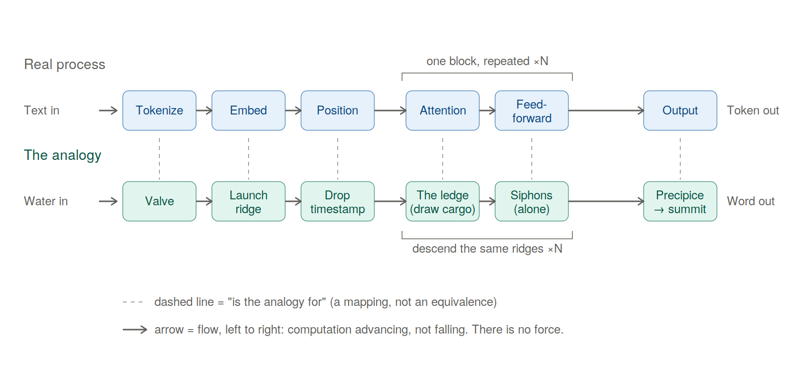
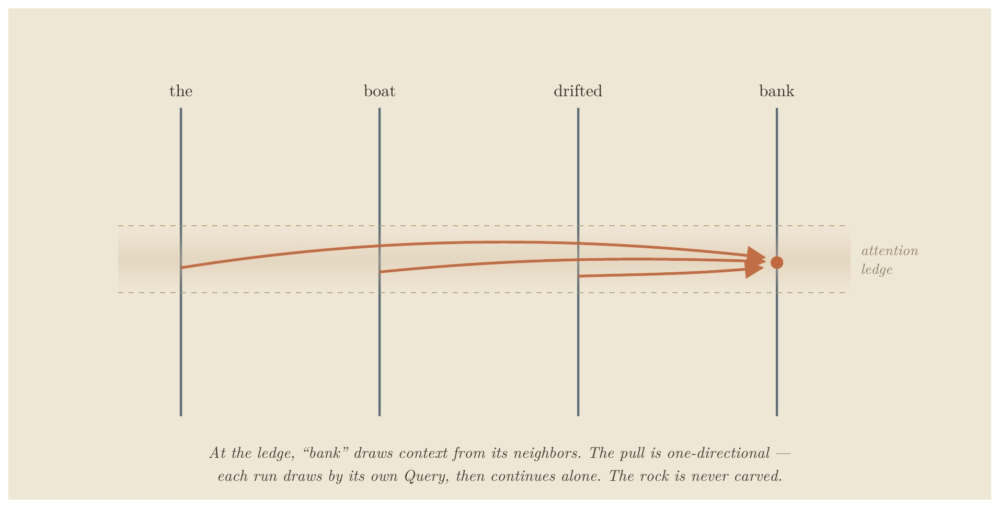
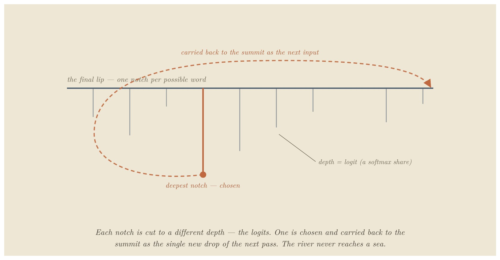
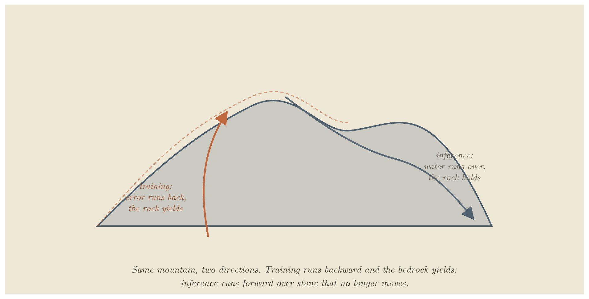

# The River and the Canyon

**A Physical Analogy for Transformers — and a Stress Test of Its Limits**

E. A. Flores · Apiana AI, Inc. · May 2026

> Prefer a typeset version? **[Read the paper as a PDF](the-river-and-the-canyon.pdf)**.

> *I'm an engineer, not an ML researcher. I built this analogy to understand transformer mechanics for myself, then started pressure-testing it — and the breaks turned out more instructive than the parts that held. It's an explainer and a stress-tested reasoning framework, not a formal result; people deeper in the field will find places to sharpen or reject it, which is the point. The one rule I'd keep regardless: never trust an analogy until you can state the claim with no analogy in the sentence.*

> **The paper is in two parts.** Part I builds the analogy into a working instrument — weights as a frozen mountain, water as activations, training as carving, inference as water over stone that no longer moves — held consistently from raw text to generated word and into the techniques that run real models. Part II turns that instrument on itself and stress-tests it to failure, to find the exact line where it stops being the territory.

## Abstract

Most explanations of large language models are either too loose (a "digital brain") or too dense (a wall of linear algebra). This paper takes a third path: it maps the real operations of a transformer onto one sustained physical picture — weights as frozen solid rock, activations as water flowing over it, training as the slow carving of the stone, inference as water finding paths across rock that no longer moves. The governing axis is permanence: grooves carved by training are permanent, channels laid by attention per input are not, and that single distinction is the difference between weights and activations. The picture is held from tokenization through attention, the residual stream, and the feed-forward block, and on into KV caching, FlashAttention, and LoRA. Then it does what most analogies avoid: it pressure-tests its own picture against real mechanism to find where it stops being the territory — and reports what that turned up, including one case that nearly produced a false result. It is written for the technically literate non-specialist who wants an intuition they can reason from, debug with, and explain to others — and who wants to know precisely where not to trust it.

## Contents

### Part I — Building the Instrument

- [Introduction](#introduction)
- [The Topography (Static Architecture)](#the-topography-static-architecture)
- [The Hydrology (Dynamic Mechanics)](#the-hydrology-dynamic-mechanics)
- [Tectonic Shifts (Training vs. Inference)](#tectonic-shifts-training-vs-inference)
- [Advanced Hydrology (Production Techniques)](#advanced-hydrology-production-techniques)

### Part II — Testing It to Failure

- [The Structural Frontier (Interpretability)](#the-structural-frontier-interpretability)
- [Stress to Failure](#stress-to-failure)
- [What the Stress Test Found](#what-the-stress-test-found)
- [Conclusion: The Wonder Without a Ghost](#conclusion-the-wonder-without-a-ghost)
- [Sources](#sources)
- [Appendix: Quick-Reference Blueprint](#appendix-quick-reference-blueprint)

---

# Part I — Building the Instrument

## Introduction

Most explanations of LLMs fall into one of two traps: mystifyingly abstract ("a digital brain that thinks") or brutally mathematical (Attention(Q,K,V) = softmax(QKᵀ/√dₖ)·V). The first replaces mechanism with anthropomorphism; the second hides the structural elegance underneath.

This paper offers a third register. The core mapping: weights are the mountain; activations are the water. Training is the slow carving of bedrock into shape. Inference is water finding paths down a mountain frozen solid. Attention is the fluid step where water finds and follows its own temporary channels across the rock — recomputed fresh for every input, leaving no lasting mark. With that mapping held steady, the same intuition carries all the way into production techniques.



> **Figure 1.** The forward pass, with each real step aligned above its analogy: the real process (top) and the mountain-and-water picture (bottom), stage by stage. Dashed lines mean *is the analogy for* — a mapping, not an equivalence. Flow runs left to right because the computation advances; nothing falls. The diagram shows a *single* pass, producing one token; generation repeats it — each output token is appended to the input and the entire pass runs again for the next word, which is why the river runs the whole range once per word rather than reaching any sea.

An analogy that only ever agrees with you is worthless — it will happily explain anything — so the two-part split is the method, not decoration. Part I takes the picture seriously enough to build something you can reason with; Part II forces that same picture to make clear mechanical claims about real model behavior, states what would break them, and checks each against known mechanism. The breaking is not an appendix to the building; it is the other half of the same job — and what it turned up was sharper than what the building did.

Every concept below appears twice: once in engineering terms, once in the analogy.

## The Topography (Static Architecture)

```
[Raw Text] → 1.TOKENIZATION → 2.EMBEDDINGS → 3.POSITIONAL ENCODING → [First Layer]
```

### 1. Tokenization: Choosing the Drops

**Real terms:** A separate, mechanical tokenizer slices raw text into sub-word units and converts them to integer IDs from a fixed vocabulary. "the" is usually one token; "tokenization" may split into [token] + [ization]. The model never reads text — only integer IDs.

**Analogy:** A valve breaks the continuous stream of text into discrete, standardized drops. The mountain never sees a sentence all at once — only a disciplined stream of individual drops.

### 2. Embeddings: Map Coordinates

**Real terms:** Each token ID is looked up in an embedding matrix, becoming a dense vector (e.g. d_model = 1024 or 4096). Training nudges these so tokens used in similar contexts point in similar directions. Meaning is purely geometric — proximity and angle encode semantic relationship — which is why "king" and "queen" land near each other with no engineer coding the link.

**Analogy:** Each drop type has a fixed launch point on the highest ridge — but those points aren't stamped onto a finished mountain. During construction, while the terrain is still rising and freely takes shape, the ridge is sculpted so drops that behave alike come to rest on adjacent crags. "King" and "queen" end up neighbors not by placement but because training moved the mountain until they did.

The launch ridge is a map of meaning — but only in an averaged, context-free sense, and that limit sets up everything attention does. An ambiguous word like *bank* drops from the same averaged coordinate every time, pulled partway toward *river* and partway toward *money* at once. The ridge knows the word's accumulated history; it knows nothing of the present sentence. The launch point is a prior; the descent is what resolves it into a specific meaning. Crucially, that resolution changes the drop — the value the water carries — and never the rock: the ridge and slopes stay frozen while each input's flow is computed fresh over them.

> **A Note on High-Dimensional Sanity.** The basic formulas from 3D geometry still apply in a 1024-dimensional embedding space. Distance is still distance, and cosine similarity (1 = same direction, 0 = perpendicular, −1 = opposite) still measures directional alignment. What fails is not the math, but the intuition for scale and crowding. The one trap is exactly that crowding: in 1024D, two random vectors are almost always nearly perpendicular, so any genuine similarity is a stark, rare signal. Keep your 3D intuition for distance and angle; abandon only the need to visualize. The one thing 3D can't supply is how many nearly-perpendicular directions the space holds at once — that count explodes with dimension and has no spatial picture. It is the engine of superposition, which Part II returns to.

### 3. Positional Encoding: Time-Stamping the Stream

**Real terms:** Attention is order-blind — it treats inputs as an unordered bag. Position must be injected. Sinusoidal/learned encodings are added onto the embeddings as an offset before the stack. Rotary (RoPE), now more common, instead rotates the Query and Key vectors by an angle proportional to position inside the attention step, so relative position falls out of the QK dot product. Either way: "dog" in "the dog bit the man" must be mathematically distinct from "dog" in "the man bit the dog."

**Analogy:** Five identical drops down a slope follow the same path. To prevent that, each drop is marked by position. The older method stamps a fixed timecode at the valve; the newer rotates each drop's orientation by its position so identical drops strike the rock at subtly different angles. Either way, position becomes an ordered coordinate system.

## The Hydrology (Dynamic Mechanics)

```
[Input Vectors] → 4.ATTENTION (water maps its path) → 5.PARALLEL HEADS → 6.FEED-FORWARD (private processing) → [Next Layer]
```

### The Residual Stream: The Central Run

**Real terms:** Modern layers don't overwrite the input vector — the architecture is additive: x + Attn(x), then x + FFN(x). (A normalization step — LayerNorm/RMSNorm — sits at each block to keep magnitude from drifting; it's a stabilizer, not a place where tokens mix.) The embedding space acts as a continuous highway, each block writing a small incremental update. There is one channel per token, running in parallel — and the only operation that lets one draw on another is attention.

**Analogy:** Every drop rides its own deep-cut riverbed — its Central Run — from summit to base, keeping the same one the whole descent. At a ridge its current isn't remade from scratch; attention pools and feed-forward siphons are side-tributaries that branch off briefly, compute a contribution, and fold it back into that drop's main channel. The runs travel parallel and private — except at the rare attention ledges.

The drop does not swell into a puddle. One token stays one fixed-width vector at every layer — what changes is its composition, not its volume. The embedding gives it an averaged, context-free profile (generic *bank*). At each attention ledge it exchanges dissolved traces with its neighbors (taking in *boat* and *drifted*); in each siphon, fixed rock transforms that mixture without being consumed. By the lower layers it is still one drop, the same size, but its solution is richer and far more specific.

> **A Note on Fluid Physics.** This river does not obey conservation the way physical water does. Information distinguishability is destroyed at certain operations, and brand-new signal is manufactured inside the siphons. For now, hold the fluid image to understand the blend, but keep a weather eye on the fact that what flows in almost never equals what flows out.

Two cautions keep this honest: the solutes come from other drops, never leached from the rock (a rock dissolving into the water would be erosion — training, not inference); and "carrying *boat*-context" never means the drop contains the word — it is one vector, richer in composition, not more in contents.

### 4. Attention: The Self-Mapping Riverbed

**Real terms:** Attention is where tokens exchange context. Each projects three vectors via trained matrices — Query ("what context am I looking for?"), Key ("what context do I contain?"), Value ("what do I offer?"). A token's Query is multiplied against every Key (QKᵀ); softmax turns the scores into proportions summing to 1.0; the model blends all Values by those proportions: softmax(QKᵀ/√dₖ)·V. After this, "bank" next to "river" sits in a different geometric neighborhood than "bank" next to "robbery."

**Analogy:** This is the foundational illusion. The rock is dead and unmoving, yet the water appears to interact intelligently. At a ledge the rock briefly exposes each Central Run to its neighbors; each drop draws according to its own Query. The ledge creates the opportunity; the draw does the rest. They discover and follow a temporary channel across the stone — but carve nothing. Change one drop upstream and the whole network of ripples recalculates a different channel. The mountain didn't move; the water found a path over it, computed entirely from itself, and that path vanishes the instant the next input arrives.

How a drop draws is a three-part mechanism, all computed from its current value by fixed rock (three trained projections):

1. **A question** (Query) — what this drop seeks. *Bank* asks, in effect, "what around me fixes which kind of bank I am?"
2. **A placard** (Key) — what each drop advertises. *Boat*'s reads "watercraft, rivers, shores"; *teller*'s reads "money, counting, a counter."
3. **A cargo** (Value) — what a drop actually hands over, which need not match its placard. The placard is how you get found; the cargo is what you give.

The gather is exact: *bank*'s question is checked against every placard (QKᵀ), and match-strength sets what fraction of each cargo pours into *bank*'s Central Run. Strong match with *boat* → a large pour; weak match with *the* → a thin trickle.

> **A Note on "Neighbors".** In this framework, "neighbor" is a purely geometric concept, not a local or physical one. Because attention has zero distance decay, a drop at the end of a long sequence can instantly look back and pull cargo from a drop that passed a hundred paces upstream just as strongly as one right next to it. They are neighbors in relevance, not in proximity.

Three cautions: the weights are mixing proportions, not odds — nothing is selected, every neighbor contributes its weighted share at once. The pour is one-directional — *bank* drawing *boat*'s cargo does nothing to *boat*, which is meanwhile gathering its own blend; who-draws-from-whom is set by the asker. And the rock gives none of the substance — question, placard, and cargo are all carried by the drops; the terrain only supplies the projections and the ledge.

And the drops don't take turns. Every drop poses its own question, reads every placard, and blends its own cargo-mix simultaneously — so the ledge isn't one drop resolving against passive neighbors but the whole constellation settling at once. The sentence's meaning doesn't assemble drop by drop; it precipitates all together, in one pass.

> **The key distinction:** grooves (carved by training) are permanent. Channels (laid by attention, per input) are not. The decisive difference for this framework is permanence — and that is exactly the boundary between weights and activations the analogy is built to preserve.

**Worked example.** In "the boat drifted toward the bank," watch *bank*. Its drop lands at one blurry launch point — every sense at once. At the first ledge it looks around; *boat* and *drifted* are the strongest match, their Value pours in, and the drop leaves shifted toward the riverside region. Change one word upstream — "the teller counted the cash inside the bank" — and *boat*'s contribution never happens; *teller* and *cash* prevail, and the same starting drop slides into a different valley. The rock never moved; the neighbors changed.



> **Figure 2.** Each drop carries a question (Query), a placard (Key), and a cargo (Value — what it hands over, which need not match its placard). The question is matched against every placard; match-strength sets the fraction of each cargo that pours in.

### 5. Multi-Head Attention: Multi-Sensory Flow

**Real terms:** Rather than one attention over the full dimension, the space splits into parallel heads (e.g. 8, 16, 32). With d_model = 1024 and 8 heads, each works in its own 128-dim slice. Heads appear to specialize — syntax, pronoun reference, topical sentiment — though these are interpretive readings, not labels the model assigns. Outputs are stitched back at the layer's end.

**Analogy:** The stream splits its perception into several independent senses (hold this as a clean caricature — real heads overlap and multitask): one responds to the grade, another to the granite's texture, a third to long-range alignment across the basin. At the ledge's bottom they merge back into the Central Run.

### 6. The Feed-Forward Block: Pressurized Siphons

**Real terms:** After attention shares context, each token passes alone through a feed-forward network (classically two projections with a non-linearity; Llama/Gemma-style models use three, gated, with GELU/SiLU). This is attention's counterpart: where attention lets tokens talk, the FFN transforms each token in isolation, with no cross-token communication. It's associated with learned feature transformations including factual recall — though, as superposition (Part II) makes clear, the behavior is distributed, not cleanly localized.

**Analogy:** Having drawn from one another, the drops are forced — one at a time — through narrow, pressurized siphons. Inside there are no neighbors; each is squeezed and accelerated purely on its own properties, then spills back into its Central Run. Every layer alternates the two: gather and mix, then squeeze each one alone.

### 7. Stacking Layers: Descending the Range

**Real terms:** One layer isn't enough. Transformers stack 24 to 100+ layers; Layer 1's outputs are Layer 2's inputs. A rough labor division tends to emerge — low layers toward surface token patterns, middle toward syntax, high toward abstract semantics — though the boundaries are gradient and overlapping, not clean tiers.

**Analogy:** The water descends ridge after ridge, each shifting its composition slightly, until by the final precipice the simple raindrops have been mixed and organized into a sophisticated current reflecting the whole journey. (One caution to collect in Part II: "down" is a bookkeeping direction — later in the stack — not a physical fall. Nothing pulls the water; "flow" is just the computation advancing. The falling image is the analogy's most intuitive move and its deepest error.)

### 8. The Final Precipice: From Water to Word

**Real terms:** After the last layer, the final-position vector passes through a closing normalization and the unembedding projection (sometimes tied to the embedding matrix as its transpose, sometimes separate), producing a logit — one raw score per vocabulary token (typically ~32k–256k, not millions). Softmax converts the full set into a probability distribution. Temperature scales the logits first: small values sharpen toward the top scorer (near-deterministic), larger values flatten (more varied). A sampling rule then draws the token — greedy/argmax takes the peak; top-k, nucleus (top-p), and multinomial roll weighted dice among the leaders. The chosen token is decoded, appended to the input, and the entire descent runs again for the next word.

**Analogy:** The current reaches the final lip, passing one last calibrating gate (the final norm). Below the lip is a fan of outflow notches, one per possible word, each cut to a different depth (the logits). The system reads the whole fan and converts depths into flow-shares (softmax), with a temperature dial setting how sharply depths are distinguished. Then the water commits to one notch. Here's the move the downhill picture hides: the chosen water isn't released into a sea — it's carried back to the summit as the lone new drop of the next pass, joining the damp trails its predecessors left (the KV cache, below). The river never reaches an ocean; it runs the whole range once per word.



> **Figure 3.** Generation is not water exiting at the bottom; it is one token chosen and fed back to the top, the whole range re-run once per word.

## Tectonic Shifts (Training vs. Inference)

The whole of machine learning hinges on a distinction that looks like two states of matter but is better understood as one material under different amounts of flow. The mountain is always rock. What separates the regime that shapes it from the regime that merely runs over it is not a phase change but a dosage: how much water, for how long.



> **Figure 4.** The difference is dosage, not material: training is sustained flow at carving volume; a single inference pass carries nowhere near enough to move rock. The mountain is frozen not because it was fired, but because the firehose is off.

### 9. Training: The Canyon Carves the River

**Real terms:** Data is fed forward, error is measured against a target, and that error is propagated backward (backpropagation). Every weight is nudged via gradient descent to minimize it.

**Analogy:** Training has two movements. **Construction:** at initialization there is no terrain, only formless randomness, and the early violent phase is where the mountain comes into being — gross structure established. This is the one genuinely malleable moment, because before a fixed landscape exists there's nothing solid to resist reshaping. **Refinement:** once terrain stands, continued training is water running over already-solid rock, long enough and hard enough to cut grooves into stone that already exists. This corrects the old "soft clay, then fired" picture — the rock doesn't have to be soft to be carved. The Grand Canyon wasn't cut while the rock was clay. Most of training is erosion: channels deepening over millions of iterations until the valleys guide the water exactly where it needs to go.

One detail makes the rest precise: the water that does the carving is *language* — text, flowing over the rock, billions of passes of it, and nothing else ever touches the stone. The mountain never meets a river, a tool, an atom, or a person; it meets *descriptions* of them. So the grooves are a record of how language behaves, carved entirely from the shadows the world casts into text, never from the world directly. That is a precise fact about the mechanism, and it sets up — but does not answer — a question the conclusion returns to: whether a structure shaped only by those shadows can be said to understand what cast them.

### 10. Inference: Water on Solid Stone

**Real terms:** Once training ends, the weights lock — static numbers in memory. A query computes activations, but no parameter changes by a single bit. This is why a base model doesn't learn or remember your conversation after the session is wiped.

**Analogy:** The flood has stopped. One stream runs once — one forward pass — far below the dosage that carves. The same rock erosion was cutting a moment ago is now simply being run over. The uncanny illusion of an active mind responding to your words is purely the attention step: dynamic routing on top of an entirely static substrate.

**The adaptation nuance.** "Frozen" means what one pass cannot move, not what nothing can ever move. Continued training and fine-tuning crank the flow back to carving regime — enough sustained water to cut standing rock again. That's why fine-tuning works, and also why it's bounded: it is not a return to construction (the landscape doesn't go molten and re-formable), but heavy erosion on rock that already stands. It can deepen channels, connect existing high ground into new routes, and locally raise modest new peaks where the data pushes hard — but it cannot freely re-raise the range. The honest permanence boundary: not "fired and unchangeable," but "shaped freely only once, during the build, and merely carvable — by sufficient flow — ever after." This is the hinge the framework turns on, and the one Part II tests hardest.

## Advanced Hydrology (Production Techniques)

### 11. KV Caching: Damp Trails on the Ledge

**Problem:** LLMs generate auto-regressively. To produce token 101, the model runs attention against all 100 prior tokens — recomputing their Keys and Values every step is wasteful. The fix: cache past K and V in a buffer (the KV cache), so only the new token's Q, K, V are computed. Most modern models shrink the cache further by sharing K/V across groups of heads (Grouped-Query Attention), cutting memory without changing the mechanism.

**Analogy:** A long stream leaves a damp, glistening trail on the rocks it passes. A new drop at the top doesn't reinvent the riverbed — it brings its fresh query, meets the wet trails of its predecessors (Keys and Values), and slides into the established current. You only compute the newest splash. The trails are left by the water that passed, not carved into the rock; the terrain is untouched, which is why the cache is state, not a change to the model.

### 12. FlashAttention: Blinders and Local Mathematics

**Problem:** GPUs are fast at arithmetic but slow at moving data between large main memory (HBM) and tiny on-chip memory (SRAM). Standard attention computes and stores a giant N×N matrix, choking memory bandwidth. FlashAttention breaks the input into blocks, computes attention incrementally inside SRAM, and never writes the full matrix to slow memory.

**The crucial detail:** It's exact, not an approximation. Softmax is global — it nominally needs every score at once — which seems to fight block-wise processing. FlashAttention solves this with online softmax: a running maximum and running sum, rescaled as each block arrives. The output is identical to full attention up to floating-point rounding. The speed comes entirely from avoiding slow memory traffic.

**Analogy:** Instead of photographing the whole cliff at ultra-high resolution and hauling the file to a slow server, you put on blinders: study one square foot, compute how water slips over it, move on — but keep a running tally in the margin (high-water mark, total flow) and adjust earlier figures as you go. Because you carry those totals, the final map is exactly as accurate as the all-at-once photograph. You just never wrote or hauled the textbook-sized map.

### 13. LoRA: Tarps and Traffic Cones

**Problem:** Fully fine-tuning an LLM updates billions of parameters — unsustainable memory. LoRA freezes the original weight matrix W and injects two small low-rank matrices alongside it. If W is 4096×4096, A and B are narrow strips (4096×8 and 8×4096). Only these train, cutting trainable parameters by well over 99%.

**Analogy:** LoRA changes the route without recarving the main rock. A full fine-tune turns the firehose back on the standing canyon — heavy, broad recarving that drags at everything. LoRA instead leaves the bedrock untouched and lays down slick tarps and traffic cones: a light, targeted guide (A×B) at a critical valley choke point diverts the river into a new valley without moving an ounce of stone. This is the dosage idea at its cleanest — a removable steering layer on top of rock you never disturb.

---

# Part II — Testing It to Failure

An analogy that only agrees with you is worthless. The way to find what a picture is worth is to turn on it deliberately: state each claim in plain mechanism with no analogy in the sentence, write down in advance what would prove it wrong, and check. Most of what follows bends or breaks. The deepest break sits under the analogy's most natural verb.

## The Structural Frontier (Interpretability)

If the mountain's shape explains how water moves, can we read an existing mountain backward to recover the concepts it holds? This is Mechanistic Interpretability. It is partially possible and improving — but it fights two structural walls, not engineering failures.

**1. Superposition (the primary wall).** Concepts aren't stored in clean, isolated zones. A single dimension doesn't represent "dogs"; a concept is smeared across hundreds of dimensions as a directional pattern, and a single dimension may fire for dozens of unrelated concepts ("blue," "legal contracts," "fast"). That symptom is polysemanticity; its cause is superposition — because near-orthogonal directions are cheap in high-dim space, the model stores far more features than it has dimensions, packed as overlapping directions rather than clean axes. So you can't point at a direction and read off its meaning — the direction has no single meaning. The leading countermeasure, sparse autoencoders (dictionary learning), tries to un-mix these features. It produced early wins, but several recent evaluations challenge whether it reliably beats simpler baselines on probing and steering, and at least one major lab has signaled it is pulling back. It is active and unsettled, not solved.

This capacity has a second face, and the mountain shows them as one fact. Superposition is the wall from the reading side: you can't cleanly extract a feature because directions are packed past orthogonality. The identical crowding is a wall from the writing side: when training carves new knowledge into a region whose capacity is already heavily used, the new channels can't be cut without disturbing the ones there — the free directions are spoken for. As crowding deepens, learning something new and forgetting something old converge toward the same act — this is catastrophic forgetting, the write-side mirror of superposition's read-side wall.

Here the picture is more honest than the usual caution that "you can't visualize 1024 dimensions." The capacity problem itself transfers perfectly to a 3D mountain, because the geometry is continuous all the way up: added independent directions relieve crowding in 1D, 3D, and 4096D alike, with no rung where the kind of thing changes. A finite substrate has only so much room to keep things distinct; once a region is densely used, new structure competes with old. You can watch that on a terrain — it is the same phenomenon, not a metaphor for it.

What does not transfer is the magnitude. With exact orthogonality there's no miracle — a d-dim space holds exactly d perpendicular directions. The explosion to exponentially many directions appears only once you accept near-orthogonality, small overlaps instead of right angles (the Johnson–Lindenstrauss regime). And those overlaps aren't free — they are the interference budget. The model fits far more than its axis count precisely because it lets features bleed slightly into one another, and that same bleed is what eventually degrades them. Roominess and crowding are the same fact measured two ways. The mountain shows this honestly — every groove you cut weakens its neighbors' walls — but it can't show the scale: how slight each high-dim overlap can be, hence how much can be packed before the bleed turns catastrophic. That gap matters for one question only: why a large model absorbs so much before interference dominates.

This answers a question the picture invites: does fine-tuning raise new land? No — the architecture is fixed at construction (fixed width, depth, parameter count), so fine-tuning adds no dimensions. But "fixed" isn't "full." The terrain is used unevenly — some directions heavily load-bearing, others barely used — which is why there's usually room. New knowledge enters by reshaping fixed land: carving fresh grooves into slack slopes, deepening or redirecting existing grooves, connecting channels into new drainage (much "new" knowledge is recombination), and, where crowded, cutting across established grooves and stealing their water (interference). There is no sharp line where the terrain becomes "full" and learning flips to overwriting — interference rises continuously and accelerates; most real forgetting happens in the crowded-but-not-saturated middle, not at a cliff. One-line version: fine-tuning doesn't add land, it re-carves fixed land — and because the land is high-dim and unevenly used, there's often far more room than 3D suggests, but every cut into crowded ground costs something already there.

**2. Information destruction (the secondary wall).** Several operations are inherently many-to-one — most plainly the weighted sum blending many Values into one at each attention step, plus non-linearities that flatten ranges of input to the same output. (Softmax itself is nearly information-preserving; the collapse is in the summation and flattening, not the normalization.) They act like waterfalls: once separate streams merge over the drop, you can't look at the pool below and reconstruct exactly where each molecule entered. Because the forward pass discards information, it can't be cleanly run backward to a single cause.

The most important limit to carry forward: the picture cannot tell you where a capability lives, because in a superposed system capabilities do not live anywhere you could point.

## Stress to Failure

For each phenomenon, I stated the analogy's prediction in plain mechanism, with no mountain in the sentence; wrote the disproving observation in advance; then asked the strict question — did the picture name the real mechanism, or only the right neighborhood while the true cause sat elsewhere? (This is the old discipline of testing an analogy by its critical disanalogies — Mill, Keynes — compressed into a rule I could invoke mid-thought.) A prediction that lands the area but misses the mechanism is a partial break, honestly labeled.

**Genuine simplifications** — places the picture rounds off detail without misleading about mechanism:

- **Drops are discrete; the real operations are continuous.** Tokens are genuinely discrete, but embeddings and attention are continuous matrix operations. The drop is a handle for the token, not a picture of the math.
- **"Frozen" is true only at inference.** The rock can be recarved at training dosage; one pass never moves it. What it can never do is return to construction.
- **Attention leans toward routing because fluid conveys direction.** The operation is mathematically a weighted synthesis — each token assembling a custom blend — as much as path selection. Hold both.
- **This is not the loss landscape.** That older picture plots loss against parameters, with the optimizer descending it. There gradient descent is the traveler; here it's the sculptor that carves the slope, and the water that later runs over the rock is a different thing on a different surface.

**Foundational caveats** — places the picture imports physics the system doesn't obey:

- **The capacity problem transfers; only its magnitude doesn't.** (Detailed above.) The relational geometry transfers perfectly (cosine similarity proves it), and saturation transfers too; only the size of the room — how far the space stays free before crowding suddenly — is invisible to 3D.
- **The water is not conserved.** Fluid intuition smuggles in conservation of volume; the residual stream obeys it in neither direction. Distinguishability is destroyed (the waterfalls), but magnitude is also created — the stream grows with depth, each block writes new signal, the FFN manufactures features that weren't there. Never reason "what flows in flows out."
- **The water draws only from upstream, and "neighbors" overstates locality.** This describes decoder-only, autoregressive models. Causal masking means a drop draws only from drops earlier in the sequence — so "looks around" wrongly implies both sides. And attention is all-to-all with no distance decay — the first token is exactly as reachable as the one just upstream — so "neighbors" implies an adjacency the mechanism lacks. Keep the word for readability, but the real operation is a weighted synthesis of every permitted source at once. (The pull stays one-directional and asymmetric, which the prose does capture.)

Now the four cases worth keeping in full. The first is the deepest, because it sits under the central verb of the analogy itself.

### The deepest break: there is no force

Every page has water falling — descending the range, pouring over the precipice, finding the low valley. That is the analogy's central verb, and its deepest error. The picture invites a force, and there is not one.

State it plainly. A force pulling the flow toward a preferred path would mean the forward pass is relaxing toward a lowest-energy or least-resistance state — and it is not. Optimization happens during training, not inference. At inference the model isn't searching over paths, testing routes, settling into an answer, or minimizing anything; it is evaluating a fixed function, layer by layer. There is no driving force at all — not gravity, not least resistance, not a pull toward the likely. Nothing is sought, because nothing is searched.

So "flow" must be held as a bookkeeping image, not a physical claim. At each layer the drop's value is replaced by a new value computed from it by the fixed weights. The terrain doesn't push the water; the terrain is what the water becomes. "Down" means later in the stack, not lower in energy. Even the sense that the water "finds the easy path" is the same ghost — the path isn't found by least resistance, it is computed directly, and what looks like a preferred route is only the shape the frozen terrain was trained to produce, read off after the fact.

This is the analogy's most dangerous habit in its purest form: it reaches for the cause it can most vividly draw — water obviously falls, so the computation must too — and it is load-bearing for the entire picture rather than one exotic operation. The instant "down" smuggles in "downhill," or "terrain" smuggles in "force," the analogy has told you something false — and it will feel completely natural, because falling water is the most intuitive thing in the framework. That is precisely why it is the most dangerous.

### The clean break: model merging

Two models fine-tuned from the same base can often be averaged, weight for weight, into one that keeps both strengths. The analogy is confident: they share the same bedrock, so their valleys line up; average two mountains from different clay and you'd get a featureless plain. Shared origin, it says, is what makes models mergeable.

Wrong variable. What governs mergeability is not shared ancestry but compatible parameter geometry — whether the solutions sit in the same low-loss basin, accounting for the fact that one network can be permuted into many equivalent forms. Two models from the same base can drift into different basins and average into garbage; two from different starts can be permuted into alignment (re-basined) and merge cleanly. That re-basining step is exactly what the mountain can't see — nothing in "shared bedrock" corresponds to permuting coordinates to match. Shared origin correlates with basin compatibility, which is why the analogy is right often enough to feel earned. But correlation isn't cause: the picture reached for the variable it could draw instead of the one that decides the outcome. That is the most honest thing a break can teach — the picture will always prefer the cause it can draw.

### The bend: quantization

Shrink a model's numbers from sixteen bits to four and it keeps working, often astonishingly. The analogy expects this: coarsen the rock, and as long as the large basin structure survives, water finds broadly the same valleys. The neighborhood is right. But the picture assumes the coarsening is uniform, and that's where it bends. A transformer's sensitivity is sharply non-uniform: a small minority of weights and activation channels carry a disproportionate share of the load, while most tolerate brutal rounding. The methods that make low-bit quantization work succeed precisely by refusing to treat the model as evenly compressible — they locate the load-bearing components and protect them while crushing the rest. The analogy pointed at the right phenomenon and assumed the wrong texture: smooth where the material is lumpy.

### The near-miss: testing inference

This is the one I almost got wrong, and the case I most want on record, because the way it nearly fooled me is the whole point of the discipline.

The analogy's central claim is about inference: water runs over frozen stone and the rock doesn't move. So I went after it directly.

**The Setup:** Take a small model, teach it invented facts, then freeze every layer past a chosen depth so that downstream stretch is mechanically locked. Fine-tune only the layers above on a second, conflicting set of facts until the first degrades. Then take the internal state those frozen layers originally received, before the fine-tune, and feed it back in. If the old behavior returns, it would seem to show the degradation lived entirely in what reached the frozen computation, not in the computation itself — loss without the rock moving. A vivid, fundable result, fully designed.

Then I wrote the claim down with no mountain in it, and it fell apart into a stark structural contrast:

**The Tautology Rig (what I designed):** If downstream layers are entirely frozen, they represent a completely static mathematical function. Feeding a fixed function the exact input vector it originally received will yield the exact original output by construction — guaranteed, for any model, any task, any depth. The experiment was a closed loop wrapped around an un-falsifiable identity. It couldn't teach me anything because it was mathematically impossible to fail.

**The Real Experiment (what survives):** The degradation half stands alone: a behavior can be made to fail while a downstream computation is held fixed, which means the loss can be induced purely by upstream drift. The activation replay becomes informative only when it is partial — measuring not *if* restoring the whole state brings the behavior back (it must), but *how little* of the structural state must be restored to recover the original performance.

This is a real experiment — connected to the established tools for exactly this question (path patching, causal scrubbing, attribution patching) — but not yet run. I state it as a prediction, not a result. One caution the same discipline forces: none of this licenses a claim about where a capability "lives." Superposition forbids that. The claim is only ever about the region I froze and the inputs I replayed. And the underlying idea isn't new — that forgetting involves drift in what reaches a layer, rather than damage to the layer alone, is close to consensus already. The picture didn't discover it; it pointed, clumsily, toward a clean way to measure it.

## What the Stress Test Found

The failures cluster, and the cluster is the actual finding — more useful than any single prediction, because it's a rule you can carry to a picture you haven't tested.

The analogy has teeth in exactly one circumstance: when a phenomenon genuinely turns on the line between permanent and temporary — between weights and water. It bends or breaks the moment the deciding variable lives somewhere else — in geometry (model merging), in statistical salience (quantization), in hardware scheduling (the memory-vs-compute behavior of inference), or in optimizer dynamics. Where the governing variable leaves the permanence boundary, the mountain can still locate the right neighborhood, but it cannot name the mechanism — and, worse, it will confidently pretend it can, reaching for whichever cause it can draw.

That yields a triage test for any intuition about these systems — the mountain or anyone else's:

1. **Can you state the claim with no analogy in the sentence at all?** If you can't put it in plain mechanism, you don't have a claim — you have an image.
2. **Does it secretly assume uniformity** where the real system is lumpy and heterogeneous? (That bent quantization.)
3. **Does the real answer depend on a variable the picture cannot see** — basin geometry, hardware, optimization, which-components-matter? (That broke merging and nearly fooled the inference test.)

If the deciding variable lies outside the picture's reach, let it point you to the neighborhood — then set it down. That is the whole transferable result: not a mountain, but a method for not being fooled by mountains, including the most seductive one you build yourself. The picture is genuinely useful on a leash. Off the leash it hands you something elegant and wrong, and it feels like insight right up until someone writes the claim down without it.

This is also the honest scope of the framework as a research instrument: a strong generator of questions (it reliably points at what to interrogate when a model is compressed, adapted, combined, or supplemented) and a weak provider of mechanisms (wherever a phenomenon turned on geometry, salience, or hardware, the real explanation came from elsewhere). The one place it forced a genuinely testable question it didn't borrow was the permanence boundary itself. The analogy points; mechanism decides.

## Conclusion: The Wonder Without a Ghost

I built the most convincing version of this picture I could, then tried to break it — because a picture you intend to lean on should be tested by whoever leans on it hardest. It held where it should: tokenization, attention, the residual stream, the production tricks of Part I. It broke where it should: the moment the deciding variable slipped off the permanence boundary onto geometry, salience, or hardware. And once it nearly walked me into a result true by construction and informative about nothing — caught only by writing the claim down without the mountain in it. That near-miss isn't the embarrassing footnote; it's the spine. A weak analogy hides its edges; a strong one shows you exactly where it stops being the territory, and survives the showing.

What's left is the thing the picture was for: demystification. When an LLM produces coherent, empathetic, or brilliant prose, it's easy to assume a ghost in the machine. The framework forces the boring, elegant reality: no hidden hand, only a self-organizing physical system — gradient descent grinding against massive datasets to minimize error, billions of times, until a structure emerges complex enough to capture the geometry of human language. But be precise about what that demystifies. It establishes there is no agent beneath the structure — nothing wanting or choosing the words from behind the rock. It does not explain why this particular structure captures language so well; that question neither the mechanism nor the picture answers. No ghost is a real result. Understood is not.

There's a further line, about what the grooves could be an understanding of. The terrain was carved by one thing: language, flowing over it billions of times. It never touched rivers, tools, atoms, people, or pain — it touched descriptions of them. So the grooves are a frozen record of how language behaved: which patterns co-occurred, which explanations followed which questions, which descriptions clustered around which concepts. That is a deep model of language behavior — far more than "mere statistics." And the grooves can encode regularities that genuinely reflect the world, because language itself is full of world-structure — the terrain captures many shadows the world casts into language. What the framework does not show is that the model understands the world in the grounded human sense. When the water runs the grooves and a correct-seeming answer falls out, the picture cannot tell you whether the terrain grasped the question or reproduced the shape that questions like it tend to be answered with — and the rock holds no fact about which. The honest claim is narrow and strong at once: the terrain captures the shape of how language flows, including the shadows the world casts into it; whether modeling those shadows amounts to understanding the things that cast them is a separate question, and the mountain does not settle it.

And whether there is anything it is like to be the river is a third question still — one the mechanism cannot settle and does not pretend to.

The wonder survives the prosecution. It doesn't require a ghost, and it doesn't require the analogy to be more than it is. The river never truly fell, and the canyon never truly pulled — there was only a fixed shape and water taking it. Held that carefully, the picture still shows what it was built to show — and now we know, to the foot, where it stops.

One edge is worth naming as a door rather than a wall. This paper modeled a single carving flow: human text, the only water that shaped the terrain here. But text is not the only kind of structure a model can be trained on — code carries formal constraint, video carries temporal continuity, simulation carries controllable dynamics, action carries consequence. Whether each of those carves a different geometry, and how far this picture extends to them, is a real question — one this paper raises but does not answer. It is taken up in a companion piece, *What Kind of Water Carves the Mountain?*

## Sources

This is an explainer, not a literature review, but the load-bearing empirical claims — especially in Part II — rest on specific work:

- **High-dimensional capacity (the counting fact behind superposition).** The Johnson–Lindenstrauss regime; for its role in transformers, Elhage et al., "Toy Models of Superposition" (Anthropic, 2022).
- **Superposition, polysemanticity, dictionary learning.** Bricken et al., "Towards Monosemanticity" (2023); Templeton et al., "Scaling Monosemanticity" (Anthropic, 2024).
- **Sparse autoencoders and the current debate.** Recent work has challenged whether SAEs reliably outperform simpler baselines on some probing, steering, and downstream tasks: Kantamneni et al., "Are Sparse Autoencoders Useful?" (2025); Wu et al., "AxBench" (2025); Smith et al., "Negative Results for SAEs on Downstream Tasks" (Google DeepMind, 2025); Korznikov et al., "Sanity Checks for Sparse Autoencoders" (2026).
- **Non-uniform quantization (outlier/salient weights).** Dettmers et al., "LLM.int8()" (NeurIPS 2022); Frantar et al., "GPTQ" (ICLR 2023); Lin et al., "AWQ" (MLSys 2024). Shared finding: a small fraction of weights/channels are disproportionately load-bearing, and protecting them is what makes low-bit quantization work.
- **Model merging, basins, re-basining.** Frankle et al. on linear mode connectivity; Ainsworth et al., "Git Re-Basin" (2023); Wortsman et al., "Model Soups" (2022).
- **Memory-bound decode and exact block-wise attention.** Dao et al., "FlashAttention" (2022).
- **Forgetting / representational drift behind the inference experiment, and the activation-patching tools it names** — path patching (Wang et al., "Interpretability in the Wild," 2022), causal scrubbing (Chan et al., 2022), attribution patching (Nanda, 2023). The experiment is described in full in Part II; it is designed, not yet run, and stated as a prediction.

## Appendix: Quick-Reference Blueprint

| Component | ML Equivalent | Operational State | Physical Analogy |
|---|---|---|---|
| **Raindrop Type** | Token ID | Mechanical vocabulary unit | Drops cut from the stream by a valve. |
| **Ledge Coordinates** | Embedding Vector | Meaning as high-dim geometry | Ridges sculpted in construction so similar drops sit near each other. |
| **Drop Time-Stamp / Twist** | Positional Encoding | Injected before or inside attention | A timecode stamp or an entry-angle rotation preserving order. |
| **The Solid Rock** | Weights (W) | Raised once; carvable only by training-dosage flow, never by one pass | The topography guiding fluid flow. |
| **The Flowing Water** | Activations | Temporary, per-input | Dynamic fluid navigating the terrain. |
| **Permanent Grooves** | Learned weights | Carved by training, fixed at use | Channels eroded into standing rock. |
| **The Central Run** | Residual Stream | Per-token additive channel through every layer | Each drop's riverbed; runs draw on one another only at attention. |
| **Temporary Channels** | Attention (QKᵀ → V blend) | Recomputed every pass | Question matched to placards, pulling a weighted blend of cargo; dissolves when flow stops. |
| **Pressurized Siphons** | Feed-Forward Block | Isolated per-token processing | Single siphons processing drops privately. |
| **Final Notch / Fan** | Unembedding + Softmax + Sampling | Last vector → distribution → one token, fed back | Fan of notches; one chosen and carried back to the summit. |
| **Carving Flood** | Backprop / Gradients | Training-dosage flow | Sustained flow cutting and deepening channels. |
| **Moisture on Stone** | KV Cache | Buffer of historical K, V | Wet trails lubricating the next arrival. |
| **Margin Tally + Blinders** | FlashAttention | Exact, block-wise, in fast memory | Local patch navigation holding running totals. |
| **Tarps / Cones** | LoRA (A×B) | Low-param adaptation, base frozen | Light interventions steering currents without blasting rock. |

---

*Written by E. A. Flores, Apiana AI, Inc. I used Claude (Anthropic) extensively as an editorial and technical sounding board across many rounds of drafting — pressure-testing arguments, checking claims, challenging the structure. The framework, the predictions, the errors, and every structural and editorial decision are mine.*

*© 2026 E. A. Flores. Licensed under Creative Commons Attribution-NonCommercial 4.0 (CC BY-NC 4.0).*
